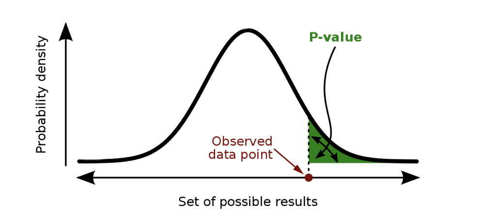
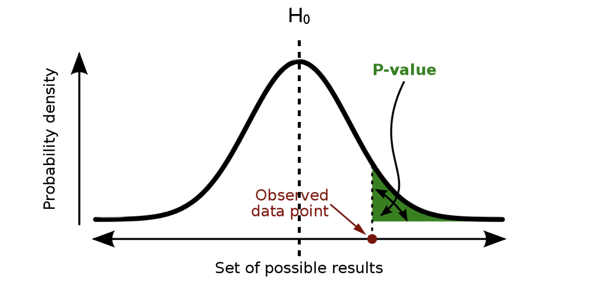
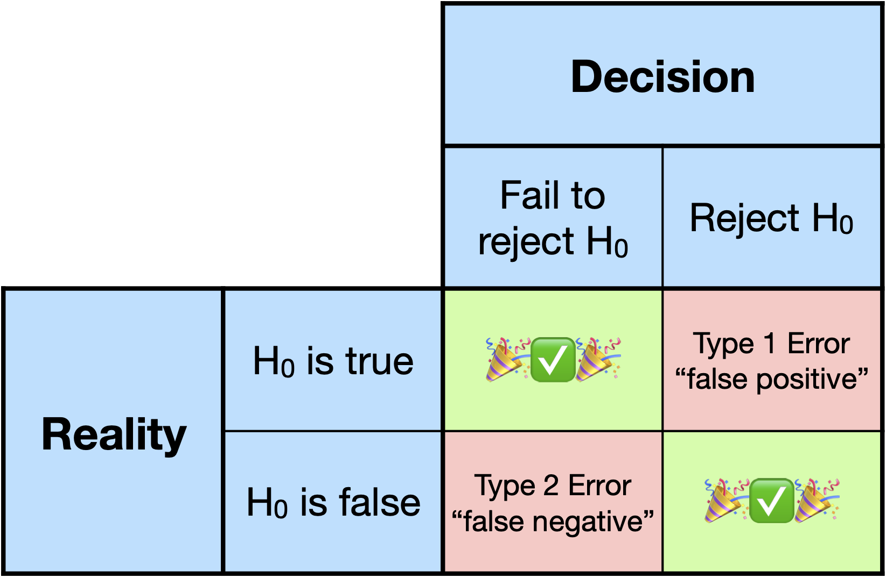
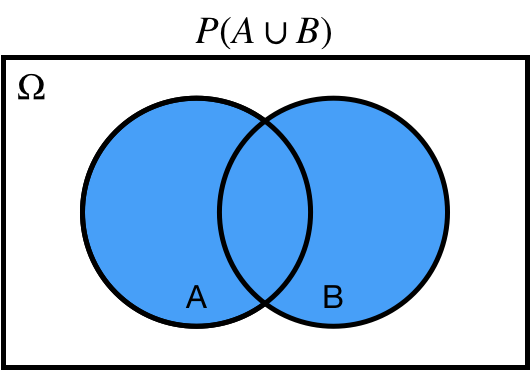
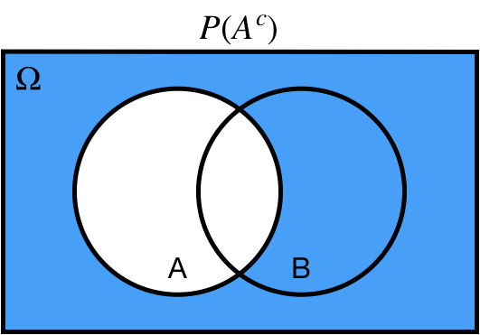
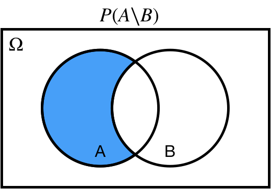
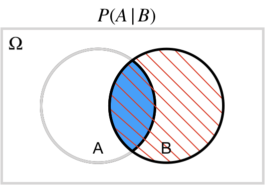
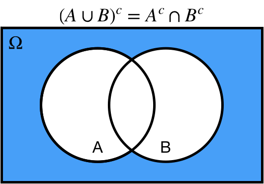
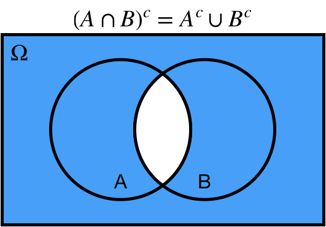
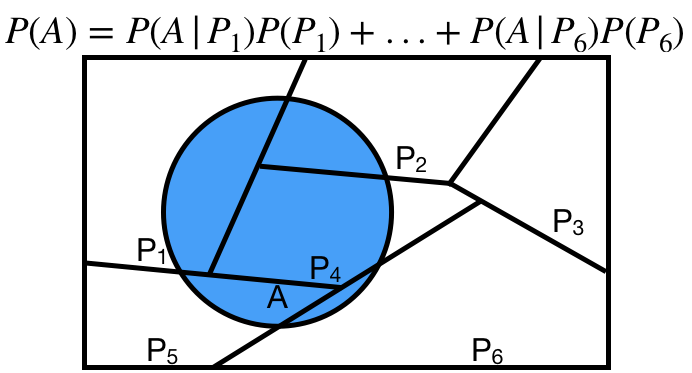

```{r setup, include=FALSE, purl=FALSE}
options(htmltools.dir.version = FALSE)
knitr::opts_chunk$set(comment = "##")
knitr::opts_chunk$set(cache = TRUE)
library(kableExtra)
library(tidyverse)
```


# Outline


1. Hypothesis Testing
2. Linear Models

#### Appendices: 
<ol type="A">
  <li>Probability</li>
  <li>Random Variables</li>
</ol>


.middler[**Goal:** Understand and learn how to apply statistical tests and models with real data!]


---
class: inverse

.sectionhead[Part 1. Hypothesis Testing]

---
layout: true
# Hypothesis Testing

---

## Motivation

Hypothesis testing always begins with a scientific question of interest.
Suppose we have a coin, and we want to test whether or not it is fair.
We might flip the coin over and over and record the results, and then measure the proportion of times we got a heads.

We can state this experiment more formally. 
Let $X_1,...,X_n$ be $n$ random variables corresponding to an indicator of whether a coin flip is heads (i.e. $X_i = 1$ if the $i$<sup>th</sup> flip is heads, $0$ if tails).
We don't know the *true* probability that our coin lands on heads, so we may say that $$X_i \stackrel{iid}{\sim} Bin(1, p),$$ with unknown probability parameter $p$.<sup>1</sup>

.footnote[[1] A binomial distribution with $n=1$ is sometimes also denoted $Bernoulli(p)$]

---

We are interested in whether our coin is fair, which corresponds to $p=\dfrac{1}{2}$. 
This hypothesis we are interested in testing will be our **null hypothesis**, denoted $H_0$ (pronounced "H-naught" or "H-zero").

Alternatively, we may think that our coin is biased in either direction (i.e. either lands on heads too often or lands on tails too often). 
This corresponds to $p \neq \dfrac{1}{2}$.
This is our **alternative hypothesis**, denoted $H_a$ (or sometimes $H_1$).

Thus, our hypothesis test is as follows:

\begin{align}
H_0: p&=\dfrac{1}{2}\\
H_a: p&\neq \dfrac{1}{2}
\end{align}

---

## The hypotheses

In general, we can think of

* **Null hypothesis** $H_0$: our default assumption to be tested, our baseline, no relationships/differences/values of our parameters of interest. *Assumed to be true unless evidence suggests otherwise!*

* **Alternative hypothesis** $H_a$: the alternative to our null, something interesting is happening in our data, our scientific hypothesis of interest 


An important note: for the most part, these are broad generalizations, not formal definitions! 
It is not always the case that the alternative is "interesting" and the null is not. 
However, we do typically set up our hypothesis tests so that this is the case!

---

## The testing

.center[**We always assume that our null hypothesis is true!**]

Our question is whether our data provides sufficient evidence to **reject the null** $H_0$.

For example, if we flipped our coin 100 times and observed 99 heads, we probably would reject our null hypothesis that the coin is fair.
If instead we flipped our coin 100 times and observed 52 heads, we probably would not conclude that we have enough evidence to reject our null hypothesis, and maintain our baseline assumption that the coin is fair.

.center[**This style of thinking is key in all of statistics!**]

Where we assume something is true, and then observe whether or not the evidence (data) supports this assumption.

In hypothesis testing, we never, ever, ever examine whether our evidence supports our scientific hypothesis (the alternative)!
We only examine whether it supports rejecting a baseline assumption (the null).

---
layout: false

# Populations and Samples

* The difference between a **population** and a **sample** is fundamental in statistics!

* **Inferential statistics:** using information from a sample to infer something about a population

* "something about a population": we call this a **parameter**. A parameter is a numerical characteristic describing a population/model.


* Example of a model/population: coin flips distributed $Bin(1, p)$

* Example of a parameter: the probability of heads $p$

---

# Populations and Samples

* **Key idea:** the sample is not the population!

* **Inferential statistics:** using information from a sample to infer something about a population

* Use observed data to estimate the parameters

---

# Estimates and Estimators

We use **estimators** to calculate **estimates** for our **parameters**

* **Estimator:** a function of our data (the mean, the sum, the number of heads)

* **Estimate:** the number calculated from our data (an observed sample mean of 52, an observed sum of 117, 61 observed heads)

---
layout: true

# Example

---

Back to our example, recall that we aim to test 

\begin{align}
H_0: p&=\dfrac{1}{2}\\
H_a: p&\neq \dfrac{1}{2}
\end{align}

using a random variable representing a heads 
$$X_i \stackrel{iid}{\sim} Bin(1, p).$$
Let's assume that we have the patience to flip our coin $n=100$ times.


---


Let's code this in R! (Who has time to flip 100 coins??)

```{r}
# set the seed for reproducibility!
set.seed(302)
# the true population parameter, considered unknown!
p <- 0.6
# simulate 100 coin flips
coin_flips <- rbinom(100, size = 1, prob = p)
head(coin_flips)
sum(coin_flips)
```

We observed `r sum(coin_flips)` heads out of 100 coin flips!

This is our **test statistic**, a random variable calculated from our sample data which we will use to evaluate our hypotheses.


---


We observed `r sum(coin_flips)` heads out of 100 coin flips!

Is this unusual enough to reject $H_0$?

In order to answer this, we must ask ourselves: if we assume $H_0$ is true, how unlikely is what we observed? *Before* we conduct our experiment, we must decide what cut-off we would like to use to determine whether or not to reject $H_0$. 
This cut-off is typically denoted by the greek letter $\alpha$.

Typically, we reject $H_0$ if the probability of observing a test statistic *as or more extreme* than what we observed is less than 5%. We will use this cut-off, even though it is arbitrary!
Thus, we set $\alpha = 0.05$.


---

We can use `pbinom()` to calculate the probability of observing a test statistic as extreme or more extreme than `r sum(coin_flips)`. 

* *"as extreme or more extreme"*: Our alternative $H_a: p \neq \frac{1}{2}$ means that we are interested in bias in *either* direction. Thus, we must consider not only the probability of observing *more than* `r sum(coin_flips)` heads, but also the probability of observing *less than* `r 50 - (sum(coin_flips) - 50)` heads, because this is just as extreme in the other direction!

---

Note that `lower.tail = TRUE` is the default, and returns the probability of observing a value *less than or equal to* the value that we input.
Thus, when `lower.tail = FALSE`, we return the probability of observing a value *strictly greater than* the value that we input. We want the probability of observing a value *greater than or equal to* the value that we input. 
Thus, we subtract 1 to make sure this value is included in our probability.

```{r}
# record test statistic
test_stat <- sum(coin_flips)
# record how "extreme" our test statistic is
diff_from_exp <- abs(50 - test_stat)
# first component: probability of observing a test statistic as or more extreme
#                  than ours less than the expected value
# second component: probability of observing a test statistic as or more extreme
#                   than ours more than the expected value
p_val <- pbinom(50 - diff_from_exp, size = 100, prob = 0.5) +
  pbinom(50 + diff_from_exp - 1, size = 100, prob = 0.5, lower.tail = FALSE) 
round(p_val, 3)
```


$P(\text{observing a test statistic as or more extreme than what we observed}|H_0) =$ `r round(p_val, 3)`!

---

$P(\text{observing a test statistic as or more extreme than what we observed}|H_0) =$ `r round(p_val, 3)`

This is less than our pre-determined cut-off of 0.05, so we conclude that our results are **statistically significant**! This means that we reject $H_0$ and have evidence to support our alternative hypothesis $H_a$, that our coin is biased. With that conclusion, we have completed our hypothesis test!

Note that we do **not** conclude that $H_0$ is false, or that $H_a$ is true! We only state our conclusion in terms of sufficient evidence to reject the null or insufficient evidence to reject the null!

---
layout: false
layout: true

# P-values

---

We've already defined a p-value, without explicitly naming the term.

.middler[**p-value:** probability of observing a result as or more extreme than what we observed, assuming the null hypothesis is true]

---

.middler-nocent[
* Tells us whether our results/hypothesis is right or wrong?
]

---

.middler-nocent[
* ~~Tells us whether our results/hypothesis is right or wrong?~~
]

---

.middler-nocent[
* ~~Tells us whether our results/hypothesis is right or wrong?~~

* Probability the null hypothesis is true?
]

---

.middler-nocent[
* ~~Tells us whether our results/hypothesis is right or wrong?~~

* ~~Probability the null hypothesis is true?~~
]

---

.middler-nocent[
* ~~Tells us whether our results/hypothesis is right or wrong?~~

* ~~Probability the null hypothesis is true?~~

* Inverse probability of a publication?
]

---

.middler-nocent[
* ~~Tells us whether our results/hypothesis is right or wrong?~~

* ~~Probability the null hypothesis is true?~~

* ~~Inverse probability of a publication?~~
]

---

.middler[**p-value:** probability of observing a result as or more extreme than what we observed, assuming the null hypothesis is true]

---

.middler[**p-value:** probability of observing a result <u>*as or more extreme*</u> than what we observed, assuming the null hypothesis is true]


---

**p-value:** probability of observing a result <u>*as or more extreme*</u> than what we observed, assuming the null hypothesis is true

.center[]

---

.middler[**p-value:** probability of observing a result as or more extreme than what we observed, assuming the null hypothesis is true]

---

.middler[**p-value:** probability of observing a result as or more extreme than what we observed, <u>*assuming the null hypothesis is true*</u>]

---

**p-value:** probability of observing a result as or more extreme than what we observed, <u>*assuming the null hypothesis is true*</u>

.center[]

---

**p-value:** probability of observing a result as or more extreme than what we observed, assuming the null hypothesis is true

**Premise:** If our results are extreme under the assumption of the null hypothesis, then perhaps our assumption is wrong

That's it. Nothing more, nothing less, and every part of the definition is important.

---
layout: false

# Why is 0.05 so special?

---

# Why is 0.05 so special?

## It isn't. 

A cut-off of 0.05 was deemed by Ronald Fisher<sup>1</sup> in 1925 to indicate that "either there is something in the treatment, or a coincidence has occurred such as does not occur more than once in twenty trials."

Academia has decided that this value is of critical importance for reasons that frustrate statisticians to this day.

.footnote[[1] Historical note: Fisher is considered by many to be the father of modern statistics, and his contributions to the field cannot be denied. He was also a vocal racist, prominent eugenics supporter, and Nazi sympathizer. I mention this to acknowledge and highlight the historical context of statistics research. Fisher's views were extreme, even by the admittedly different standards of the time. We can appreciate the magnitude of his contributions to statistics while also recognizing and understanding the problematic views he actively supported and how those views might have impacted the people and the development of the field around him.]

---
layout: true

# Type 1 error

---

.middler[## Why we should be cautious about small p-values]

---

.middler[## Why we should be cautious about small p-values]

**Type 1 errors** are "false positives".

We commit a type 1 error if we incorrectly reject the null hypothesis when the null hypothesis is actually true.

---

.middler[
$\LARGE \alpha = P(\text{reject } H_0 | H_0)$

$\LARGE 1-\alpha = P(\text{don't reject } H_0 | H_0)$
]

---

.middler[
$\LARGE .05 = P(\text{reject } H_0 | H_0)$

$\LARGE .95 = P(\text{don't reject } H_0 | H_0)$
]

---

.center[]

---
layout: false

.middler-nocent[
* Why we should be cautious about small p-values
]

---

.middler-nocent[
* Why we should be cautious about small p-values

* Why we should be cautious about large p-values
]

---
layout: true

# Type 2 Error
---

.middler[## Why we should be cautious about large p-values]

---

.middler[## Why we should be cautious about large p-values]

**Type 2 errors** are "false negatives".

We commit a type 2 error if we incorrectly fail to reject the null hypothesis when the null hypothesis is actually false.

---

.middler[
$\LARGE P(\text{fail to reject } H_0 | H_0 \text{ is false})$
]

---

Type 2 error also gives us the concept of **power**, the probability of correctly rejecting the null.

.middler[
$\Large \text{Power} = P(\text{reject } H_0 | H_0 \text{ is false}) = 1 - P(\text{type 2 error})$
]

---
layout: false

# Type 1 and 2 Errors

.middler-nocent[
* We can decrease the probability of a Type 2 errors by increasing our Type 1 error.
  * Why?
* We can decrease the probability of a Type 2 error *without sacrificing* Type 1 error by increasing our sample size.
  * Why?
]


---

# Type 1 and 2 Errors

.middler[

]

---
layout: true
# Hypothesis Testing
---

.middler-nocent[
* Why we should be cautious about small p-values

* Why we should be cautious about large p-values
]

---

.middler-nocent[
* Why we should be cautious about small p-values

* Why we should be cautious about large p-values
]

.middler[

]

---

.middler-nocent[
* Why we should be cautious about small p-values

* Why we should be cautious about large p-values

* Why we should be cautious about medium p-values
]

---
layout: true

# Hypothesis Testing
---


There are many different types of hypothesis tests, but the most common tests have a very simple premise: take your **estimate**, compare it to your **null hypothesized value**, and weight the difference by the **standard error**.

(Note: a standard error is just an estimate of the standard deviation)


---

## What does this look like?

Let's say you are estimating the mean of some data, which you are calling $\mu$. 
You are testing whether the mean is different than 10. Your **test statistic** is
$$T=\dfrac{\hat{\mu}-10}{\text{se}(\hat{\mu})},$$
Note: we put hats on our parameters to indicate our estimates of those parameters. 

For example, $\mu$ is a parameter that represents some unknown population mean. $\hat{\mu}$ is our estimate of $\mu$, perhaps a sample mean of 11.2.

---

More generally, a common test statistic for an arbitrary parameter $\theta$ is
$$T = \dfrac{\hat{\theta}-\theta_0}{\text{se}(\hat{\theta})},$$
where $\theta_0$ is the hypothesized value of $\theta$ under $H_0$.

We can also test multiple parameters at once (for example $H_0: \beta_1 = \beta_2 = 0$), but we will not go into the details in this course.

---

## Difference in Means

We can also test for functions of our parameters. 
For example, pretend we are interested in comparing the average height of two different species of trees.
We denote the true average height of tree type 1 and 2 as $\mu_1$ and $\mu_2$, respectively.
Our null hypothesis, as usual, is that there is no difference. Thus we set up our hypothesis test
$$\begin{align*}
H_0: \mu_1 &= \mu_2\\
H_a: \mu_1 &\neq \mu_2
\end{align*}$$

Note that this is equivalent to 
$$\begin{align*}
H_0: \mu_1 - \mu_2 &= 0\\
H_a: \mu_1 -\mu_2 &\neq 0
\end{align*}$$

Then one possibility for our test statistic is 
$$T = \dfrac{\hat{\mu}_1 - \hat{\mu_2}-0}{\text{se}(\hat{\mu}_1 - \hat{\mu_2})}$$

---

## Bias

**Bias:** The bias of an estimate is the expected difference between the estimate and the true value.
$$\text{Bias}(\hat{\theta}) = \mathbb{E}(\hat{\theta}) - \theta$$

Let's say we have $T$ from any of our examples above of the form 
$$T = \dfrac{\hat{\theta}-\theta_0}{\text{se}(\hat{\theta})}.$$
Our estimate is called **unbiased** if the expectation of our estimate is equal to the true parameter value, that is, 
$$\mathbb{E}[\hat{\theta}]=\theta.$$

---

## We have a test statistic, now what?

If we have a test statistic of the form
$$T = \dfrac{\hat{\theta}-\theta_0}{\text{se}(\hat{\theta})},$$
it is very common to model 
$$T \stackrel{H_0}{\sim} N(0,1).$$
We won't get into the reasons why in this course<sup>1</sup>.
Modeling the test statistic with a standard normal distribution is sometimes called a **z-test**.

This means that, *under the null hypothesis*, our test statistic is distributed $N(0,1).$

.footnote[[1] Commonly, it is due to either the central limit theorem or properties of maximum likelihood estimators.]


---

$$T \stackrel{H_0}{\sim} N(0,1)$$

What does the pdf of this distribution look like?

.center[
```{r, echo = FALSE, fig.height = 4}
n01 <- ggplot(data = data.frame(x = c(-3, 3)), aes(x)) +
  stat_function(fun = dnorm, n = 101, args = list(mean = 0, sd = 1)) + ylab("") +
  theme_bw(base_size = 20) + 
  scale_y_continuous(expand = c(0, 0.005)) +
  scale_x_continuous(expand = c(0, 0)) + 
  labs(title = "N(0,1) Density Curve") +
  theme(plot.title = element_text(hjust = 0.5))
n01
```
]

---

$$T \stackrel{H_0}{\sim} N(0,1)$$

What if we calculate a test statistic $T=1.64$?

.center[
```{r, echo = FALSE, message = FALSE, fig.height = 4}
n01 + geom_segment(x = 1.64, y = 0, xend = 1.64, yend = dnorm(1.64), 
                   colour = "blue", linetype = "dotted", lwd = 1.3) +
  geom_label(x = 1.64, y =  dnorm(1.64) + 0.01, label = "T", 
             col = "blue", size = 5)
```
]

---

If our test is

$$\begin{align*}
H_0: \theta &= \theta_0\\
H_a: \theta &> \theta_0
\end{align*}$$

Then our p-value looks like

.center[
```{r, echo = FALSE, fig.height = 4}
n02 <- n01 + stat_function(fun = dnorm, 
                xlim = c(1.64, 3),
                geom = "area",
                fill = "lightblue") + 
  geom_segment(x = 1.64, y = 0, xend = 1.64, yend = dnorm(1.64), 
                   colour = "blue", linetype = "dotted", lwd = 1.3) +
  geom_label(x = 1.64, y =  dnorm(1.64) + 0.01, label = "T", 
             col = "blue", size = 5)
n02
```
]

---

If our test is

$$\begin{align*}
H_0: \theta &= \theta_0\\
H_a: \theta &\neq \theta_0
\end{align*}$$

Then our p-value looks like

.center[
```{r, echo = FALSE, message = FALSE, fig.height = 4}
n02 + stat_function(fun = dnorm, 
                xlim = c(-1.64, -3),
                geom = "area",
                fill = "lightblue") + 
  geom_segment(x = -1.64, y = 0, xend = -1.64, yend = dnorm(-1.64), 
                   colour = "blue", linetype = "dotted", lwd = 1.3) +
  geom_label(x = -1.64, y =  dnorm(-1.64) + 0.01, label = "-T", col = "blue", size = 5)
```
]

---
layout: false

# t-tests

Sometimes, instead of using a normal distribution to model our test statistic, we use a **t distribution**. Typically, this is done when the sample size is small (such as less than 30) or when we estimate our population standard deviation.

A t distribution has heavier tails than a normal distribution, meaning the density is higher in the extreme regions away from the mean.
Thus, using a t distribution is more conservative than using a normal distribution.

*Why?*

---

# t-tests

In the real world, we almost always estimate our population standard deviation. However, both t-tests and z-tests are commonly used.
This is because as our sample size increases, the difference between a t-test and a z-test goes to $0$.
In practice, we often have sample sizes large enough where there difference is marginal, and normal distributions are nicer to work with than t-distributions.

.center[
```{r, echo = FALSE, message = FALSE, fig.height = 4}
myfac <- factor(c(2, 5, 10, 30), levels = c(2, 5, 10, 30))
n01 + stat_function(fun = dnorm, n = 101, args = list(mean = 0, sd = 1), size = 1.2) +
  stat_function(fun = dt, n = 101, args = list(df = 2), aes(color = myfac[1]), size = 1.1) +
  stat_function(fun = dt, n = 101, args = list(df = 5), aes(color = myfac[2]), size = 1.1) +
  stat_function(fun = dt, n = 101, args = list(df = 10), aes(color = myfac[3]), size = 1.1) +
  stat_function(fun = dt, n = 101, args = list(df = 30), aes(color = myfac[4]), size = 1.1) +
  scale_x_continuous(limits = c(-4, 4), expand = c(0, 0)) +
  labs(title = "t distributions and N(0, 1)", color = "n") + 
  scale_color_discrete(breaks = sort(myfac))
```
]

---

# <TT>t.test()</TT>: t-tests in R

Conducting t-tests in R is very easy! Just use the function `t.test()`. 
For a **two sample t-test** to compare the means of two samples, just provide the two samples in R. 
Here I use randomly simulated data.
This performs a test of the form:

\\[
\begin{align}
H_0: \mu_x &= \mu_y\\
H_a: \mu_x &\neq  \mu_y 
\end{align}
\\]

```{r}
set.seed(302)
x <- rnorm(10, mean = 0, sd = 1)
y <- rnorm(10, mean = 1.5, sd = 1)
t.test(x, y)
```

---

# <TT>t.test()</TT>: t-tests in R

Note that we can also test **one-sided** hypotheses:

\\[
\begin{align}
H_0: \mu_x &= \mu_y\\
H_a: \mu_x &< \mu_y 
\end{align}
\\]

```{r}
t.test(x, y, alternative = "less")
```

---

# <TT>t.test()</TT>: t-tests in R

We can also use a **one sample t-test** to compare the means of one sample to some hypothesized value.

This performs a test of the form:

\\[
\begin{align}
H_0: \mu_x &= 0\\
H_a: \mu_x &\neq 0
\end{align}
\\]

```{r}
t.test(x, mu = 0)
```

---
class: inverse

.sectionhead[Part 2. Linear Models]

---

# Regression

Let's assume we have some data $X_1,\ldots,X_p, Y$ where $X_1,\ldots,X_p$ are $p$ **independent variables/explanatory variables/covariates/predictors** and $Y$ is the **dependent variables/response/outcome**.
We want to know the relationship between our covariates and our response, we can do this with a method called **regression**.
Regression provides us with a statistical method to conduct

* **inference:** assess the relationship between our variables, our statistical model as a whole, predictor importance
  * What is the relationship between sleep and GPA?
  * Is parents' education or parents' income more important for explaining income?
* **prediction:** predict new/future outcomes from new/future covariates
  * Can we predict test scores based on hours spent studying?

---
# Intermission: History of "Regression"

The linguistic history of "regression", much like the history of the field of statistics, is marred in the history of eugenics and racism.

.center[[See my Twitter thread for my information about this.](https://twitter.com/BryanDMartin_/status/1317135999412113410)]

---
# Intermission: History of "Regression"

The linguistic history of "regression", much like the history of the field of statistics, is marred in the history of eugenics and racism.

.center[[See my Twitter thread for my information about this.](https://twitter.com/BryanDMartin_/status/1317135999412113410)]

.center[You can follow me for more statistics hot takes.]

---
layout: false

# Linear Regression

Given our response $Y$ and our predictors $X_1, \ldots, X_p$, a **linear regression model** takes the form:

\\[
\LARGE
\begin{eqnarray}
&Y &= \beta_0 + \beta_1 X_1 + \cdots + \beta_p X_p + \epsilon,\\
&\epsilon &\sim N(0,\sigma^2) 
\end{eqnarray}
\\]

---

# $\large \epsilon$: Error term

$\epsilon$, pronounced epsilon, represents the **error term** of our model.
We can model $Y$ as a linear function of the $X$'s, but in the real world, the relationship won't always be perfect. There is noise! It can come from

* Measurement error in the $X$'s
* Measurement error in the $Y$'s
* Unobserved/missing variables in the model
* Deviations in the true model from linearity
* True randomness

In linear regression, we assume that this error term is normally distributed with mean zero and variance $\sigma^2$.

---

# $\large \beta_0$: Intercept

$\beta_0$ is the **intercept term** of our model. Notice that 

$$\large \mathbb{E}[Y|X_1 = X_2 = \cdots = X_p = 0] = \beta_0$$

Thus, $\beta_0$ is the expected value of our response if all the covariates are equal to $0$!
This is also known as the y-intercept of our model.

---

# $\large X_j$: Independent variable

$X_j$ represents the $j$<sup>th</sup> independent variable in our model. Notice that 
$$\large \mathbb{E}[Y|X_1,\ldots, X_p] = \beta_0 + \beta_1 X_1 + \cdots + \beta_p X_p$$
What happens to this expectation if we increase $X_j$ by 1 unit, holding everything else constant?

--

The conditional expectation of $Y$ increases by $\beta_j$!

---

# $\large \beta_j$: Coefficient

$\beta_j$ represents the $j$<sup>th</sup> regression coefficient in our model.
From the previous slide, we saw that for every 1 unit increase in $X_j$, holding all other variables constant, the expected value of the response increases by $\beta_j$.
From this we can derive an interpretation.

**Interpretation of $\beta_j$:** the expected difference in the response between two observations differing by one unit in $X_j$, with all other covariates identical.

---

# Linear Regression


\\[
\LARGE
\begin{eqnarray}
&Y &= \beta_0 + \beta_1 X_1 + \cdots + \beta_p X_p + \epsilon,\\
&\epsilon &\sim N(0,\sigma^2) 
\end{eqnarray}
\\]


* $Y$: dependent variable, outcome, response
* $X_j$: independent variable, covariate, predictor
* $\beta_0$: Intercept
* $\beta_j$: coefficient, the expected difference in the response between two observations differing by one unit in $X_j$, with all other covariates identical.
* $\epsilon$: error, noise, with mean $0$ and variance $\sigma^2$

---

# <TT>lm():</TT> Linear Model

We fit a linear regression model in R using `lm()`. 
The first argument is a **formula**, which is a type of R object. 
Formula's typically take the following form<sup>1</sup>: `Y ~ X_1 + X_2 + ... + X_p`.

The dependent variable, `Y` goes on the left-hand side of the tilde `~`, which marks the formula. 
The independent variables are added on the right-hand side.
Using this formula will give us a model in the form of
\\[
\begin{eqnarray}
&Y &= \beta_0 + \beta_1 X_1 + \cdots + \beta_p X_p + \epsilon,\\
&\epsilon &\sim N(0,\sigma^2) 
\end{eqnarray}
\\]

.footnote[[1] Strictly speaking, neither the dependent variable nor the independent variables are necessary to create a formula object.]


---

# <TT>lm():</TT> Linear Model

```{r}
data(mtcars)
my_lm <- lm(mpg ~ hp + wt, data = mtcars)
class(my_lm)
my_lm
```

We can see from `names()` that `lm` objects contain a lot more than they print out by default.
```{r}
names(my_lm)
```


---

# <TT>summary():</TT> Model summaries

`summary()` gives us a summary of our `lm` object in R.

* The quantiles of the residuals: hopefully, they match a normal distribution!
* Coefficients, their standard errors, and their individual significances
* (Adjusted) R-squared value: how much of the overall variability in the response is explained by the model?
* F-statistic: hypothesis test for the significance of the overall model

---

# <TT>summary():</TT> Model summaries

```{r}
summary(my_lm)
```


---

# <TT>plot():</TT> Regression model diagnostics


Calling `plot(my_lm)` will return several diagnostic plots.
Remember that we want our error term to look normally distributed with mean zero.
Interpreting these is both a science and an art.
We won't go into all the details for this class, but here are some tips:

* **Residuals vs Fitted:** these are your errors (residuals) plotted over the predicted outcome (fitted). Errors should be random, so here you want to see randomly scattered points with no discernable pattern. You want the trend line to be approximately horizontal.
* **Normal Q-Q plot:** These are the quantiles of your errors against the quantiles of a normal distribution. In theory, your errors should be normally distributed, so you are hoping that points are mostly along the 45-degree $y=x$ line.
* **Scale-location:** This looks at the magnitude of standardized residuals over the predicted outcome. Similar interpretation as residuals vs fitted. This can make it slightly easier to identify undesireable patterns.
* **Residuals vs leverage:** This can help identify highly influential points, such as outliers. If points are outside dotted red lines, then removing them would noticeably alter your results. *Never just remove outliers!* If it's real data, it's valid and removing it will bias your results. If it's clearly mis-entered data, fine. It is much more important to understand why outliers are there than to remove them.

---

# <TT>plot():</TT> Regression model diagnostics

```{r, eval = FALSE}
plot(my_lm)
```

.center[
```{r, echo = FALSE}
plot(my_lm, which = 1)
```
]

---

# <TT>plot():</TT> Regression model diagnostics

```{r, eval = FALSE}
plot(my_lm)
```

.center[
```{r, echo = FALSE}
plot(my_lm, which = 2)
```
]

---

# <TT>plot():</TT> Regression model diagnostics

```{r, eval = FALSE}
plot(my_lm)
```

.center[
```{r, echo = FALSE}
plot(my_lm, which = 3)
```
]
---

# <TT>plot():</TT> Regression model diagnostics

```{r, eval = FALSE}
plot(my_lm)
```

.center[
```{r, echo = FALSE}
plot(my_lm, which = 5)
```
]

--- 

# <TT>coef():</TT> Extract coefficients

Use `coef()` to extract estimated coefficients as a vector.

```{r}
coef(my_lm)
```

---

# <TT>fitted():</TT> Extract fitted values

Use `fitted()` to extract the fitted/estimated values for the response. 
This can be useful to compare how our fitted values compare to the estimated values to help assess model fit.

```{r, fig.height = 3.5, eval = FALSE}
mod_fits <- fitted(my_lm)
my_df <- data.frame(actual = mtcars$mpg, fitted = mod_fits)
ggplot(my_df, aes(x = fitted, y = actual)) +
  geom_point() +
  geom_abline(slope = 1, intercept = 0, col = "red", lty = 2) + 
  theme_bw(base_size = 15) +
  labs(x = "Fitted values", y = "Actual values", title = "Actual vs. Fitted") +
  theme(plot.title = element_text(hjust = 0.5))
```


.center[
```{r, fig.height = 3.5, echo = FALSE}
mod_fits <- fitted(my_lm)
my_df <- data.frame(actual = mtcars$mpg, fitted = mod_fits)
ggplot(my_df, aes(x = fitted, y = actual)) +
  geom_point() +
  geom_abline(slope = 1, intercept = 0, col = "red", lty = 2) + 
  theme_bw(base_size = 15) +
  labs(x = "Fitted values", y = "Actual values", title = "Actual vs. Fitted") +
  theme(plot.title = element_text(hjust = 0.5))
```
]

---

# <TT>predict():</TT> Predict new outcomes

Use `predict()` to predict new outcomes given new explanatory variables.
For example, pretend we observe two new cars with horsepowers of `100` and `150`, respectively, and weights of `3000` and `3500`, respectively.

```{r}
# Note: wt is in 1000s of lbs!
new_obs <- data.frame(hp = c(100, 150), wt = c(3, 3.5))
predict(my_lm, new_obs)
```

We'll come back to prediction in future lectures!

---
layout: true

# Formula Tools
---

## `- 1`

Use `- 1` to remove an intercept from your model. Only do this if you are very sure that what you are doing is appropriate! I don't recommend doing this in practice.

```{r}
no_intercept <- lm(mpg ~ hp + wt - 1, data = mtcars)
summary(no_intercept)
```

---

## `:`

Use `X1:X2` to include an interaction effect in your model. This is useful if you have reason to believe two covariates interact, such as gender and education in a wage model.
In our case, we'll assume horsepower and weight interact in their effect on mpg.

Typically (always?), you if you include an interaction effect, you also want to include the marginal effects. You can do this automatically using `X1*X2`.

---

```{r}
interact <- lm(mpg ~ hp:wt, data = mtcars)
summary(interact)
```

---

```{r}
interact <- lm(mpg ~ hp*wt, data = mtcars)
summary(interact)
```

---

## `.`

Use `~ .` to include all non-response variables in the input data as independent variables.

```{r}
include_all <- lm(mpg ~ ., data = mtcars)
summary(include_all)
```

---
layout: false

# Matrix Notation

We can fully write out a linear regression model

\\[
\begin{equation}
\begin{bmatrix} y_1 \\ y_2\\ \vdots \\ y_n \end{bmatrix} = 
\begin{bmatrix} 1 & x_{1,1} & \cdots & x_{1,k}\\
1 & x_{2,1} & \cdots & x_{2, k}\\
\vdots & \vdots & \ddots & \vdots \\
1 & x_{n,1} & \cdots & x_{n, k}\end{bmatrix}
\begin{bmatrix} \beta_0 \\ \beta_1 \\ \vdots \\ \beta_{k} \end{bmatrix} +
\begin{bmatrix} \epsilon_1 \\ \epsilon_2 \\ \vdots \\ \epsilon_{n} \end{bmatrix}
\end{equation}
\\]

This can also be expressed in matrix form:

\\[
\begin{align}
\mathbf{Y} &= \mathbf{X}\beta + \epsilon,\\
\epsilon&\sim N(0,1)
\end{align}
\\]
* $\mathbf{Y} \in \mathbb{R}^{n \times 1}$: an n-dimensional vector of the response
* $\mathbf{X} \in \mathbb{R}^{n \times (k+1)}$: a $((k+1)\times n)$ matrix of the predictors (including intercept)
* $\beta \in \mathbb{R}^{((k+1)\times 1)}$: a $(k+1)$-dimensional vector of regression parameters
* $\epsilon \in \mathbb{R}^{n \times 1}$: an n-dimensional vector of the error term

This will be helpful for Lab 3!

---
class: inverse

.sectionhead[Generalized Linear Models (very, very briefly)]

---

# Generalized Linear Models

Linear models are powerful, but they are not always appropriate! For example, we typically wouldn't want to model a binary outcome using a linear model, because the noise term would not make sense in the context of a binary outcome.
For this, we use **logistic regression**, which models the relationship
$$
\LARGE
\log \dfrac{P(Y = 1|X)}{P(Y = 0|X)} = \beta_0 + \beta_1 X_1 + \cdots + \beta_p X_p
$$

---

# Generalized Linear Models

Logistic regression is an example of a **generalized linear model**, which extend the linear model beyond the assumptions of linear models, such as iid normal errors. Other examples include:

* Poisson regression
* Binomial regression 
* Beta regression
* Gamma regression

We model these using `glm()` in R, which also works with calls to `summary()`, `fitted()`, `predict()`, and other utility functions.
Importantly, the interpretations of the coefficients is different when you use a generalized linear model!

---
class: inverse

.sectionhead[Appendix A. Probability]

---

.middler[A *very* brief overview...]

---

# Sample Space

A **sample space**, commonly denoted $\Omega$ or $S$, is the set of all possible outcomes from a random experiment. For example

* Coin flip: $\Omega = \{H, T\}$
* Two coin flips: $\Omega = \{HH, HT, TH, TT\}$
* Rolling a 6-sided die: $\Omega = \{1, 2, 3, 4, 5, 6\}$
* Hours spent sleeping in day: $\Omega = \{x: x\in \mathbb{R}, 0 \leq x \leq 24\}$
* A simulation from a normal distribution: $\Omega = (-\infty, \infty)$

The elements of $\Omega$ must be **mutually exclusive** and **collectively exhaustive**.

---

# Events

An **event**, which we will call $A$, can be any subset of your sample space. For example

* Heads in a coin flip: $A = \{H\}$
* At least one heads in two coin flips: $A = \{HT, HT, TH\}$
* Rolling an even number on a 6-sided die: $A = \{2, 4, 6\}$
* Sleeping at least 8 hours in a day: $A = \{x: x \in \mathbb{R}, 8 \leq x \leq 24\}$
* Simulating a number between 1 and 2, inclusive, from a normal distribution: $A = [1, 2]$

---

# Probability

Informally, probability $P$ is often defined as the chance of something happening.

More formally, it is a function that goes from an event $A$ to the real line. (You might see this written $P: A \mapsto \mathbb{R}$)

* $P(\text{heads in a fair coin flip}) = \dfrac{1}{2}$
* $P(\text{at least one heads in two fair coin flips}) = \dfrac{3}{4}$ 
* $P(\text{rolling an even number on a fair dice}) = \dfrac{1}{2}$

---

# Axioms of Probability

Probability allows follows three basic principles, known as the **axioms of probability**.

1. The probability of any event $A$ must be between 0 and 1, inclusive.
  * $0 \leq P(A)\leq 1$
2. The probability of the sample space is equal to 1.
  * $P(\Omega) = 1$
3. If events $A$ and $B$ are **mutually exclusive**/**disjoint**, then the probability of *either* $A$ *or* $B$ is the same as the sum of the probability of $A$ and the probability of $B$.
  * $A \cap B = \emptyset \ \ \Rightarrow \ \ P(A\cup B) = P(A) + P(B)$

---
layout: true

# Probability Notation

---

## Intersection: $\cap$

$P(A \cap B)$: *joint* probability of $A$ *and* $B$.

.center[]

---

## Intersection: $\cap$

$P(A \cap B)$: *joint* probability of $A$ *and* $B$.

.center[]

---

## Union: $\cup$

$P(A \cup B)$ probability of $A$ *or* $B$.

.center[]

---

## Union: $\cup$

$P(A \cup B)$ probability of $A$ *or* $B$.

.center[]

---


## Complement: $A^c, A'$

$P(A^c)$ probability of *not* $A$

.center[]

---

## Complement: $A^c, A'$

$P(A^c)$ probability of *not* $A$

.center[]

---


## Difference: $A\setminus B$

$P(A\setminus B)$ probability of $A$ *and not* $B$

.center[]

---

## Difference: $A\setminus B$

$P(A\setminus B)$ probability of $A$ *and not* $B$

.center[]

---

## Conditional: $A | B$

$P(A | B)$ probability of $A$ *conditional on*/*given* $B$

.center[]

---

## Conditional: $A | B$

$P(A | B)$ probability of $A$ *conditional on*/*given* $B$

.center[]

---

## Subset: $A \subseteq \Omega$

$A \subseteq \Omega$: $A$ is a *subset* of $\Omega$

$A \subset \Omega$: $A$ is a *proper subset* of $\Omega$

.center[]

---

## Subset: $A \subseteq \Omega$

$A \subseteq \Omega$: $A$ is a *subset* of $\Omega$

$A \subset \Omega$: $A$ is a *proper subset* of $\Omega$

.center[]

---

## Superset: $\Omega \supseteq A$

$\Omega \supseteq A$: $A$ is a *superset* of $\Omega$

$\Omega \supset A$: $A$ is a *proper superset* of $\Omega$

.center[]

---

## Superset: $\Omega \supseteq A$

$\Omega \supseteq A$: $A$ is a *superset* of $\Omega$

$\Omega \supset A$: $A$ is a *proper superset* of $\Omega$

.center[]

---

## Element of: $X \in A$

$X \in A$: $X$ is an *element of* $A$

.center[]

---

## Empty set: $\varnothing$

$A\cap E = \varnothing$: the intersection of $A$ and $E$ is the empty set

.center[]

---
layout: false

# Identities of Probability

* The probability of $A^c$ is $1$ minus the probability of $A$
  * $P(A^c) = 1-P(A)$
  
* If $A$ is a subset of $B$, then the probability of $A$ is less than or equal to the probability of $B$
  * $A \subseteq B \implies P(A)\leq P(B)$
  
* The probability of a union is equal to the sum of the probabilities minus the probability of an intersection
  * $P(A \cup B) = P(A) + P(B) - P(A\cap B)$

---

# De Morgan's Laws

* Complement of the union is equal to the intersection of the complements
  
.center[]

---

# De Morgan's Laws

* Complement of the intersection is equal to the union of the complements
  
.center[]

---

# De Morgan's Laws

1. Complement of the union is equal to the intersection of the complements
  * $(A \cup B)^c = A^c \cap B^c$
  
2. Complement of the intersection is equal to the union of the complements
  * $(A \cap B)^c = A^c \cup B^c$
  
.center[    ]

---

# Independence

We say that two events $A$ and $B$ are independent, $A\perp \!\!\! \perp B$, *if and only if*

* $P(A \cap B) = P(A) P(B)$

* $P(A|B) = P(A)$

* $P(B|A) = P(B)$

This is an *extremely* important concept in statistics!

---

# Conditional Probability 

The conditional probability of $A$ given $B$ is equal to the joint probability of $A$ and $B$ divided by the marginal probability of $B$

$$P(A|B) = \dfrac{P(A\cap B)}{P(B)}$$

Note that this implies 

$$P(A\cap B) = P(A|B) P(B)$$


---


# Bayes' Rule

$$P(A|B) = \dfrac{P(A\cap B)}{P(B)}$$
also implies
$$P(A|B) = \dfrac{P(B|A)P(A)}{P(B)}$$
commonly known as **Bayes' rule**!

We won't get into the details in this class, but this can be a very useful result for reversing the conditions in your analysis.

For example: There is a big difference between the probability of having a disease given a positive screening, and the probability of a positive screening given a disease! These concepts are often confused in popular media!

---

# Law of Total Probability

We say that a set of events is a **partition** if:

* The set does not contain the empty set
* The union of the events in the set is equal to the sample space
* The intersection of any two distinct events in the set is equal to the empty set

Note that an event and its complement always define a partition!

.center[]

---

# Law of Total Probability

The **law of total probability** states that given a partition $P_1, P_2, \ldots, P_n$, then 
$$P(A) = P(A|P_1)P(P_1) + P(A|P_2)P(P_2) + \cdots +  P(A|P_n)P(P_n)$$

Commonly, our partition is some event $B$ and its complement!
$$P(A) = P(A|B)P(B) + P(A|B^c)P(B^c)$$

.center[]

---
class: inverse

.sectionhead[Appendix B. Random Variables]

---

# Random Variables

Typically, we don't care about specific events occuring.
Instead, we tend to focus on functions of our events.
These functions are called **random variables**.

More formally<sup>1</sup>, a random variable $X$ can be defined as function $X: \Omega \mapsto \mathbb{R}$.

* the number of heads out of 10 coin flips
* the sum of 8 standard die rolls
* the average value of 1,000 simulations from a $\mathcal{N}(0,1)$

Typically, a random variable is denoted by a uppercase letter, such as $X$, and values that the random variable takes is denoted by a lowercase letter, such as $x$. 
For example, we might ask the $P(X=x)$ for multiple values of $x$.

We call the set of all values a random variable can take the **support** of that random variable.

.footnote[[1] still not all the way formal]

---

# Random Variables

Random variables are **not** events! 

This can be confusing because often use similar notation with random variables and events. Think of an event as an outcome that can lead to a certain value of a random variable. For example:

* Event in 10 coinflips: $\{THHTTTHTTH\}$. 
  * Random variable representing the number of heads $X = 4$.
  
* Event in 8 standard die rolls: $\{2, 4, 2, 1, 5, 4, 2, 6\}$. 
  * Random variable representing the sum $X = 25$.

---

# Discrete Random Variables 

Random variables are **discrete** if there are a finite<sup>1</sup> number of values in the support. 
We've already seen some examples of this in class from the binomial distribution!
We define the **probability mass function**, or **PMF**, of a discrete random variable $X \sim Bin(n,p)$ as 
$$P(X=k|n,p) = \begin{pmatrix} n\\ k\end{pmatrix} p^k(1-p)^{n-k}$$

Probability mass functions must satisfy:

1. $0 \leq P(X=x) \leq 1$ for all $x$
2. $\sum_{x \in support(X)} P(X = x) = 1$
3. For any set $A\subseteq support(X)$, $P(X \in A) = \sum_{x \in A} P(X = x)$

.footnote[[1] or countably infinite]

---

# Continuous Random Variables

Random variables are **continuous** if the support is uncountably infinite. 
We've already seen some examples of this in class from the normal distribution!
We define the **probability density function**, or **PDF** of a continuous random variable $X \sim \mathcal{N}(\mu, \sigma^2)$ as 
$$f_X(x) = \dfrac{1}{\sqrt{2\pi\sigma^2}} e^{-\dfrac{1}{2}\left(\dfrac{x-\mu}{\sigma}\right)^2}$$
Probability density functions must satisfy:

1. $f_X(x) > 0$ for all $x \in support(X)$
2. The area under the curve of the pdf in the support is equal to $1$. That is,
$\int_{support(X)} f_X(x)dx = 1$
3. If $A$ is some interval in the support of $X$, then $P(X \in A) = \int_A f_X(x)dx$

Note that the second and third properties are essentially the continuous versions of the corresponding properties of discrete pmfs!

---

# Expected Value

The **expected value** or expectation of a random variable, denoted $E[X]$ or $\mathbb{E}[X]$, is the mean of the random variable.
Intuitively, it can be thought of as a weighted average of all values in the support, weighted by their value in the pdf/pmf.

Expected values satisfy the following properties for random variables $X$, $Y$ and constants $a$, $b$:
* $\mathbb{E}[a] = a$ 
* $\mathbb{E}[aX + b] = a \mathbb{E}[X] + b$
* $\mathbb{E}[X + Y] = \mathbb{E}[X] + \mathbb{E}[Y]$

If $X$ and $Y$ are independent, then 
* $\mathbb{E}[XY] = \mathbb{E}[X]\mathbb{E}[Y]$

---

# Variance

The **variance** of a random variable is the expected difference  between a random variable and its mean, squared.
$$\mathbb{E}[(X - \mathbb{E}[X])^2]$$
Intuitively, this measures how far the values of $X$ are from their mean, on average.
It is a measure of spread, or variability.

Variances satisfy the following properties for a random variable $X$ and constants $a, b$:
* $Var(a) = 0$
* $Var(aX + b) = a^2Var(X)$

The square root of the variance is known as the **standard deviation**, because it is the expected (standard) magnitude of the difference (deviation) between a random variable and its mean.
