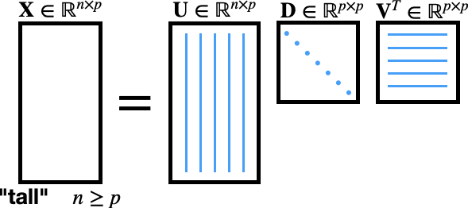
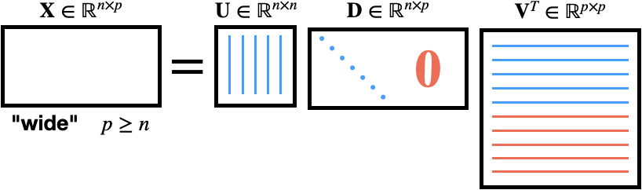
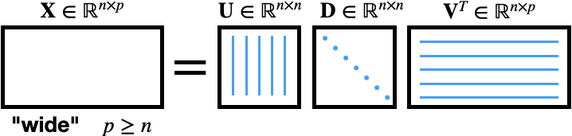
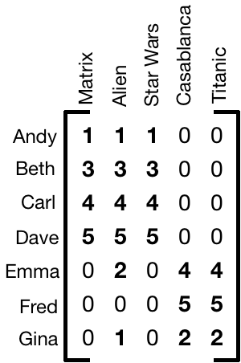
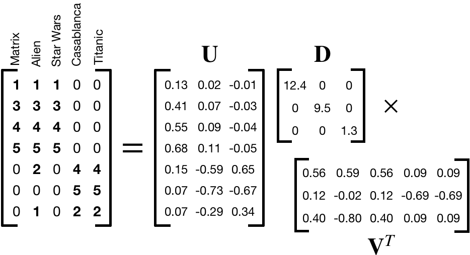
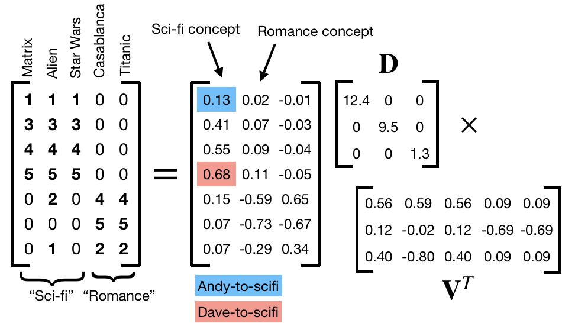
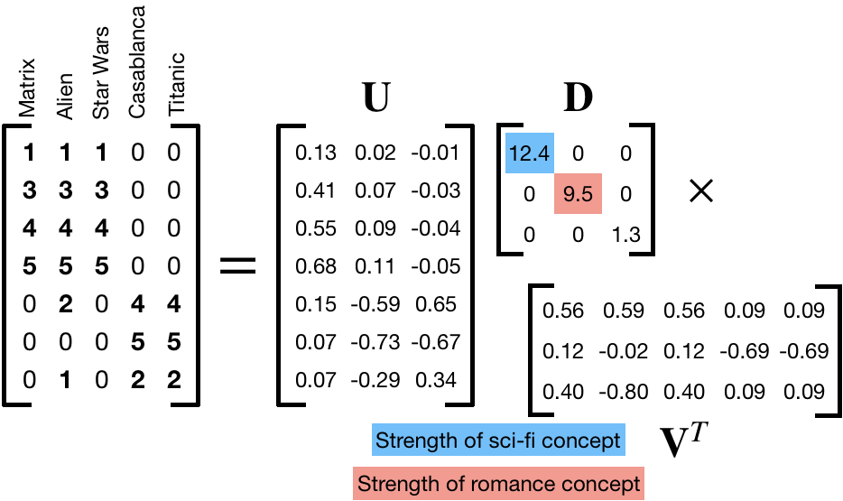
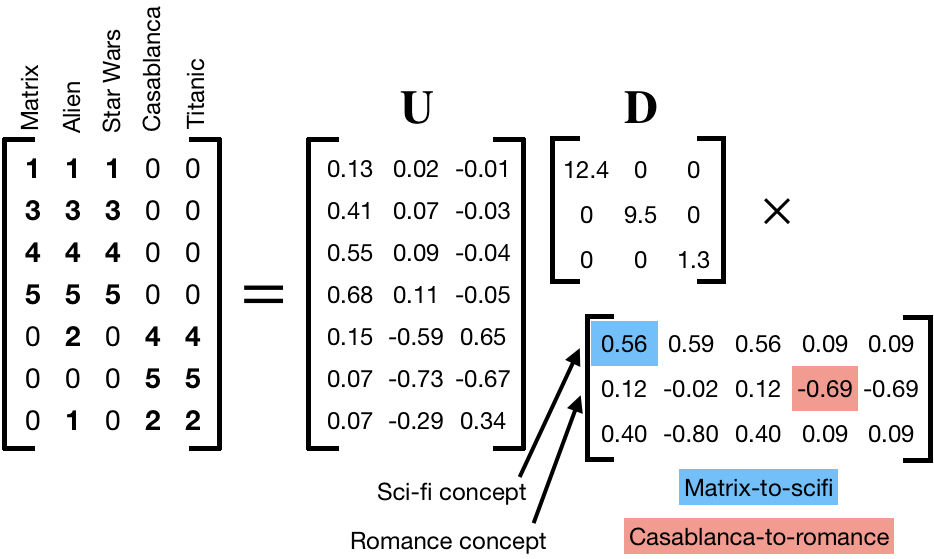
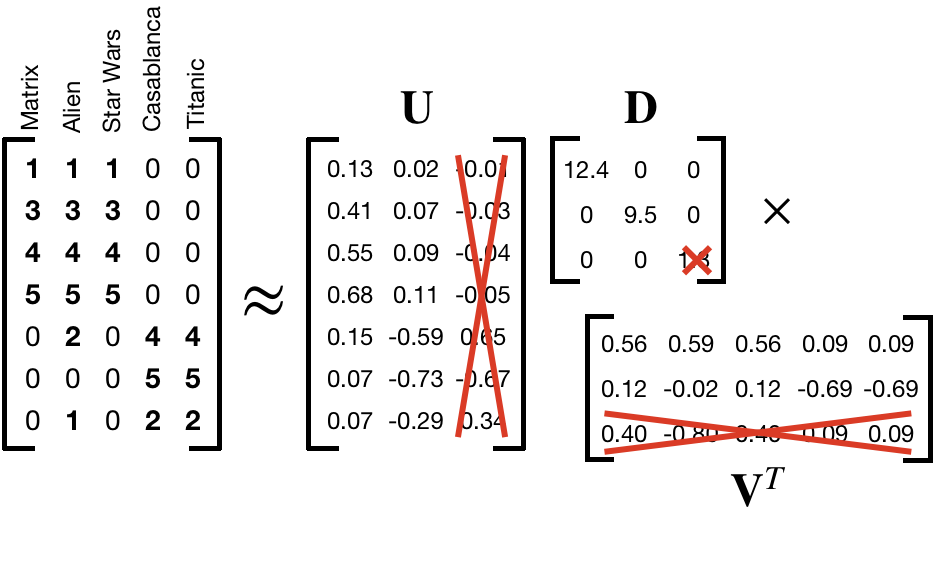

```{r setup, include=FALSE, purl=FALSE}
options(htmltools.dir.version = FALSE)
knitr::opts_chunk$set(comment = "##")
knitr::opts_chunk$set(cache = TRUE)
library(kableExtra)
library(tidyverse)
```


# Outline

1. Singular Value Decomposition (SVD)
2. Dimension Reduction
2. Image Analysis
3. Cluster Analysis
4. Project 2

.middler[**Goal:** Learn how to interpret and use the SVD in practice! (Project 2)]

---
class: inverse

.sectionhead[Part 1. Singular Value Decomposition (SVD)]

---
layout: true

# SVD

---

## Motivation

Often times, we are interested in identifying patterns or other interesting information in *high-dimensional* data, as is often done in clustering. Or we want to preserve the inherent structure in our data while reducing the complexity and size, such as image compression. Other times, we may want to assess variable importance. SVD provides a powerful tool to do all of these things, and more!

* Image compression
* De-noising
* Clustering / pattern detection
* Variable selection
* Recommendation systems

--

.middler[]

---

## Definition

A **singular value decomposition**, or **SVD**, is a decomposition (obviously). It is not a function or transformation! 

$$\mathbf{X} = \mathbf{U} \mathbf{D} \mathbf{V}^T$$

* **Input:** Any $n \times p$ matrix $\mathbf{X}$
* **Output:**
  * $\mathbf{U}$: $n \times n$ orthogonal<sup>[1]</sup> matrix
  * $\mathbf{D}$: $n \times p$ matrix
  * $\mathbf{V}$: $p \times p$ orthogonal matrix

Note that $\mathbf{U}$, $\mathbf{D}$, and $\mathbf{V}$ are all **unique**!

While this definition of SVD is true for all matrices, in practice, we almost always encounter the SVD in *reduced form*.

$$\ $$

[1] A matrix $\mathbf{A}$ is orthogonal if $\mathbf{A}^T\mathbf{A}=\mathbf{A}\mathbf{A}^T = \mathbf{I}$, where $\mathbf{I}$ is the identity matrix.

---
layout: false

# Tall Matrix - Full SVD

.middler[]

---

# Tall Matrix - Reduced SVD

.middler[]

---

# Wide Matrix - Full SVD

.middler[]

---

# Wide Matrix - Reduced SVD

.middler[]


---
# Components of SVD

.center[]

* $\mathbf{U}$: left singular vectors, $\mathbf{u}$
  * Interpretation: map our $n$ observations to $p$ "concepts"
* $\mathbf{D}$: singular values, $\sigma$
  * Interpretation: strengths of each "concept"
* $\mathbf{V}$: right singular vectors, $\mathbf{v}$
  * Interpretation: map our $p$ variables to $p$ "concepts"


---

# Matrix Rank

The **rank** of a matrix is equal to

* the maximum number of **linearly independent** row vectors in the matrix
* the maximum number of **linearly independent** column vectors in the matrix

These definitions are equivalent.

Note that for a matrix $\mathbf{X}\in \mathbb{R}^{n \times p}$, the maximum possible 
$\text{rank}(\mathbf{X}) = \text{min(n,p)}$. If $\mathbf{X}$ has this rank, it is called a **full rank** matrix.

---

# Rank-k Approximation

Among the most useful properties of the SVD is that it provides us with a method to calculate the *optimal*<sup>[1]</sup> rank $k$ approximation to a matrix $\mathbf{X}$.

\\[
\begin{equation}
\tilde{\mathbf{X}}_k =\tilde{\mathbf{U}}_k\tilde{\mathbf{D}}_k\tilde{\mathbf{V}}_k^T = \sum_{i=1}^{k} \sigma_i \mathbf{u}_i\mathbf{v}_i^T
\end{equation}
\\]

* $\tilde{\mathbf{X}}_k$: best rank $k$ approximation to $\mathbf{X}$
* $\tilde{\mathbf{U}}_k$: first $k$ singular vectors (columns) of $\mathbf{U}$
* $\tilde{\mathbf{D}}_k$: leading $k\times k$ sub-block of $\mathbf{D}$
* $\tilde{\mathbf{V}}_k^T$: first $k$ singular vectors (rows) of $\mathbf{V}^T$ 

Note that we can also write out this approximation by summing up the product first $k$ singular values and singular vectors


.footnote[[1] Optimal in the L<sub>2</sub> sense. Not important for this class, but happy to talk about what this means in more detail if you are curious.]


---

layout: true

# Interpretation - Movie Ratings

---

.middler[]

.footnote[Thanks to [Mining of Massive Datasets, Chapter 11](http://www.mmds.org/) for this motivating data]

---

.middler[]

---

## $\mathbf{U}$ as "user-to-concept"

.center[]

.footnote[Note: Sign of the values aren't super important, except in how they contrast within singular vector. Focus on the magnitudes.]

---

## $\mathbf{D}$ as "strength of concept"

.center[]

---

## $\mathbf{V}^T$ as "movie-to-concept"

.center[]

.footnote[Note: Sign of the values aren't super important, except in how they contrast within singular vector. Focus on the magnitudes.]

---
layout: false

# A note on "concepts"

The concepts we are discussing are not objective. 
There is no "truth" inherent in our concepts of sci-fi and romance.
Even in this contrived and simplified example, we are reducing the movies to core ideas or genres that we are calling concepts.
In the real world these concepts are not so clear, we can only intuit them in so far as our data allows. 

For example, in our case without any previous knowledge, we might see from $\mathbf{V}^T$ that Matrix, Alien, and Star Wars are all closely related to something that Casablanca and Titanic are not. 
This gives us a concept of Sci-fi!
Likewise, we could do the same to "derive" our concept of romance.

After all, what's that third concept supposed to be?

---
class: inverse

.sectionhead[Part 2. Dimension Reduction]

---
layout: true

# Dimension Reduction
---

Maybe we think our third concept is just noise, what can we do?

Set it equal to $0$!

.center[]

---

Maybe we think our third concept is just noise, what can we do?

Set it equal to $0$!

.center[]

---


  
