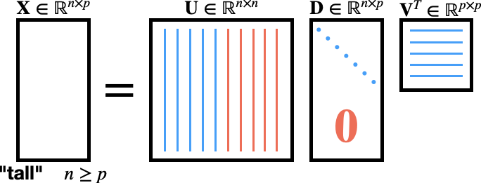
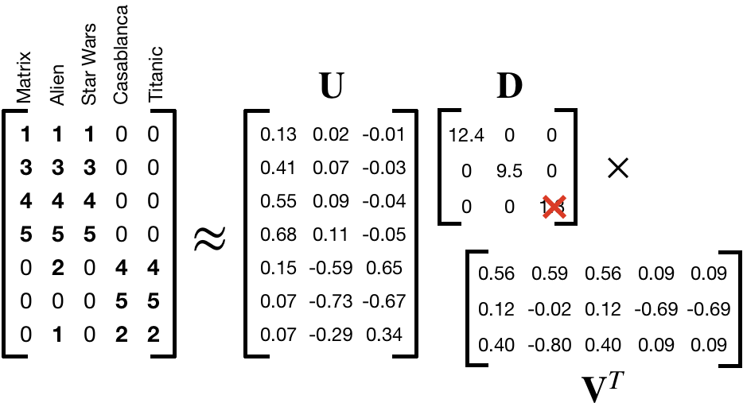
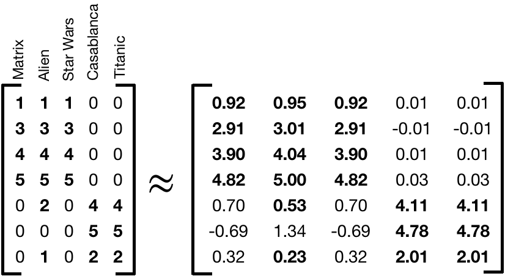
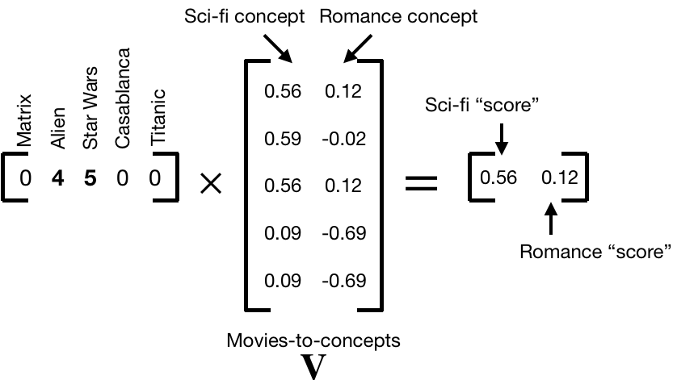

```{r setup, include=FALSE, purl=FALSE}
options(htmltools.dir.version = FALSE)
knitr::opts_chunk$set(comment = "##")
knitr::opts_chunk$set(cache = TRUE)
library(kableExtra)
library(tidyverse)
```


# Outline

1. Singular Value Decomposition (SVD)
2. Dimension Reduction
3. Image Analysis
4. Cluster Analysis
5. Project 2

.middler[**Goal:** Learn how to interpret and use the SVD in practice! (Project 2)]

---
class: inverse

.sectionhead[Part 1. Singular Value Decomposition (SVD)]

---
layout: true

# SVD

---

## Motivation

Often times, we are interested in identifying patterns or other interesting information in *high-dimensional* data, as is often done in clustering. Or we want to preserve the inherent structure in our data while reducing the complexity and size, such as image compression. Other times, we may want to assess variable importance. SVD provides a powerful tool to do all of these things, and more!

* Image compression
* De-noising
* Clustering / pattern detection
* Variable selection
* Recommendation systems

--

.middler[]

---

## Definition

A **singular value decomposition**, or **SVD**, is a decomposition (obviously). It is not a function or transformation! 

$$\mathbf{X} = \mathbf{U} \mathbf{D} \mathbf{V}^T$$

* **Input:** Any $n \times p$ matrix $\mathbf{X}$
* **Output:**
  * $\mathbf{U}$: $n \times n$ orthogonal<sup>[1]</sup> matrix
  * $\mathbf{D}$: $n \times p$ matrix
  * $\mathbf{V}$: $p \times p$ orthogonal matrix

Note that $\mathbf{U}$, $\mathbf{D}$, and $\mathbf{V}$ are all **unique**!

While this definition of SVD is true for all matrices, in practice, we almost always encounter the SVD in *reduced form*.

$$\ $$

[1] A matrix $\mathbf{A}$ is orthogonal if $\mathbf{A}^T\mathbf{A}=\mathbf{A}\mathbf{A}^T = \mathbf{I}$, where $\mathbf{I}$ is the identity matrix.

---
layout: false

# Tall Matrix - Full SVD

.middler[]

---

# Tall Matrix - Reduced SVD

.middler[]

---

# Wide Matrix - Full SVD

.middler[]

---

# Wide Matrix - Reduced SVD

.middler[]


---
# Components of SVD

.center[]

* $\mathbf{U}$: left singular vectors, $\mathbf{u}$
  * Interpretation: map our $n$ observations to $p$ "concepts"
* $\mathbf{D}$: singular values, $\sigma$
  * Interpretation: strengths of each "concept"
* $\mathbf{V}$: right singular vectors, $\mathbf{v}$
  * Interpretation: map our $p$ variables to $p$ "concepts"


---

# Matrix Rank

The **rank** of a matrix is equal to

* the maximum number of **linearly independent** row vectors in the matrix
* the maximum number of **linearly independent** column vectors in the matrix

These definitions are equivalent.

Note that for a matrix $\mathbf{X}\in \mathbb{R}^{n \times p}$, the maximum possible 
$\text{rank}(\mathbf{X}) = \text{min(n,p)}$. If $\mathbf{X}$ has this rank, it is called a **full rank** matrix.

---

# Rank-k Approximation

Among the most useful properties of the SVD is that it provides us with a method to calculate the *optimal*<sup>[1]</sup> rank $k$ approximation to a matrix $\mathbf{X}$.

\\[
\begin{equation}
\tilde{\mathbf{X}}_k =\tilde{\mathbf{U}}_k\tilde{\mathbf{D}}_k\tilde{\mathbf{V}}_k^T = \sum_{i=1}^{k} \sigma_i \mathbf{u}_i\mathbf{v}_i^T
\end{equation}
\\]

* $\tilde{\mathbf{X}}_k$: best rank $k$ approximation to $\mathbf{X}$
* $\tilde{\mathbf{U}}_k$: first $k$ singular vectors (columns) of $\mathbf{U}$
* $\tilde{\mathbf{D}}_k$: leading $k\times k$ sub-block of $\mathbf{D}$
* $\tilde{\mathbf{V}}_k^T$: first $k$ singular vectors (rows) of $\mathbf{V}^T$ 

Note that we can also write out this approximation by summing up the product first $k$ singular values and singular vectors


.footnote[[1] Optimal in the L<sub>2</sub> sense. Not important for this class, but happy to talk about what this means in more detail if you are curious.]


---

layout: true

# Interpretation - Movie Ratings

---

.middler[]

.footnote[Thanks to [Mining of Massive Datasets, Chapter 11](http://www.mmds.org/) for this motivating data]

---

.middler[]

---

## $\mathbf{U}$ as "user-to-concept"

.center[]

.footnote[Note: Sign of the values aren't super important, except in how they contrast within singular vector. Focus on the magnitudes.]

---

## $\mathbf{D}$ as "strength of concept"

.center[]

---

## $\mathbf{V}^T$ as "movie-to-concept"

.center[]

.footnote[Note: Sign of the values aren't super important, except in how they contrast within singular vector. Focus on the magnitudes.]

---
layout: false

# A note on "concepts"

The concepts we are discussing are not objective. 
There is no "truth" inherent in our concepts of sci-fi and romance.
Even in this contrived and simplified example, we are reducing the movies to core ideas or genres that we are calling concepts.
In the real world these concepts are not so clear, we can only intuit them in so far as our data allows. 

For example, in our case without any previous knowledge, we might see from $\mathbf{V}^T$ that Matrix, Alien, and Star Wars are all closely related to something that Casablanca and Titanic are not. 
This gives us a concept of Sci-fi!
Likewise, we could do the same to "derive" our concept of romance.

After all, what's that third concept supposed to be?

---
class: inverse

.sectionhead[Part 2. Dimension Reduction]

---
layout: true

# Dimension Reduction
---

Maybe we think our third concept is just noise, what can we do?

Set it equal to $0$!

.center[]

---

Maybe we think our third concept is just noise, what can we do?

Set it equal to $0$!

.center[]

---

Maybe we think our third concept is just noise, what can we do?

Set it equal to $0$!

.center[]

---

Maybe we think our third concept is just noise, what can we do?

Set it equal to $0$!

.center[]

---
layout: false

# Recommendation System

What if we have rankings for a new user, and we want to make an educated guess about what genres they prefer for recommendations?

.center[]

Note: We can use a similar procedure multiplying several users' ratings of a new movie by $\mathbf{U}$ users-to-concepts vectors in order to put movies into certain genres!

---
class: inverse

.sectionhead[Part 3. Image Analysis]

---
layout: true

# Image Analysis

---

We'll use the package `jpeg` for this section. There are other options for handling images in R, I encourage you to Google them if you end up working with images!

```{r}
library(jpeg)

# Load my image
tmp <- "https://raw.githubusercontent.com/bryandmartin/STAT302/master/images/cameraman.jpg"

# Read image into R
img <- readJPEG(readBin(tmp, "raw",1e6))
dim(img)
img[1:5, 1:5]
```

---

Note my image is $256 \times 256$ pixels because it is grayscale. Thus, it is just a matrix! The values in the matrix represent the intensity (darkness) of the grayscale.

If I had loaded a color version of this image, it would have been an array of size $256 \times 256 \times 3$, with one channel for red, blue, and green colors.

---

Here I create a function to display an image. Don't worry too much about the details. It is mostly just initializing an empty plot as a place to display my image.

```{r}
img_plot <- function(img, ...) {
  # type = 'n' plots empty points
  # labels are empty using xlab and ylab
  # xaxt and yaxt remove the ticks
  # `...` allows me to set arbitrary graph parameters, like main
  plot(1:2, type = "n", xlab = " ", ylab = " ", xaxt = "n", yaxt = "n", ...)
  rasterImage(img, 1.0, 1.0, 2.0, 2.0)
}
```


---


```{r, eval = FALSE}
img_plot(img, main = "Cameraman")
```

.center[
```{r, echo = FALSE}
img_plot(img, main = "Cameraman")
```
]

---

First we create a function to generate the best rank $k$ approximation of any matrix $A$.

```{r}
SVD_approx <- function(A, k) {
  # Generate components of SVD
  a_svd <- svd(A)
  sing_vals <- a_svd$d
  U <- a_svd$u
  V <- a_svd$v
  # Turn singular values into diagonal matrix. Be careful if k = 1!
  if (k == 1) {
    D <- matrix(sing_vals[1], nrow = 1, ncol = 1)
  } else {
    D <- diag(sing_vals[1:k])
  }
  # Calculate best rank-k approximation
  A_approx <- U[, 1:k] %*% D %*% t(V[, 1:k])
  return(A_approx)
}
```

---

Next we make a function that uses `SVD_approx()` to plot the best rank $k$ approximation to our image.
Note that pixel intensity values must be between $0$ and $1$, so we cap all values to fall within that range.

```{r}
img_approx <- function(img, k){
  approx_mat <- SVD_approx(img, k)
  # Cap minimum intensity
  approx_mat[approx_mat < 0] <- 0
  # Cap maximum intensity
  approx_mat[approx_mat > 1] <- 1
  img_plot(approx_mat, main = paste0("Best rank ", k, " approximation"))
  # Comment out return for purposes of slides
  # We don't want to store the approximation, only plot it
  # return(approx_mat)
}
```

---

```{r, fig.align = 'center'}
img_approx(img, 200)
```

---

```{r, fig.show = "hold", out.width = "33%"}
img_approx(img, 1)
img_approx(img, 2)
img_approx(img, 3)
```

---

```{r, fig.show = "hold", out.width = "33%"}
img_approx(img, 5)
img_approx(img, 10)
img_approx(img, 25)
```

---
layout: false
layout: true

# How many singular values?

---

We will define the **energy** of a matrix as the sum of the squared singular values,
\\[
\text{energy}(\mathbf{A}) = \sum_i \sigma^2_i.
\\]
We can plot the energy stored in each singular value, as well as the cumulative energy as follows:

```{r}
svd_img <- svd(img)
sing_vals2 <- svd_img$d^2
energy_df <- data.frame("sing_vals" = sing_vals2,
                        "energy" = cumsum(sing_vals2)/sum(sing_vals2))
dim(energy_df)
```

Thus we have a total of `r nrow(energy_df)` singular values, meaning our image matrix is of rank `r nrow(energy_df)`! 

---

```{r, fig.show = "hold", out.width = "40%"}
ggplot(energy_df, aes(x = 1:nrow(energy_df), y = sing_vals)) +
  geom_point() +
  theme_bw(base_size = 20) +
  labs(y = "Singular Values", x = "k")
ggplot(energy_df, aes(x = 1:nrow(energy_df), y = energy)) +
  geom_point() +
  theme_bw(base_size = 20) +
  labs(y = "Cumulative Energy", x = "k")
```

---

In general, if we are using SVD to do dimension reduction, a common rule of thumb is that we want to retain 90% of the energy. 
However, for image compression, this likely will be too much compression!

```{r, fig.align = "center", out.width = "45%"}
# which.max will return index of first TRUE
k <- which.max(energy_df$energy > .90)
img_approx(img, k)
```

---

What if we want to retain 99.8% of the energy in our image?

```{r, fig.align = "center", out.width = "55%"}
k <- which.max(energy_df$energy > .998)
img_approx(img, k)
```

---

We were able to retain 99.8% of the energy in our image using only `r k` singular values!
Thus, we are able to reduce the dimensionality of our matrix by `r (1 - k/nrow(energy_df))*100`%.
This is a similar concept to how JPEG compression works!<sup>1</sup>

.footnote[[1] A similar concept, but not the same algorithm. JPEG compression uses something called the discrete cosine transformation, not SVD.]

---
layout: false
layout: true

# Clustering
---

What if we want to get a sense of the inherent groupings, or **clusters**, in our data?

Let's load the `foreign` package to read in a `.dta` file.

```{r}
library(foreign)
cereal <- read.dta("http://statistics.ats.ucla.edu/stat/data/cerealnut.dta")
head(cereal)
```

---

We have data of nutritional information about various cereals.
Here, we are interested in analyzing which cereals are similar to each other.
We can do this using exploratory analysis with SVD!

For now, we'll stick to a simple visual analysis (more on clustering later in the course).
Thus, we will only plot our data along two dimensions.

Because we are interested in cereal clusters, we want to look at the cereal-to-concept values.
Because cereals are our observations, this is the columns of $\mathbf{U}$.

---


```{r, fig.align = "center", out.width = "36%"}
library(ggrepel)
# remove the text brand labels
cereal_svd <- svd(cereal[, -1])
cereal_df <- data.frame("x" = cereal_svd$u[, 1],
                        "y" = cereal_svd$u[, 2],
                        "label" = cereal$brand)
ggplot(cereal_df, aes(x = x, y = y, label = label)) +
  geom_point() +
  theme_bw(base_size = 20) +
  geom_text_repel(size = 4)
```

---

```{r, fig.align = "center", echo = FALSE, out.width = "45%"}
ggplot(cereal_df, aes(x = x, y = y, label = label)) +
  geom_point() +
  theme_bw(base_size = 20) +
  geom_text_repel(size = 4)
```

* bran cereals
* sugary cereals
* raisin cereals
* cereals with honey

---

What factors contributed most to each dimension? Look at the columns of $\mathbf{V}$ (the rows of $\mathbf{V}^T$).

```{r, fig.align = "center", out.width = "50%", eval = FALSE}
cereal_df <- data.frame("x" = cereal_svd$v[, 1],
                        "y" = cereal_svd$v[, 2],
                        "label" = colnames(cereal)[-1])
ggplot(cereal_df, aes(x = x, y = y, label = label)) +
  geom_point() +
  theme_bw(base_size = 20) +
  geom_text_repel(size = 4)
```

---

.middler[
```{r, fig.align = "center", out.width = "40%", echo = FALSE}
cereal_df <- data.frame("x" = cereal_svd$v[, 1],
                        "y" = cereal_svd$v[, 2],
                        "label" = colnames(cereal)[-1])
ggplot(cereal_df, aes(x = x, y = y, label = label)) +
  geom_point() +
  theme_bw(base_size = 25) +
  geom_text_repel(size = 6)
```
]

* Bran cereals have the most potassium
* Saltier cereals farther to the left

---

We can also look at the nutrient-to-concept "scores" of each dimension.
Recall that to calculate user-to-concept scores in the movie ranking data we multiplied $\mathbf{X} \mathbf{V}$.
To calculate nutrient-to-concept "scores", we calculate $\mathbf{U}^T \mathbf{X}$.

```{r, fig.align = "center", out.width = "45%", eval = FALSE}
scores <- t(cereal_svd$u) %*% as.matrix(cereal[,-1])
cereal_df <- data.frame("x" = scores[1, ],
                        "y" = scores[2, ],
                        "label" = colnames(cereal)[-1])
ggplot(cereal_df, aes(x = x, y = y, label = label)) +
  geom_point() +
  theme_bw(base_size = 20) +
  geom_text_repel(size = 4)
```

---

.middler[
```{r, fig.align = "center", out.width = "40%", echo = FALSE}
scores <- t(cereal_svd$u) %*% as.matrix(cereal[,-1])
cereal_df <- data.frame("x" = scores[1, ],
                        "y" = scores[2, ],
                        "label" = colnames(cereal)[-1])
ggplot(cereal_df, aes(x = x, y = y, label = label)) +
  geom_point() +
  theme_bw(base_size = 25) +
  geom_text_repel(size = 6)
```
]
Compare to the previous plot. This allows us to see the relative impact of each nutrient on our concepts.

---
layout: false
class: inverse

.sectionhead[Part 5. Project 2]

