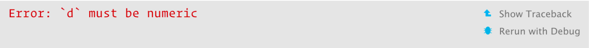
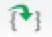
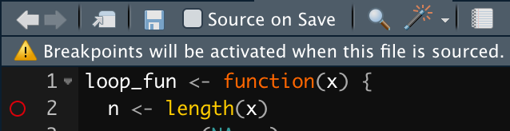
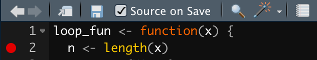
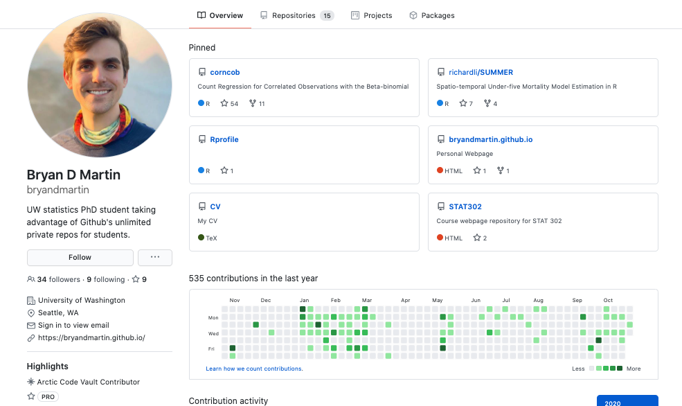

```{r setup, include=FALSE, purl=FALSE}
options(htmltools.dir.version = FALSE)
knitr::opts_chunk$set(comment = "##")
knitr::opts_chunk$set(cache = FALSE)
knitr::opts_chunk$set(error = TRUE)
library(kableExtra)
library(tidyverse)
```


# Outline

1. Debugging
2. Version Control

.middler[**Goal:** Learn how to understand and fix R errors independently and get started with git!]

---
class: inverse

.sectionhead[Part 1. Debugging]

---

# Acknowledgement

This section heavily borrows from materials by Hadley Wickham, Jennifer Bryan, and Jim Hester.

* [Hadley Wickham's Advanced R - Debugging](https://adv-r.hadley.nz/debugging.html)
* [Jennifer Bryan and Jim Hester's What they Forgot to Teach You About R - Debugging R Code](https://rstats.wtf/debugging-r-code.html)

Our [cheatsheet](https://github.com/ajmcoqui/debuggingRStudio/blob/b70a3575a3ff5e7867b05fb5e84568abba426c4b/RStudio_Debugging_Cheatsheet.pdf) comes from Amanda Gadrow.

---

# Step 1: Google!

Seriously. Always. When you see an error code you don't understand, Google it!

Not only that, Google the **exact text** of your error message (except for any references to filepaths, etc.).
R has millions of users and an incredibly active online community. If you encounter any error message, chances are someone has had to debug that exact error in the past.

---

# Step 2: Reset!

You will be amazed at how many issues will be solved by closing and re-opening R. This will be especially true when we get into package building. 

Sometimes, things get weird with your workspace, and you just need to start with a clean slate. It can be frustrating, because you don't know what was causing the issue, but also a relief, because it will be fixed!

Resetting will:

* Clear your workspace (better than `rm(list = ls()`!)
* Reset your options to their defaults (an easy one to miss!)
* Clear your search path (the order R looks for things)

---

# Step 3: Repeat!

When you encounter a bug, try to repeat it! Likely, it came about for a reason. 

When you do repeat it, you should repeat it with a minimal working example. This means you should remove as much code and simplify as much data as possible.

* Small and simple inputs
* No extraneous packages
* No unnecessary function calls

Example: did your function break with a large data matrix of real-world data stored within a package? How about if you just use a $3 \times 3$ matrix of $1$'s? 

---

# Step 4: Locate!

If you weren't able to fix a bug the "easy" way (found the solution on Google or just needed a reset), and you have a minimal working example demonstrating your bug, then you are ready for the really hard part: 
finding the bug.

Often (not always), once you find a bug, it is rather easy to fix.

.center[
]


--

.center[Finding bugs???]

---
layout: true
# <TT>traceback()</TT>: call stack

---

Sometimes functions(in functions(in functions(in functions(...)))) can get complicated...

```{r}
f <- function(a) g(a)
g <- function(b) h(b)
h <- function(c) i(c)
i <- function(d) {
  if (!is.numeric(d)) {
    stop("`d` must be numeric", call. = FALSE)
  }
  d + 10
}
f(5)
f(1:3)
```

---

.center[]

```{r, echo = FALSE}
saveTraceback <- local({
  savedTraceback <- NULL
  saver <- function(e) {
    calls <- sys.calls()
    deparsed <- lapply(calls, deparse)
    deparsed <- deparsed[-length(deparsed) + 0:1] # leave off last 2
    lastjunk <- max(grep("withCallingHandlers", deparsed))
    deparsed <- deparsed[-seq_len(lastjunk)]
    savedTraceback <<- deparsed
  }
  function(expr)
    withCallingHandlers(expr, error = saver)
})

traceback <- function() {
  base::traceback(rev(environment(saveTraceback)$savedTraceback))
}
```

```{r, eval = FALSE}
f("a")
```

```{r, eval = FALSE}
traceback() # Or, just click traceback within RStudio
```

```{r, echo = FALSE}
saveTraceback({f("a")})
traceback()
```

This is called a **call stack**.

---

```{r, echo = FALSE}
saveTraceback({f("a")})
traceback()
```

Read from bottom to top:
1. First call was to `f("a")`
2. Second call was `g(a)`
3. Third call was `h(b)`
4. Fourth call was `i(c)`
5. Fifth and last call was our error message, so we know `i(c)` triggered our error!

But we're not done yet...

We now know that our error occurred within `i(c)`, but we don't know *where* within `i(c)` our error occurred.

---

Note this is done in your **Console**, not your **Editor** pane! This is typically not a part of your reproducible workflow, this is you figuring out your own problems until you fix what actually belongs in your workflow.

Once you have the bug fixed, *then* put the debugged code in your Editor pane. 
In general, most debugging will be done through the **Console**!

---
layout: false

# Stop on error: <TT>traceback</TT>

We can also set `traceback()` as our default error handler using
```{r, eval = FALSE}
options(error = traceback)
```
and `traceback()` will automatically be called whenever we encounter an error. 
I personally don't like doing this, but to each their own.


---
layout: false
layout: true
# <TT>print(), cat(), str()</TT>: messages
---

Take your function, throw in a `print()` statement to see what the function is seeing.


```{r}
i <- function(d) {
  print(d)
  if (!is.numeric(d)) {
    stop("`d` must be numeric", call. = FALSE)
  }
  d + 10
}
f("a")
```

This is a quick and easy way to find bugs quickly. Probably the most common first step when manually debugging!
---

Take your function, throw in a `cat()` statement to see what the function is seeing. 


```{r}
i <- function(d) {
  cat("The value of input parameter d is:", d, "\n")
  cat("The class of input parameter d is:", class(d), "\n")
  if (!is.numeric(d)) {
    stop("`d` must be numeric", call. = FALSE)
  }
  d + 10
}
f("a")
```

I like to use `cat()` when I want to print myself more informative error messages, or when I want to print out multiple messages so that I can tell them apart.
---

Take your function, throw in a `str()` statement to see what the function is seeing.

```{r}
i <- function(d) {
  str(d)
  if (!is.numeric(d)) {
    stop("`d` must be numeric", call. = FALSE)
  }
  d + 10
}
f("a")
```

More specifically, `str()` can be used to see *the structure of* what the function is seeing. 
This can often be more informative if the structure is not what you expect (a common source of bugs!).

---

The main downside to these approaches is that it can get messy quickly if you use multiple print statements, and you cannot further investigate the object. 
However, many bugs come down to typos or other trivial errors, and print statements are often all you need!

---
layout: false
layout: true

# <TT>browser()</TT>: Interactive debugger

---

Sometimes, it may not be enough to just use print statements and locate a bug. You can get more information and interact with that information using `browser()`, an interactive debugger.

Within RStudio, you can also get right to an interactive debugger by clicking `Rerun with Debug`.

.center[]

---

Alternatively, we can plug `browser()` into our function, similarly to the print statements.

```{r, eval = FALSE}
i <- function(d) {
  browser()
  if (!is.numeric(d)) {
    stop("`d` must be numeric", call. = FALSE)
  }
  d + 10
}
f("a")
```


---

After you run a function with `browser()`, you will be *inside* of your function with an interactive debugger!

You will know it worked if you see a special prompt: `Browse[1]>`.

We can see:

* The environment within the function using the Environment pane
* The call stack using the new Traceback pane
* Special interactive debugging commands

.center[]


---

.center[.huge[[Demo](https://raw.githubusercontent.com/bryandmartin/STAT302/master/docs/LectureSlides/lectureslides6_debuggit/lectureslides_debuggit.Rmd)]]

<br/>

```{r, eval = FALSE}
# BROWSER DEMO
f <- function(a) g(a)
g <- function(b) h(b)
h <- function(c) i(c)
i <- function(d) {
  browser()
  if (!is.numeric(d)) {
    stop("`d` must be numeric", call. = FALSE)
  }
  d + 10
}
f("a")
```

---

## Interactive debugging commands

.center[]

* Next, `n`: executes the next step in the function. (If you have a variable named `n`, use `print(n)` to display its value.)

* Step into,  or `s`: works like next, but if the next step is a function, it will step into that function so you can explore it interactively. (Easy to get lost!)

* Finish,  or `f`: finishes execution of the current loop or function. Useful to skip over long for loops you don't need to interact with.

* Continue, `c`: leaves the debugger and continues execution of the function. Useful if you’ve fixed the bad state and want to check that the function proceeds correctly.

* Stop, `Q`: exits the debugger and returns to the R prompt.

---

## Interactive debugging commands

.center[]

* Enter (no text): repeat the previous interactive debugging command. Defaults to Next `n` if you haven't used any debugging commands yet.

* `where`: prints stack trace of active calls (the interactive equivalent of `traceback`).

---

## Other useful things to do

* `ls()`: List the current environment. You can use this to browse everything that the function is able to see at that moment.

* `str()`, `print()`: examine objects as the function sees them.

---

## A Note

If you execute the step of a function where the error occurs, you will exit interactive debugging mode, the error message will print, and you will be returned to the R prompt!
This can get annoying, because it stops you from interacting right when you hit the bug.

What I often do is execute my function within an interactive debugger until I hit the error so I know exactly where the error occurs. Then I execute my function again within an interactive debugger, stopping just before I trigger the error.
To check I'm in the right place, I then copy and paste the next line of code into my `Browse` console.
This will trigger the error without exiting the interactive debugger.

Once I am there, I am now interacting with the exact environment R is using before the error is triggered.
I then usually examine one-by-one each object in the environment to make sure the structure matches up with what I expect.
Usually doing this allows me to identify what object does not look what I expect and why, allowing me to fix it.
However, if I still can't figure it out, I then `s` "Step into" the next function and repeat this process.

---

.center[.huge[[Demo](https://raw.githubusercontent.com/bryandmartin/STAT302/master/docs/LectureSlides/lectureslides6_debuggit/lectureslides_debuggit.Rmd)]]

<br/>

```{r, eval = FALSE}
# BROWSER DEMO 2
loop_fun <- function(x) {
  # browser()
  n <- length(x)
  y <- rep(NA, n)
  z <- rep(NA, n)
  for (i in 1:n) {
    y[i] <- x[i] * 2
    z[i] <- y[i] * 2
  }
  return(list("y" = y, "z" = z))
}
loop_fun(1:5)
loop_fun(diag(1:5))
```
---
layout: false
layout: true
# Breakpoints
---

Breakpoints are an RStudio-specific tool that work as an alternative to `browser()`.
A breakpoint at a line is equivalent to a `browser()` call before that line, but with the benefit that you don't need to change your source code and worry about leaving a `browser()` where it doesn't belong.
Personally, I find them a bit more tedious because they require sourcing and saving, and I prefer working with code directly rather than IDE's.

To set a break point, just click the empty space next to a line number.
If your file is not saved, it will prompt you to save it. 
You will then then see an empty circle, indicating that RStudio will remember the breakpoint, but it has not been enabled.


In order to enable a breakpoint, you need to save and source file.
You can then enable as many breakpoints as you want with a single click.
However, as soon as you edit the file at all (even if you don't save), it will no longer be considered sourced, and you will have to re-source it to enable breakpoints.

.center[ &nbsp; &nbsp;  ]

---

.center[.huge[[Demo](https://raw.githubusercontent.com/bryandmartin/STAT302/master/docs/LectureSlides/lectureslides6_debuggit/lectureslides_debuggit.Rmd)]]

<br/>

```{r, eval = FALSE}
# BREAKPOINT DEMO
loop_fun <- function(x) {
  # browser()
  n <- length(x)
  y <- rep(NA, n)
  z <- rep(NA, n)
  for (i in 1:n) {
    y[i] <- x[i] * 2
    z[i] <- y[i] * 2
  }
  return(list("y" = y, "z" = z))
}
loop_fun(1:5)
loop_fun(diag(1:5))
```

---
layout: false

# Stop on error: <TT>recover</TT>

Note that we can also set an interactive debugger as our default error handler using `recover`
```{r, eval = FALSE}
options(error = recover)
```
This works similarly to `options(error = traceback)` except you will now be able to select a frame and interactively debug within the frames.
Again, I personally don't like doing this because often a quick bug I can identify right away from the error message without needing to enter an interactive debugger, so I don't like to have it do this on every error.

---

# Stop on error: <TT>recover</TT>


.center[.huge[[Demo](https://raw.githubusercontent.com/bryandmartin/STAT302/master/docs/LectureSlides/lectureslides6_debuggit/lectureslides_debuggit.Rmd)]]

<br/>

```{r, eval = FALSE}
# RECOVER DEMO
f <- function(a) g(a)
g <- function(b) h(b)
h <- function(c) i(c)
i <- function(d) {
  if (!is.numeric(d)) {
    stop("`d` must be numeric", call. = FALSE)
  }
  d + 10
}
# options(error = recover)
f("a")
```

---

# <TT>debug()</TT>: debug a function

If you want to enter the debugger for a function within a package, you can't just insert a `browser()`. 
Even for your own functions, it may be more convenient to debug the entire function rather than edit the source code.
When a function is in debug mode, it will remain in debug mode until you call `undebug()`.

---

.center[.huge[[Demo](https://raw.githubusercontent.com/bryandmartin/STAT302/master/docs/LectureSlides/lectureslides6_debuggit/lectureslides_debuggit.Rmd)]]

<br/>

```{r, eval = FALSE}
# DEBUG DEMO
debug(lm)
lm(mpg ~ wt, data = mtcars)
debug(f)
f("a")
undebug(lm)
undebug(f)
```

---

# <TT>debugonce()</TT>: debug a function

It can get tedious to `undebug()` every function you flagged with `debug()`.
As an alternative, you can call `debugonce()`, which will automatically undebug the function as soon as you exit the interactive debugger.

```{r, eval = FALSE}
debugonce(lm)
lm(mpg ~ wt, data = mtcars)
debugonce(f)
f("a")
```

---

# <TT>trace()</TT>: debug at chosen place

`trace()` is an alternative to `debug()`. It is similar in that a function will be traced until you call `untrace()`. 
It is more flexible in that it allows you to choose where you want to debug a function, but it can also be more complicated to use.

```{r}
trace(print, quote(if (is.numeric(x) && x >= 3) cat("hi\n")), print = FALSE)
print(1)
print(3)
untrace(print)
```

---

# <TT>trace()</TT>: debug at chosen place

.center[.huge[[Demo](https://raw.githubusercontent.com/bryandmartin/STAT302/master/docs/LectureSlides/lectureslides6_debuggit/lectureslides_debuggit.Rmd)]]

<br/>

```{r, eval = FALSE}
# TRACE DEMO
fun <- function() {
  for (i in 1:10000) {
    if (i == 9876) {
      stop("Oh no!")
    }
  }
}

# x <- as.list(body(fun))
# x
# as.list(x[[2]])
# as.list(x[[c(2, 4)]])
# as.list(x[[c(2, 4, 2)]])
# as.list(x[[c(2, 4, 2, 3)]])
trace(fun, browser, at = list(c(2, 4, 2, 3)))
fun()
```

---

# Debugging Summary

.middler-nocent[
### 1. Google!
### 2. Reset!
### 3. Repeat!

### 4. Locate:
* Call stack: `traceback()`
* Non-interactive messages: `print()`, `cat()`, `str()`
* Interactive debugging: breakpoints, `browser()`, `debug()`,
`debugonce()`, `trace()`, breakpoints
* Interactive debugging commands: Next `n`, Step into  `s`, Finish  `f`, Continue `c`, Stop `Q`, `where`
* Stop on error: `traceback` (non-interactive), `recover` (interactive)
]

---

# Debugging Resources

.middler-nocent[
* [Advanced R Debugging - Hadley Wickham ](https://adv-r.hadley.nz/debugging.html)
* [What they Forgot to Teach You About R - Jennifer Bryan and Jim Hester](https://rstats.wtf/debugging-r-code.html)
* [Debugging Techniques in RStudio - Amanda Gadrow](https://resources.rstudio.com/wistia-rstudio-conf-2018-2/debugging-techniques-in-rstudio-amanda-gadrow-4)
* [Debugging with RStudio Article - Jonathan McPherson](https://support.rstudio.com/hc/en-us/articles/200713843)
* [Introduction to debugging in R and RStudio - Jim Hester](https://www.jimhester.com/talk/2019-crug-debugging/)

<br/>

.center[[Cheatsheet](https://github.com/ajmcoqui/debuggingRStudio/blob/b70a3575a3ff5e7867b05fb5e84568abba426c4b/RStudio_Debugging_Cheatsheet.pdf)]
]

---

.middler[]

---
class: inverse

.sectionhead[Part 2. Version Control]

---

# Acknowledgement

Much of this section, particularly the install guide and getting started section, borrow heavily from the fantastic [Happy Git and GitHub for the useR](https://happygitwithr.com/) by Jenny Bryan and others.

---
layout: true
# Version Control
---

Have you ever had a paper/code look like this:

* draft1.docx
* Draft2.docx
* draft2_profcomments.docx
* draft_final.docx
* draftFINAL.docx
* finaldraftFinal.docx
* finalDraftFinal-comments.docx
* actualfinaldraft.docx
* actualfinaldraft2.docx
* thetruerealfinaliamdonewiththispaper.docx
* aaaaaaaguhgh.docx
* fdajsglasjdfFINISHED.docx

$\hspace{5em} \vdots$

---

.center[

]

---

.middler-nocent[
* At some point, this is going to interfere with your workflow
* Reversion can get difficult and border on impossible
* *Date modified* sorting can only get you so far
* Susceptible to computer crashes
* Makes working with collaborators a pain (who did what? when?)
]

---

Cloud-based services, like Dropbox and Google Drive, can help you with some of these challenges. 
In particular, they can make working with collaborators easier, because all changes will be synchronized and you will be able to always see the most recent version.

However, how will you know:

* Who changed what?
* When specific components were changed?
* What was on a previous version?

---

We want something that:

1. Keeps old versions indefinitionally (tracking changes, reversions become easy)
2. Keeps track of who changed what and when they changed it
3. Changes are automatically integrated into the most recent version, and conflicts receive warnings
4. Work with multiple collaborators

---
layout: false

# Git

**git** is an open-source version control system. 
git tracks all changes to all files in a project over time so there is a comprehensive record of each version of the project.

Each project is stored inside of a **repository** (similar structure to when we work with R projects!). The repository contains all relevant files to the project.

For large software projects, this usually means our repository contains folders and subfolders with source code, write-ups, data, etc.

---
# Data Analysis Repository Example

A possible (recommended) structure is to use `Data`/`Code`/`Analysis`/`Output`.

* `Data`: Raw and unprocessed data files. Put files in here to load, never edit the files within `Data`!
* `Code`: Put .R (or .py, etc.) files here. They can be loaded into .Rmd files or your writing, so that the same code files can be used across multiple files
* `Analysis`: Put .Rmd (or other text) files here. These files allow you to present your results.
* `Output`: Figures (.pdf, .png, etc), saved analysis output (.Rdata, .rda), and other files containing code output. You code should save output in a systematic way (not through the menu bar!) so that revisions are automatically worked throughout your analysis

---
# GitHub

git is software that can be used locally. 
You do not need access to the internet to do proper version control on your computer. 
However, if you want to share your work or collaborate with others, it is best to use an online repository hub such as **GitHub**.

Like RStudio with R, GitHub adds many user-friendly features to git. 

* Effective collaboration
* Code distribution
* Allow others to comment on your code and suggest changes (pull requests/issues)
* Building your coding portfolio!

---
class: inverse

.sectionhead[Please follow along with any slides marked with (*).]

---
# Install Git (*)

Installing and connecting all the software you need is truly half the battle.

* **Mac:** Congratulations, you are using a good operating system for software development and you are probably already done. Open the `Terminal` app and type `git --version` to find out which version you have and `which git` to find out where it is. If you see an offer to install command line tools, do so!
  * If for some reason you don't have git pre-installed, you can download it from [here](http://git-scm.com/downloads).

* **Linux:** Congratulations, you are using a good operating system for software development and you are probably already done. Open your console and type type `git --version` to find out which version you have and `which git` to find out where it is. If you don't have it, then it's easy to install.
  * Ubuntu or Debian Linux: `sudo apt-get install git`
  * Fedora or RedHat Linux: `sudo yum install git`
  
---

# Install Git - Windows (*)
  
* **Windows:** Whew... 

 * Install [Git for Windows](https://gitforwindows.org/) (also known as `msysgit` or "Git Bash")
 * **Important note:** When asked about "Adjusting your PATH environment", make sure to select "Git from the command line and also from 3rd-party software".
 * Note that RStudio for Windows prefers for Git to be installed below `C:/Program Files` and this appears to be the default. This implies, for example, that the Git executable on my Windows system is found at `C:/Program Files/Git/bin/git.exe`. Unless you have specific reasons to otherwise, follow this convention.
 
To quote Jenny Bryan: "Windows is not the ideal platform for scientific computing and software development. A lot of the functionality is going to feel janky and strapped on. Because it is."

Hopefully, after following the instructions above, you have a Git Bash shell. To check this, open your shell and type `echo $SHELL`. You should see something like `usr/bin/bash`.

---

# Shell

The **shell** is a program on your computer that runs other programs. 
Sometimes people use the terms `Terminal`, `Console`, `Command Line`, and `Shell` interchangably.

You can open a shell within RStudio:
  * *Tools > Terminal* to launch a shell within RStudio. This will often be sufficient for our purposes
  * *Tools > Shell* to launch a shell external to RStudio.
  * **Windows:** For this class, we will focus on the **Git Bash** shell, which should have come with your install of Git for Windows. First, confirm that RStudio detected the presence of Git Bash. This should have happened automatically if you installed in the default location, but check by going to *Tools > Global Options > Terminal* and make sure you see "Git Bash" under "New terminals open with:".
  
---

# Shell
  
To open a shell outside of RStudio:
  * Mac/Linux: Search for the application `Terminal` on your computer and open it.
  * Windows: The easiest way is to open "Git" within the Windows menu and select "Git Bash". You may sometimes need to run Git Bash as an administrator, in which case you should right click and select that option.
  
---

# Basic Shell Commands

* `pwd` (**p**rint **w**orking **d**irectory). Shows the current working directory of your shell.
* `ls` (**l**ist **f**iles). Shows the files in the current working directory. Use `ls -a` to also list hidden files, such as .Rhistory and .git.
* `cd` (**c**hange **d**irectory). Allows you to navigate through your directories by changing the shell’s working directory.
  * You can still use relative paths such as `..` and `.`
  * `~` is still your home directory
  * You can drag and drop a file or folder into the shell window to paste the absolute path
  * You can use `Tab` to autocomplete unambiguous directory and file names. 
* Navigate previous commands with arrow-up and arrow-down
* Search for previous commands with `ctrl + r`

---

# Basic git commands 

These commands are used within shell

* `git status` Informs you of your current branch, any changes or untracked files, and whether you are in sync with your remotes.
* `git remote -v` lists all remotes. Very useful for making sure git knows about your remote and that the remote address is correct.
* `git remote add origin GITHUB_URL` adds the remote `GITHUB_URL` with nickname origin.
* `git add FILENAME` stages changes to the file. Will add the file to the tracked files if it isn't already. Use `git add .` to add all untracked files (but be careful with this!)
* `git commit -m "COMMIT MESSAGE"` commit all staged changes
* `git pull` pulls from remote to local copy
* `git push` pushes from local copy to remote
* `git init` creates an empty git repo within your current directory

---

# Register a GitHub Account (*)

Go to [https://github.com](https://github.com) and register a free account!
Remember, GitHub can become a part of your professional portfolio, and it likely will if you plan to do any coding as part of your career. So choose your username **carefully**! Some rules of thumb:

* Incorporate your actual name to increase visibility and recognizability
* Shorter is better than longer
* You should be willing to show your boss
* Make it timeless (don't include your current university affiliation, etc)
* All lowercase is recommended

All users get unlimited free private repositories with up to three collaborators. As students, I highly recommend you sign up for free student benefits at [https://education.github.com/](https://education.github.com/), which includes unlimited free private repositories with unlimited collaborators.

---

# Register a GitHub Account (*)

.center[]

---

# Set up git (*)

Run the following in your shell (filling in your information, of course):

```{bash, eval = FALSE}
git config --global user.name 'Firstname Lastname'
git config --global user.email 'email@website.com'
git config --global --list
```

**Note:** The email should be the email associated with your GitHub account!

I also suggest you set up your default editor. At some point when you have a merge conflict, git will push you into an editor to resolve it. It should be the one you prefer! (I use Sublime Text on a Mac)

For example, if you like `emacs`, you can do

```{bash, eval = FALSE}
git config --global core.editor "emacs"
```

Check out [Software Carpentry's guide](https://swcarpentry.github.io/git-novice/02-setup/) for more examples of what line to run for different editor-operating system combinations.

---

# Recommended: Install a git client (*)

I highly recommend installing a GUI for git. 
I like [GitKraken](https://www.gitkraken.com/), and it works on all common operating systems.

See [https://happygitwithr.com/git-client.html](https://happygitwithr.com/git-client.html) to see Jenny Bryan's writeup of more git clients as well as why they are helpful.

---
class: inverse

.sectionhead[The next few things will be your submission for Short Lab 4]

---
# Create a git repo (*)

.middler-nocent[
1. Go to GitHub and click the green "New Repository" button. 
2. Repository name: `shortlab4` or similar, following the naming conventions you've used in the class so far.
3. Description: Whatever you want, but fill in something.
4. Public or Private. If private, you **must** add `bryandmartin` and `mumudididi` as collaborators.
5. YES initialize the repository with a README.
]

---
# Clone your git repo (*)

.middler-nocent[
1. Open a shell window.
2. **Change your working directory to your `ShortLabs` (or similar) parent folder for your short labs.**
3. Clone the repo by entering (filling in the relevant info):
  ```{bash, eval = FALSE}
  git clone https://github.com/YOUR-USERNAME/YOUR-REPOSITORY.git
  ```
  Note that you can get the direct link by navigating to your repo and clicking the green "Clone or download" button and copying the text there.

4. Explore your repo by entering (filling in the relevant info):
  ```{bash, eval = FALSE}
  cd YOUR-REPOSITORY
  ls
  head README.md
  git remote show origin
  git status
  ```
]

---

# Commit and push a local change (*)

1. Edit your README within shell by using the following line.
  ```{bash, eval = FALSE}
  echo "A line I wrote using the shell on my local computer" >> README.md
  ```

2. Check the status
  ```{bash, eval = FALSE}
  git status
  ```

3. Stage your commit and check the status
  ```{bash, eval = FALSE}
  git add .
  git status
  ```

4. Commit and push and check the status
  ```{bash, eval = FALSE}
  git commit -m "A commit from my local computer"
  git push
  git status
  ```
  
Now check the repository online at GitHub. What changed?


---

# Add Short Lab 4 (*)


1. Navigate to [the shortlab section of the course webpage](https://bryandmartin.github.io/STAT302/shortlabs.html).
2. Download the .Rmd for Short Lab 4
3. Using your standard file browser, copy the .Rmd into the git repo you created for the previous slides.
4. In the Short Lab 4 .Rmd, fill in the required text for the link to your repo
5. Knit/Compile Short Lab 4
6. Add, commit, and push the change to your remote repository following the relevant steps from the previous slide.

Now check the repository online at GitHub. If you see a README, .Rmd, and .html, then congratulations, you are done with this step!

---

# Note on credentials (*)

Hopefully, with your second pushed commit, you weren't prompted to re-enter your GitHub credentials. If this is true, then you can skip this slide.

If you were prompted to re-enter your GitHub credentials, then please follow the instruction in [Chapter 10 of happygitwithr](https://happygitwithr.com/credential-caching.html).


---

# Use git through RStudio (*)

After you have confirmed that the online GitHub repository matches what you expect:

1. Delete the local repository on your computer.
2. *File > New Project > Version Control > Git*. In the "repository URL", paste the HTTPS URL for your repository.
3. **Create this project within your `ShortLabs` parent directory for short labs!**
4. Click "Open in new session"

**This is the recommended set up for all of your R projects!** 

That is, first create on GitHub, then clone through RStudio. (Not clone through shell and then delete and then re-clone, this was done for demonstration purposes only.)

---

# Edit your repo through RStudio (*)

You should now have re-created the `shortlab4` (or similar) sub-folder within `ShortLabs`, and it should be associated with an R project.
If it is not already open, open that R project by double clicking on the project file.

**You should now see a `Git` pane within RStudio!**

1. Within the `Files` pane of RStudio, open `README.md`.
2. Add a new line of text "A commit from RStudio" to `README.md` and save.
3. Click `Diff` within the `Git` pane.
4. Click the box under `Staged` for the changed file (top left box).
5. Add a commit message within the box (top right).
6. Click push (top right).


---

# Finished with Short Lab 4? (*)

Now check the repository online at GitHub. You should see a README, .Rmd, and .html.
Your README should include two lines indicating that it was edited from both the shell on your local computer and RStudio.

If this is true, then congratulations, you are done with this Short Lab 4!

If this is not true, then let me know and we will work through it together!

Don't forget, if you created a private repository, be sure to add both `bryandmartin` and `mumudididi` as collaborators.

---

# More on git and GitHub

I highly encourage you to check out [Happy Git and GitHub for the useR](https://happygitwithr.com/) by Jenny Bryan and others for more details on much of what we went over for this section.

There are also several helpful public cheatsheets available for [git](https://www.atlassian.com/git/tutorials/atlassian-git-cheatsheet).


