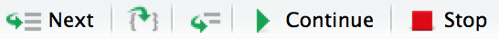

```{r setup, include=FALSE, purl=FALSE}
options(htmltools.dir.version = FALSE)
knitr::opts_chunk$set(comment = "##")
knitr::opts_chunk$set(cache = FALSE)
knitr::opts_chunk$set(error = TRUE)
library(kableExtra)
library(tidyverse)
```


# Outline

1. Debugging
2. Version Control

.middler[**Goal:** Learn how to understand and fix R errors independently and get started with git!]

---
class: inverse

.sectionhead[Part 1. Debugging]

---

# Acknowledgement

This section heavily borrows from materials by Hadley Wickham, Jennifer Bryan, and Jim Hester.

* [Hadley Wickham's Advanced R - Debugging](https://adv-r.hadley.nz/debugging.html)
* [Jennifer Bryan and Jim Hester's What they Forgot to Teach You About R - Debugging R Code](https://rstats.wtf/debugging-r-code.html)

Our [cheatsheet](https://github.com/ajmcoqui/debuggingRStudio/blob/b70a3575a3ff5e7867b05fb5e84568abba426c4b/RStudio_Debugging_Cheatsheet.pdf) comes from Amanda Gadrow.

---

# Step 1: Google!

Seriously. Always. When you see an error code you don't understand, Google it!

Not only that, Google the **exact text** of your error message (except for any references to filepaths, etc.).
R has millions of users and an incredibly active online community. If you encounter any error message, chances are someone has had to debug that exact error in the past.

---

# Step 2: Reset!

You will be amazed at how many issues will be solved by closing and re-opening R. This will be especially true when we get into package building. 

Sometimes, things get weird with your workspace, and you just need to start with a clean slate. It can be frustrating, because you don't know what was causing the issue, but also a relief, because it will be fixed!

Resetting will:

* Clear your workspace (better than `rm(list = ls()`!)
* Reset your options to their defaults (an easy one to miss!)
* Clear your search path (the order R looks for things)

---

# Step 3: Repeat!

When you encounter a bug, try to repeat it! Likely, it came about for a reason. 

When you do repeat it, you should repeat it with a minimal working example. This means you should remove as much code and simplify as much data as possible.

* Small and simple inputs
* No extraneous packages
* No unnecessary function calls

Example: did your function break with a large data matrix of real-world data stored within a package? How about if you just use a $3 \times 3$ matrix of $1$'s? 

---

# Step 4: Locate!

If you weren't able to fix a bug the "easy" way (found the solution on Google or just needed a reset), and you have a minimal working example demonstrating your bug, then you are ready for the really hard part: 
finding the bug.

Often (not always), once you find a bug, it is rather easy to fix.

.center[
]


--

.center[Finding bugs??? Come on. This is top-notch gif humor.]

---
layout: true
# <TT>traceback()</TT>: call stack

---

Sometimes functions(in functions(in functions(in functions(...)))) can get complicated...

```{r}
f <- function(a) g(a)
g <- function(b) h(b)
h <- function(c) i(c)
i <- function(d) {
  if (!is.numeric(d)) {
    stop("`d` must be numeric", call. = FALSE)
  }
  d + 10
}
f(5)
f(1:3)
```

---

.center[]

```{r, echo = FALSE}
saveTraceback <- local({
  savedTraceback <- NULL
  saver <- function(e) {
    calls <- sys.calls()
    deparsed <- lapply(calls, deparse)
    deparsed <- deparsed[-length(deparsed)+0:1] # leave off last 2
    lastjunk <- max(grep("withCallingHandlers", deparsed))
    deparsed <- deparsed[-seq_len(lastjunk)]
    savedTraceback <<- deparsed
  }
  function(expr)
    withCallingHandlers(expr, error = saver)
})

traceback <- function() {
  base::traceback(rev(environment(saveTraceback)$savedTraceback))
}
```

```{r, eval = FALSE}
f("a")
```

```{r, eval = FALSE}
traceback() # Or, just click traceback within RStudio
```

```{r, echo = FALSE}
saveTraceback({f("a")})
traceback()
```

This is called a **call stack**.

---

```{r, echo = FALSE}
saveTraceback({f("a")})
traceback()
```

Read from bottom to top:
1. First call was to `f("a")`
2. Second call was `g(a)`
3. Third call was `h(b)`
4. Fourth call was `i(c)`
5. Fifth and last call was our error message, so we know `i(c)` triggered our error!

But we're not done yet...

We now know that our error occurred within `i(c)`, but we don't know *where* within `i(c)` our error occurred.

---

Note that we can also set `traceback()` as our default error handler using
```{r, eval = FALSE}
options(error = traceback)
```
and `traceback()` will automatically be called whenever we encounter an error. 
I personally don't like doing this, but to each their own.

---

Note this is done in your **Console**, not your **Editor** pane! This is typically not a part of your reproducible workflow, this is you figuring out your own problems until you fix what actually belongs in your workflow.

Once you have the bug fixed, *then* put the debugged code in your Editor pane. 
In general, most debugging will be done through the **Console**!

---
layout: false
layout: true
# <TT>print(), cat(), str()</TT>: messages
---

Take your function, throw in a `print()` statement to see what the function is seeing.


```{r}
i <- function(d) {
  print(d)
  if (!is.numeric(d)) {
    stop("`d` must be numeric", call. = FALSE)
  }
  d + 10
}
f("a")
```

This is a quick and easy way to find bugs quickly. Probably the most common first step when manually debugging!
---

Take your function, throw in a `cat()` statement to see what the function is seeing. 


```{r}
i <- function(d) {
  cat("The value of input parameter d is:", d, "\n")
  cat("The class of input parameter d is:", class(d), "\n")
  if (!is.numeric(d)) {
    stop("`d` must be numeric", call. = FALSE)
  }
  d + 10
}
f("a")
```

I like to use `cat()` when I want to print myself more informative error messages, or when I want to print out multiple messages so that I can tell them apart.
---

Take your function, throw in a `str()` statement to see what the function is seeing.

```{r}
i <- function(d) {
  str(d)
  if (!is.numeric(d)) {
    stop("`d` must be numeric", call. = FALSE)
  }
  d + 10
}
f("a")
```

More specifically, `str()` can be used to see *the structure of* what the function is seeing. 
This can often be more informative if the structure is not what you expect (a common source of bugs!).

---

The main downside to these approaches is that it can get messy quickly if you use multiple print statements, and you cannot further investigate the object.

---
layout: false
layout: true

# <TT>browser()</TT>: Interactive debugger

---

Sometimes, it may not be enough to just use print statements and locate a bug. You can get more information and interact with that information using `browser()`, an interactive debugger.

Within RStudio, you can also get right to an interactive debugger by clicking `Rerun with Debug`.

.center[]

---

Alternatively, we can plug `browser()` into our function, similarly to the print statements.

```{r, eval = FALSE}
i <- function(d) {
  browser()
  if (!is.numeric(d)) {
    stop("`d` must be numeric", call. = FALSE)
  }
  d + 10
}
f("a")
```


---

After you run a function with `browser()`, you will be *inside* of your function with an interactive debugger!

You will know it worked if you see a special prompt: `Browse[1]>`.

We can see:

* The environment within the function using the Environment pane
* The call stack using the new Traceback pane
* Special interactive debugging commands

.center[]

<br/>

.center[.huge[[Demo](https://raw.githubusercontent.com/bryandmartin/STAT302/master/docs/LectureSlides/lectureslides7/lectureslides7.Rmd)]]

```{r, echo = FALSE, eval = FALSE}
# BROWSER DEMO
f <- function(a) g(a)
g <- function(b) h(b)
h <- function(c) i(c)
i <- function(d) {
  browser()
  if (!is.numeric(d)) {
    stop("`d` must be numeric", call. = FALSE)
  }
  d + 10
}
f("a")
```

---

## Interactive debugging commands

.center[]

* Next, `n`: executes the next step in the function. (If you have a variable named `n`, use `print(n)` to display its value.)

* Step into,  or `s`: works like next, but if the next step is a function, it will step into that function so you can explore it interactively. (Easy to get lost!)

* Finish,  or `f`: finishes execution of the current loop or function. Useful to skip over long for loops you don't need to interact with.

* Continue, `c`: leaves the debugger and continues execution of the function. Useful if you’ve fixed the bad state and want to check that the function proceeds correctly.

* Stop, `Q`: exits the debugger and returns to the R prompt.

---

## Interactive debugging commands

.center[]

* Enter (no text): repeat the previous interactive debugging command. Defaults to Next `n` if you haven't used any debugging commands yet.

* `where`: prints stack trace of active calls (the interactive equivalent of `traceback`).

---

## Other useful things to do

* `ls()`: List the current environment. You can use this to browse everything that the function is able to see at that moment.

* `str()`, `print()`: examine objects as the function sees them.

---

## A Note

If you execute the step of a function where the error occurs, you will exit interactive debugging mode, the error message will print, and you will be returned to the R prompt!
This can get annoying, because it stops you from interacting right when you hit the bug.

What I often do is execute my function within an interactive debugger until I hit the error so I know exactly where the error occurs. Then I execute my function again within an interactive debugger, stopping just before I trigger the error.
To check I'm in the right place, I then copy and paste the next line of code into my `Browse` console.
This will trigger the error without exiting the interactive debugger.

Once I am there, I am now interacting with the exact environment R is using before the error is triggered.
I then usually examine one-by-one each object in the environment to make sure the structure matches up with what I expect.
Usually doing this allows me to identify what object does not look what I expect and why, allowing me to fix it.
However, if I still can't figure it out, I then `s` "Step into" the next function and repeat this process.


