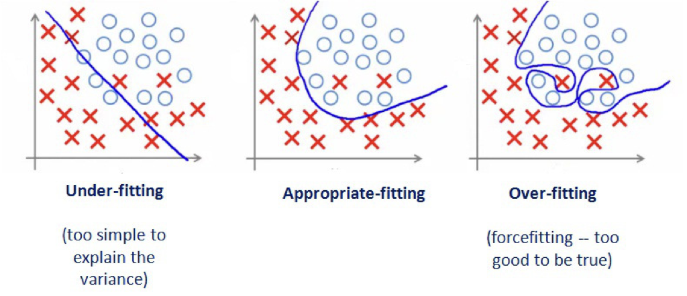

```{r setup, include=FALSE, purl=FALSE}
options(htmltools.dir.version = FALSE)
knitr::opts_chunk$set(comment = "##")
knitr::opts_chunk$set(cache = TRUE)
knitr::opts_chunk$set(error = TRUE)
library(kableExtra)
library(tidyverse)
```


# Outline

1. Training and Testing
2. Cross-validation
3. Statistical Prediction

.middler[**Goal:** Learn the concepts, terminology, and techniques in statistical prediction!]

---
# Acknowledgement

This lecture borrows heavily from the Ryan Tibshirani's [Statistical Prediction lecture](http://www.stat.cmu.edu/~ryantibs/statcomp/lectures/prediction.html) for Statistical Computing at Carnegie Mellon University.

---
class: inverse

.sectionhead[Part 1. Training and Testing]

---


# Recall: Regression

Let's assume we have some data $X_1,\ldots,X_p, Y$ where $X_1,\ldots,X_p$ are $p$ **independent variables/explanatory variables/covariates/predictors** and $Y$ is the **dependent variables/response/outcome**.
We want to know the relationship between our covariates and our response, we can do this with a method called **regression**.
Regression provides us with a statistical method to conduct

* **inference:** assess the relationship between our variables, our statistical model as a whole, predictor importance
  * What is the relationship between sleep and GPA?
  * Is parents' education or parents' income more important for explaining income?
* **prediction:** predict new/future outcomes from new/future covariates
  * Can we predict test scores based on hours spent studying?
  

  
---

# Recall: Linear Regression

Given our response $Y$ and our predictors $X_1, \ldots, X_p$, a **linear regression model** takes the form:

\\[
\LARGE
\begin{eqnarray}
&Y &= \beta_0 + \beta_1 X_1 + \cdots + \beta_p X_p + \epsilon,\\
&\epsilon &\sim N(0,\sigma^2) 
\end{eqnarray}
\\]


Previously, we focused on using this model for inference (e.g. $H_0: \beta_1 = 0$). Today, we are shifting our focus to prediction!

---

# Statistical Prediction

Often, we use a linear model even when we know that the "truth" is not a purely linear relationship with normally-distributed errors.

--

Does this mean our model is wrong? Yes, in some sense.


--


Does this mean our model is bad? No, not necessarily!

If we consider a linear model only to be a rough approximation, we can still make use of it for **statistical prediction**!


---
layout: true
# Test Error
---


.middler-nocent[
**Training data:** data we use to train/fit our model (everything we've seen so far)

**Test data:** data we use to evaluate/test the performance of our model 
]

---

Suppose we have training data $X_{i1}, \ \ldots,\ X_{ip}, Y_i, \ i = 1,\ldots,n$ which we use to estimate regression coefficents $\hat\beta_0, \ \hat\beta_1, \ldots \hat\beta_p$ (Recall: we use $\hat{}$ "hats" to indicate **estimates**)

Now suppose we are given new testing data $X^*_1, \ \ldots, X^*_{p}$ and asked to predict the associated $Y^∗$. 
Using our estimated linear model, the prediction is: 
$$\hat{Y}^* = \hat\beta_0 + \hat{\beta}_1 X^*_1 + \cdots + \hat{\beta}_p X^*_p$$
---

Given our prediction 

$$\hat{Y} = \hat\beta_0 + \hat{\beta}_1 X^*_1 + \cdots + \hat{\beta}_p X^*_p$$
We define the **test error**, or **prediction error**, as
$$\mathbb{E}[(Y^* -\hat{Y}^*)^2].$$

In other words, the test error is defined as the expected squared difference between a new prediction and the truth!<sup>1</sup>

.footnote[[1] where the expectation is taken over all random training and test data.]

---

**Test Error:** $\mathbb{E}[(Y^* -\hat{Y}^*)^2],$ the expected squared difference between a new prediction and the truth.

The test error would make a great way to assess the predictive power of our model!

However, how do we estimate it? We don't know the value of that expectation, so somehow we have to use our data to estimate it in order to use it to assess our model. 
This provides us with a tool for

* **predictive assessment:** an understanding of the magnitude of errors we should expect when making future predictions
* **model/method selection:** choose among multiple choices of model based on minimizing test error

---
layout: false
layout: true
# Training Error

---

A natural estimator for the test error might be the observed average **training error:**

$$\dfrac{1}{n}\sum_{i=1}^n (Y_i - \hat{Y}_i)^2.$$

Can you think of a problem with this approach?

---

$$\dfrac{1}{n}\sum_{i=1}^n (Y_i - \hat{Y}_i)^2.$$
Can you think of a problem with this approach?

In general, this will be *too optimistic*. Why? We chose estimates $\hat{\beta}_0,\ \ldots,\ \hat{\beta}_p$ based on our training data! 
More specifically (with a linear regression model), we chose estimates *such that* they minimize the error from our training data.
We cannot expect this error rate to generalize to test data.

Critically, the more complex our model, the more optimistic our training data will be as an estimate for our test data!

---
layout: false
layout: true

# Training Error vs Test Error Examples
---

```{r, message = FALSE, eval = FALSE}
library(ggpubr)
# generate data
set.seed(302)
n <- 30
x <- sort(runif(n, -3, 3))
y <- 2*x + 2*rnorm(n)
x_test <- sort(runif(n, -3, 3))
y_test <- 2*x_test + 2*rnorm(n)
df_train <- data.frame("x" = x, "y" = y)
df_test <- data.frame("x" = x_test, "y" = y_test)

# store a theme
my_theme <- theme_bw(base_size = 16) + 
  theme(plot.title = element_text(hjust = 0.5, face = "bold"),
        plot.subtitle = element_text(hjust = 0.5))

# generate plots
g_train <- ggplot(df_train, aes(x = x, y = y)) + geom_point() +
  xlim(-3, 3) + ylim(min(y, y_test), max(y, y_test)) + 
  labs(title = "Training Data") + my_theme
g_test <- ggplot(df_test, aes(x = x, y = y)) + geom_point() +
  xlim(-3, 3) + ylim(min(y, y_test), max(y, y_test)) + 
  labs(title = "Test Data") + my_theme
ggarrange(g_train, g_test) # from ggpubr, to put side-by-side
```


---

.middler[
```{r, message = FALSE, echo = FALSE, fig.align = "center", fig.height = 4}
library(ggpubr)
# generate data
set.seed(302)
n <- 30
x <- sort(runif(n, -3, 3))
y <- 2*x + 2*rnorm(n)
x_test <- sort(runif(n, -3, 3))
y_test <- 2*x_test + 2*rnorm(n)
df_train <- data.frame("x" = x, "y" = y)
df_test <- data.frame("x" = x_test, "y" = y_test)

# store a theme
my_theme <- theme_bw(base_size = 16) + 
  theme(plot.title = element_text(hjust = 0.5, face = "bold"),
        plot.subtitle = element_text(hjust = 0.5))

# generate plots
g_train <- ggplot(df_train, aes(x = x, y = y)) + geom_point() +
  xlim(-3, 3) + ylim(min(y, y_test), max(y, y_test)) + 
  labs(title = "Training Data") + my_theme
g_test <- ggplot(df_test, aes(x = x, y = y)) + geom_point() +
  xlim(-3, 3) + ylim(min(y, y_test), max(y, y_test)) + 
  labs(title = "Test Data") + my_theme
ggarrange(g_train, g_test) # from ggpubr, to put side-by-side
```
]

---

```{r, message = FALSE, eval = FALSE}
# Fit linear model and calculate training error
lm_fit <- lm(y ~ x, data = df_train)
yhat_train <- predict(lm_fit)
# (y_i - yhat_i)^2
train_err <- mean((df_train$y - yhat_train)^2)

# Calculate testing error
yhat_test <- predict(lm_fit, data.frame(x = df_test$x))
test_err <- mean((df_test$y - yhat_test)^2)

# Add linear model and error text to plot
g_train2 <- g_train + 
  labs(subtitle = paste("Training error:", round(train_err, 3))) +
  geom_line(aes(y = fitted(lm_fit)), col = "red", lwd = 1.5)
g_test2 <- g_test + 
  labs(subtitle = paste("Test error:", round(test_err, 3))) +
  geom_line(aes(y = fitted(lm_fit), x = df_train$x), col = "red", lwd = 1.5)

ggarrange(g_train2, g_test2)
```


---

## Degree 1 Model

.middler[
```{r, message = FALSE, echo = FALSE, fig.align = "center", fig.height = 4}
# Fit linear model and calculate training error
lm_fit <- lm(y ~ x, data = df_train)
yhat_train <- predict(lm_fit)
# (y_i - yhat_i)^2
train_err <- mean((df_train$y - yhat_train)^2)

# Calculate testing error
yhat_test <- predict(lm_fit, data.frame(x = df_test$x))
test_err <- mean((df_test$y - yhat_test)^2)

# Add linear model and error text to plot
g_train2 <- g_train + 
  labs(subtitle = paste("Training error:", round(train_err, 3))) +
  geom_line(aes(y = fitted(lm_fit)), col = "red", lwd = 1.5)
g_test2 <- g_test + 
  labs(subtitle = paste("Test error:", round(test_err, 3))) +
  geom_line(aes(y = fitted(lm_fit), x = df_train$x), col = "red", lwd = 1.5)

ggarrange(g_train2, g_test2)
```
]

---

```{r, message = FALSE, eval = FALSE}
# Fit 5 degree polynomial and calculate training error
lm_fit_5 <- lm(y ~ poly(x, 5), data = df_train)
yhat_train_5 <- predict(lm_fit_5)
train_err_5 <- mean((df_train$y - yhat_train_5)^2)

# Calculate testing error
yhat_test_5 <- predict(lm_fit_5, data.frame(x = df_test$x))
test_err_5 <- mean((df_test$y - yhat_test_5)^2)

# Create smooth line for plotting
x_fit <- data.frame(x = seq(-3, 3, length = 100))
line_fit <- data.frame(x = x_fit, y = predict(lm_fit_5, newdata = x_fit))
                       
# Add linear model and error text to plot
g_train3 <- g_train + 
  labs(subtitle = paste("Training error:", round(train_err_5, 3))) +
  geom_line(data = line_fit, aes(y = y, x = x), col = "red", lwd = 1.5)
g_test3 <- g_test + 
  labs(subtitle = paste("Test error:", round(test_err_5, 3))) +
  geom_line(data = line_fit, aes(y = y, x = x), col = "red", lwd = 1.5)

ggarrange(g_train3, g_test3)
```

---

## Degree 5 Model

.middler[
```{r, message = FALSE, echo = FALSE, fig.align = "center", fig.height = 4, warning = FALSE}
# Fit 5 degree polynomial and calculate training error
lm_fit_5 <- lm(y ~ poly(x, 5), data = df_train)
yhat_train_5 <- predict(lm_fit_5)
train_err_5 <- mean((df_train$y - yhat_train_5)^2)

# Calculate testing error
yhat_test_5 <- predict(lm_fit_5, data.frame(x = df_test$x))
test_err_5 <- mean((df_test$y - yhat_test_5)^2)

# Create smooth line for plotting
x_fit <- data.frame(x = seq(-3, 3, length = 100))
line_fit <- data.frame(x = x_fit, y = predict(lm_fit_5, newdata = x_fit))
                       
# Add linear model and error text to plot
g_train3 <- g_train + 
  labs(subtitle = paste("Training error:", round(train_err_5, 3))) +
  geom_line(data = line_fit, aes(y = y, x = x), col = "red", lwd = 1.5)
g_test3 <- g_test + 
  labs(subtitle = paste("Test error:", round(test_err_5, 3))) +
  geom_line(data = line_fit, aes(y = y, x = x), col = "red", lwd = 1.5)

ggarrange(g_train3, g_test3)
```
]

---

```{r, message = FALSE, eval = FALSE}
# Fit 10 degree polynomial and calculate training error
lm_fit_10 <- lm(y ~ poly(x, 10), data = df_train)
yhat_train_10 <- predict(lm_fit_10)
train_err_10 <- mean((df_train$y - yhat_train_10)^2)

# Calculate testing error
yhat_test_10 <- predict(lm_fit_10, data.frame(x = df_test$x))
test_err_10 <- mean((df_test$y - yhat_test_10)^2)

# Create smooth line for plotting
x_fit <- data.frame(x = seq(-3, 3, length = 100))
line_fit <- data.frame(x = x_fit, y = predict(lm_fit_10, newdata = x_fit))
                       
# Add linear model and error text to plot
g_train4 <- g_train + 
  labs(subtitle = paste("Training error:", round(train_err_10, 3))) +
  geom_line(data = line_fit, aes(y = y, x = x), col = "red", lwd = 1.5)
g_test4 <- g_test + 
  labs(subtitle = paste("Test error:", round(test_err_10, 3))) +
  geom_line(data = line_fit, aes(y = y, x = x), col = "red", lwd = 1.5)

ggarrange(g_train4, g_test4)
```

---

## Degree 10 Model

.middler[
```{r, message = FALSE, echo = FALSE, fig.align = "center", fig.height = 4, warning = FALSE}
# Fit 10 degree polynomial and calculate training error
lm_fit_10 <- lm(y ~ poly(x, 10), data = df_train)
yhat_train_10 <- predict(lm_fit_10)
train_err_10 <- mean((df_train$y - yhat_train_10)^2)

# Calculate testing error
yhat_test_10 <- predict(lm_fit_10, data.frame(x = df_test$x))
test_err_10 <- mean((df_test$y - yhat_test_10)^2)

# Create smooth line for plotting
x_fit <- data.frame(x = seq(-3, 3, length = 100))
line_fit <- data.frame(x = x_fit, y = predict(lm_fit_10, newdata = x_fit))
                       
# Add linear model and error text to plot
g_train4 <- g_train + 
  labs(subtitle = paste("Training error:", round(train_err_10, 3))) +
  geom_line(data = line_fit, aes(y = y, x = x), col = "red", lwd = 1.5)
g_test4 <- g_test + 
  labs(subtitle = paste("Test error:", round(test_err_10, 3))) +
  geom_line(data = line_fit, aes(y = y, x = x), col = "red", lwd = 1.5)

ggarrange(g_train4, g_test4)
```
]

---

```{r, message = FALSE, eval = FALSE}
# Fit 15 degree polynomial and calculate training error
lm_fit_15 <- lm(y ~ poly(x, 15), data = df_train)
yhat_train_15 <- predict(lm_fit_15)
train_err_15 <- mean((df_train$y - yhat_train_15)^2)

# Calculate testing error
yhat_test_15 <- predict(lm_fit_15, data.frame(x = df_test$x))
test_err_15 <- mean((df_test$y - yhat_test_15)^2)

# Create smooth line for plotting
x_fit <- data.frame(x = seq(-3, 3, length = 100))
line_fit <- data.frame(x = x_fit, y = predict(lm_fit_15, newdata = x_fit))
                       
# Add linear model and error text to plot
g_train5 <- g_train + 
  labs(subtitle = paste("Training error:", round(train_err_15, 3))) +
  geom_line(data = line_fit, aes(y = y, x = x), col = "red", lwd = 1.5)
g_test5 <- g_test + 
  labs(subtitle = paste("Test error:", round(test_err_15, 3))) +
  geom_line(data = line_fit, aes(y = y, x = x), col = "red", lwd = 1.5)

ggarrange(g_train5, g_test5)
```

---

## Degree 15 Model

.middler[
```{r, message = FALSE, echo = FALSE, fig.align = "center", fig.height = 4, warning = FALSE}
# Fit 15 degree polynomial and calculate training error
lm_fit_15 <- lm(y ~ poly(x, 15), data = df_train)
yhat_train_15 <- predict(lm_fit_15)
train_err_15 <- mean((df_train$y - yhat_train_15)^2)

# Calculate testing error
yhat_test_15 <- predict(lm_fit_15, data.frame(x = df_test$x))
test_err_15 <- mean((df_test$y - yhat_test_15)^2)

# Create smooth line for plotting
x_fit <- data.frame(x = seq(-3, 3, length = 100))
line_fit <- data.frame(x = x_fit, y = predict(lm_fit_15, newdata = x_fit))
                       
# Add linear model and error text to plot
g_train5 <- g_train + 
  labs(subtitle = paste("Training error:", round(train_err_15, 3))) +
  geom_line(data = line_fit, aes(y = y, x = x), col = "red", lwd = 1.5)
g_test5 <- g_test + 
  labs(subtitle = paste("Test error:", round(test_err_15, 3))) +
  geom_line(data = line_fit, aes(y = y, x = x), col = "red", lwd = 1.5)

ggarrange(g_train5, g_test5)
```
]

---
layout: false
layout: true

# Bias-Variance Tradeoff

---

.middler-nocent[
The formula for test error can be decomposed as a function of the bias and variance of our estimates.

* **Bias:** the expected difference between our estimate and the truth

* **Variance:** the variability of our estimate of the truth
]

---

.center[]

Image Credit: An Introduction to Statistical Learning by Gareth James, Daniela Witten, Trevor Hastie, Robert Tibshirani

---

.middler-nocent[
* **Bias:** underfitting, error from missing relevant relationships

* **Variance:** overfitting, error from high sensitivity
]

---

.middler[]

.footnote[[Image Source](https://medium.com/greyatom/what-is-underfitting-and-overfitting-in-machine-learning-and-how-to-deal-with-it-6803a989c76)]


---

.middler[]

.footnote[[Image Source](https://medium.com/greyatom/what-is-underfitting-and-overfitting-in-machine-learning-and-how-to-deal-with-it-6803a989c76)]

---

It is easy to fit a model with extremely low variance and extremely high bias, or extremely low bias and extremely high variance, but these models will not have a good test error.
Ideally, we would like an estimate that has both low bias and low variance, but this is not always possible!

As a general rule of thumb, as we increase the complexity of our model, the bias will decrease but the variance will increase.
You can think of our bias decreasing because we are training our model to be more specific to our training data.
You can think of the variance increasing because our model will be overfit, and will vary substantially with new training data.


---
layout: false
class: inverse

.sectionhead[Part 2. Cross-validation]


---
layout: true

# Sample-splitting
---

Where do we get our "training data" and our "test data" in practice? We can't just simulate more data for our test data in the real world. 
In practice, we use a technique called **sample-splitting:**

1. Split the data set into two (or more...) parts
2. First part of data: train the model/method
3. Second part of data: make predictions
4. Evaluate observed test error

---

```{r, eval = FALSE}
# Generate data
set.seed(302)
n <- 50
x <- sort(runif(n, -3, 3))
y <- 2*x + 2*rnorm(n)

# Randomly split data into two parts
inds <- sample(rep(1:2, length = n))
split <- as.factor(inds) %>%
  fct_recode(Training = "1", Test = "2")
data <- data.frame("x" = x, "y" = y, "split" = split)

g_split <- ggplot(data, aes(x = x, y = y, color = split)) + geom_point() +
  labs(title = "Sample-splitting") + my_theme
g_split
```


---

```{r, echo = FALSE, fig.align = "center", fig.height = 6}
# Generate data
set.seed(302)
n <- 50
x <- sort(runif(n, -3, 3))
y <- 2*x + 2*rnorm(n)

# Randomly split data into two parts
inds <- sample(rep(1:2, length = n))
split <- as.factor(inds) %>%
  fct_recode(Training = "1", Test = "2")
data <- data.frame("x" = x, "y" = y, "split" = split)

g_split <- ggplot(data, aes(x = x, y = y, color = split)) + geom_point() +
  labs(title = "Sample-splitting") + my_theme
g_split
```
---

```{r}
# Train on the training split
data_train <- data %>% filter(split == "Training")
lm_1 <- lm(y ~ x, data = data_train)
lm_10 <- lm(y ~ poly(x, 10), data = data_train)

# Predict on the second half
data_test <- data %>% filter(split == "Test")
pred_1 <- predict(lm_1, data.frame(x = data_test$x))
pred_10 <- predict(lm_10, data.frame(x = data_test$x))

# Calculate test error
test_err_1 <- mean((data_test$y - pred_1)^2)
test_err_10 <- mean((data_test$y - pred_10)^2)
```


---

```{r, eval = FALSE}
# Create smooth lines for plotting
x_fit <- data.frame(x = seq(min(data$x), max(data$x), length = 100))
line_fit_1 <- data.frame(x = x_fit, y = predict(lm_1, newdata = x_fit))
line_fit_10 <- data.frame(x = x_fit, y = predict(lm_10, newdata = x_fit))
                       
# Add linear model and error text to plot
g_split1 <- g_split + 
  labs(subtitle = paste("Degree 1 Test error:", round(test_err_1, 3))) +
  geom_line(data = line_fit_1, aes(y = y, x = x), col = "black", lwd = 1.5)
g_split10 <- g_split + 
  labs(subtitle = paste("Degree 10 Test error:", round(test_err_10, 3))) +
  geom_line(data = line_fit_10, aes(y = y, x = x), col = "black", lwd = 1.5)

ggarrange(g_split1, g_split10, common.legend = TRUE, legend = "bottom")
```

---

```{r, echo = FALSE, fig.align = "center", fig.height = 5}
# Create smooth lines for plotting
x_fit <- data.frame(x = seq(min(data$x), max(data$x), length = 100))
line_fit_1 <- data.frame(x = x_fit, y = predict(lm_1, newdata = x_fit))
line_fit_10 <- data.frame(x = x_fit, y = predict(lm_10, newdata = x_fit))
                       
# Add linear model and error text to plot
g_split1 <- g_split + 
  labs(subtitle = paste("Degree 1 Test error:", round(test_err_1, 3))) +
  geom_line(data = line_fit_1, aes(y = y, x = x), col = "black", lwd = 1.5)
g_split10 <- g_split + 
  labs(subtitle = paste("Degree 10 Test error:", round(test_err_10, 3))) +
  geom_line(data = line_fit_10, aes(y = y, x = x), col = "black", lwd = 1.5)

ggarrange(g_split1, g_split10, common.legend = TRUE, legend = "bottom")
```


---


Sample-splitting gives us a powerful tool to evaluate the performance of estimator *on data that was not used to train it*! Of course, this comes at the cost of sacrificing some of our data that could be used in order to train a model with as much information as possible, but this is a sacrifice we must make in practice if we want to appropriately evaluate the predictive performance of our models/methods!

However, we can usually do better than just splitting our data in half.

---
layout: false
layout: true

# Cross-validation
---

Wednesday!


