```{r setup, include=FALSE, purl=FALSE}
options(htmltools.dir.version = FALSE)
knitr::opts_chunk$set(comment = "##")
knitr::opts_chunk$set(cache = TRUE)
library(kableExtra)
library(tidyverse)
```


# Outline

1. Singular Value Decomposition (SVD)
2. Dimension Reduction
3. Image Analysis
4. Cluster Analysis
5. Principal Components Analysis (PCA)

.middler[**Goal:** Appreciate the beauty of SVD and PCA!]

---
class: inverse

.sectionhead[Part 1. Singular Value Decomposition (SVD)]

---
layout: true

# SVD

---

## Motivation

Often times, we are interested in identifying patterns or other interesting information in *high-dimensional* data, as is often done in clustering. Or we want to preserve the inherent structure in our data while reducing the complexity and size, such as image compression. Other times, we may want to assess variable importance. SVD provides a powerful tool to do all of these things, and more!

* Image compression
* De-noising
* Clustering / pattern detection
* Variable selection
* Recommendation systems

--

.middler[]

---

## Definition

A **singular value decomposition**, or **SVD**, is a decomposition (obviously). It is not a function or transformation! 

$$\mathbf{X} = \mathbf{U} \mathbf{D} \mathbf{V}^T$$

* **Input:** Any $n \times p$ matrix $\mathbf{X}$
* **Output:**
  * $\mathbf{U}$: $n \times n$ orthogonal<sup>[1]</sup> matrix
  * $\mathbf{D}$: $n \times p$ matrix
  * $\mathbf{V}$: $p \times p$ orthogonal matrix

Note that $\mathbf{U}$, $\mathbf{D}$, and $\mathbf{V}$ are all **unique**!

While this definition of SVD is true for all matrices, in practice, we almost always encounter the SVD in *reduced form*.

$$\ $$

[1] A matrix $\mathbf{A}$ is orthogonal if $\mathbf{A}^T\mathbf{A}=\mathbf{A}\mathbf{A}^T = \mathbf{I}$, where $\mathbf{I}$ is the identity matrix.

---
layout: false

# Tall Matrix - Full SVD

.middler[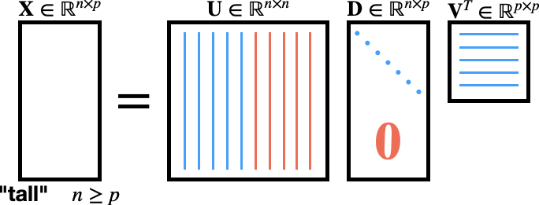]

---

# Tall Matrix - Reduced SVD

.middler[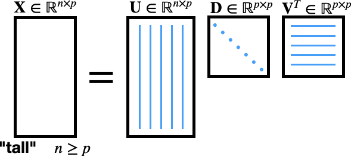]

---

# Wide Matrix - Full SVD

.middler[]

---

# Wide Matrix - Reduced SVD

.middler[]


---
# Components of SVD

.center[]

* $\mathbf{U}$: left singular vectors, $\mathbf{u}$
  * Interpretation: map our $n$ observations to $p$ "concepts"
* $\mathbf{D}$: singular values, $\sigma$
  * Interpretation: strengths of each "concept"
* $\mathbf{V}$: right singular vectors, $\mathbf{v}$
  * Interpretation: map our $p$ variables to $p$ "concepts"


---

# Matrix Rank

The **rank** of a matrix is equal to

* the maximum number of **linearly independent** row vectors in the matrix
* the maximum number of **linearly independent** column vectors in the matrix

These definitions are equivalent.

Note that for a matrix $\mathbf{X}\in \mathbb{R}^{n \times p}$, the maximum possible 
$\text{rank}(\mathbf{X}) = \text{min(n,p)}$. If $\mathbf{X}$ has this rank, it is called a **full rank** matrix.

---

# Rank-k Approximation

Among the most useful properties of the SVD is that it provides us with a method to calculate the *optimal*<sup>[1]</sup> rank $k$ approximation to a matrix $\mathbf{X}$.

\\[
\begin{equation}
\tilde{\mathbf{X}}_k =\tilde{\mathbf{U}}_k\tilde{\mathbf{D}}_k\tilde{\mathbf{V}}_k^T = \sum_{i=1}^{k} \sigma_i \mathbf{u}_i\mathbf{v}_i^T
\end{equation}
\\]

* $\tilde{\mathbf{X}}_k$: best rank $k$ approximation to $\mathbf{X}$
* $\tilde{\mathbf{U}}_k$: first $k$ singular vectors (columns) of $\mathbf{U}$
* $\tilde{\mathbf{D}}_k$: leading $k\times k$ sub-block of $\mathbf{D}$
* $\tilde{\mathbf{V}}_k^T$: first $k$ singular vectors (rows) of $\mathbf{V}^T$ 

Note that we can also write out this approximation by summing up the product first $k$ singular values and singular vectors


.footnote[[1] Optimal in the L<sub>2</sub> sense. Not important for this class, but happy to talk about what this means in more detail if you are curious.]


---

layout: true

# Interpretation - Movie Ratings

---

.middler[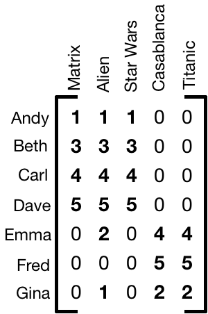]

.footnote[Thanks to [Mining of Massive Datasets, Chapter 11](http://www.mmds.org/) for this motivating data]

---

.middler[]

---

## $\mathbf{U}$ as "user-to-concept"

.center[]

.footnote[Note: Sign of the values aren't super important, except in how they contrast within singular vector. Focus on the magnitudes.]

---

## $\mathbf{D}$ as "strength of concept"

.center[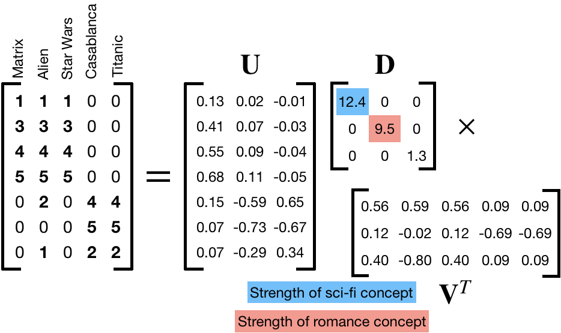]

---

## $\mathbf{V}^T$ as "movie-to-concept"

.center[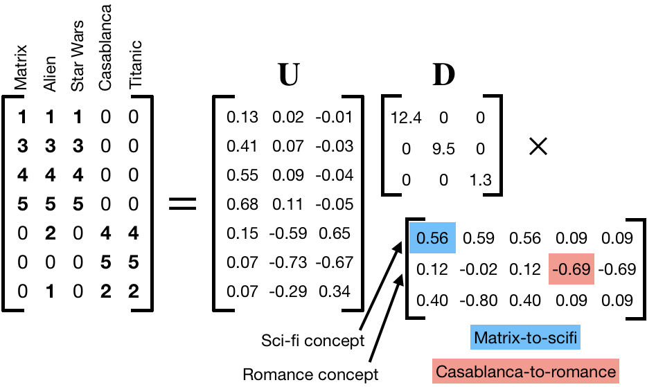]

.footnote[Note: Sign of the values aren't super important, except in how they contrast within singular vector. Focus on the magnitudes.]

---
layout: false

# A note on "concepts"

The concepts we are discussing are not objective. 
There is no "truth" inherent in our concepts of sci-fi and romance.
Even in this contrived and simplified example, we are reducing the movies to core ideas or genres that we are calling concepts.
In the real world these concepts are not so clear, we can only intuit them in so far as our data allows. 

For example, in our case without any previous knowledge, we might see from $\mathbf{V}^T$ that Matrix, Alien, and Star Wars are all closely related to something that Casablanca and Titanic are not. 
This gives us a concept of Sci-fi!
Likewise, we could do the same to "derive" our concept of romance.

After all, what's that third concept supposed to be?

---
class: inverse

.sectionhead[Part 2. Dimension Reduction]

---
layout: true

# Dimension Reduction
---

Maybe we think our third concept is just noise, what can we do?

Set it equal to $0$!

.center[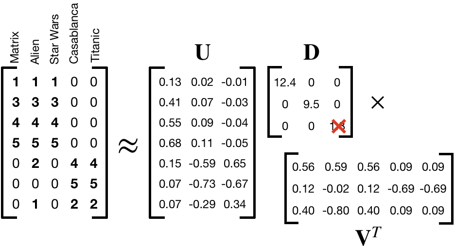]

---

Maybe we think our third concept is just noise, what can we do?

Set it equal to $0$!

.center[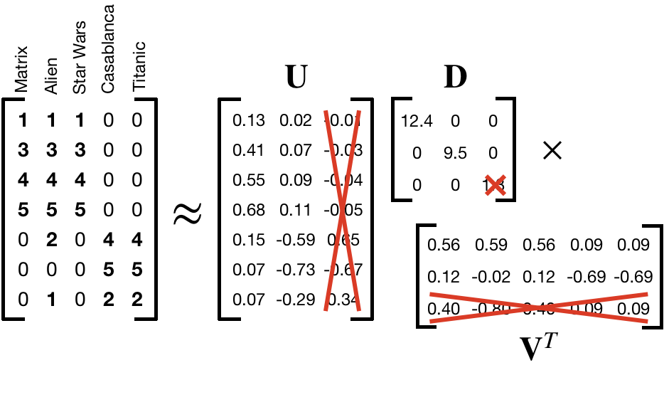]

---

Maybe we think our third concept is just noise, what can we do?

Set it equal to $0$!

.center[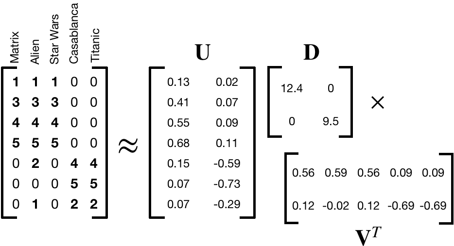]

---

Maybe we think our third concept is just noise, what can we do?

Set it equal to $0$!

.center[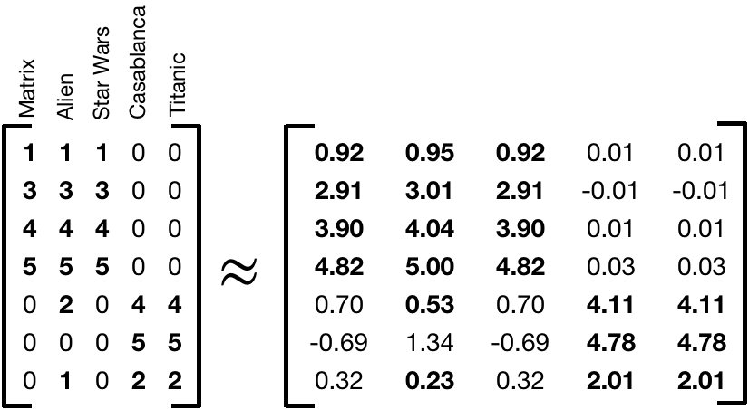]

---
layout: false

# Recommendation System

What if we have rankings for a new user, and we want to make an educated guess about what genres they prefer for recommendations?

.center[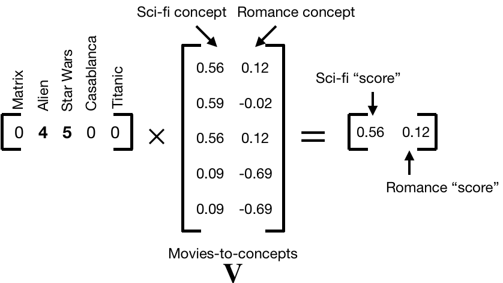]

Note: We can use a similar procedure multiplying several users' ratings of a new movie by $\mathbf{U}$ users-to-concepts vectors in order to put movies into certain genres!

---
class: inverse

.sectionhead[Part 3. Image Analysis]

---
layout: true

# Image Analysis

---

We'll use the package `jpeg` for this section. There are other options for handling images in R, I encourage you to Google them if you end up working with images!

```{r}
library(jpeg)

# Load my image
tmp <- "https://raw.githubusercontent.com/bryandmartin/STAT302/master/images/cameraman.jpg"

# Read image into R
img <- readJPEG(readBin(tmp, "raw",1e6))
dim(img)
img[1:5, 1:5]
```

---

Note my image is $256 \times 256$ pixels because it is grayscale. Thus, it is just a matrix! The values in the matrix represent the intensity (darkness) of the grayscale.

If I had loaded a color version of this image, it would have been an array of size $256 \times 256 \times 3$, with one channel for red, blue, and green colors.

---

Here I create a function to display an image. Don't worry too much about the details. It is mostly just initializing an empty plot as a place to display my image.

```{r}
img_plot <- function(img, ...) {
  # type = 'n' plots empty points
  # labels are empty using xlab and ylab
  # xaxt and yaxt remove the ticks
  # `...` allows me to set arbitrary graph parameters, like main
  plot(1:2, type = "n", xlab = " ", ylab = " ", xaxt = "n", yaxt = "n", ...)
  rasterImage(img, 1.0, 1.0, 2.0, 2.0)
}
```


---


```{r, eval = FALSE}
img_plot(img, main = "Cameraman")
```

.center[
```{r, echo = FALSE}
img_plot(img, main = "Cameraman")
```
]

---

First we create a function to generate the best rank $k$ approximation of any matrix $A$.

```{r}
SVD_approx <- function(A, k) {
  # Generate components of SVD
  a_svd <- svd(A)
  sing_vals <- a_svd$d
  U <- a_svd$u
  V <- a_svd$v
  # Turn singular values into diagonal matrix. Be careful if k = 1!
  if (k == 1) {
    D <- matrix(sing_vals[1], nrow = 1, ncol = 1)
  } else {
    D <- diag(sing_vals[1:k])
  }
  # Calculate best rank-k approximation
  A_approx <- U[, 1:k] %*% D %*% t(V[, 1:k])
  return(A_approx)
}
```

---

Next we make a function that uses `SVD_approx()` to plot the best rank $k$ approximation to our image.
Note that pixel intensity values must be between $0$ and $1$, so we cap all values to fall within that range.

```{r}
img_approx <- function(img, k){
  approx_mat <- SVD_approx(img, k)
  # Cap minimum intensity
  approx_mat[approx_mat < 0] <- 0
  # Cap maximum intensity
  approx_mat[approx_mat > 1] <- 1
  img_plot(approx_mat, main = paste0("Best rank ", k, " approximation"))
  # Comment out return for purposes of slides
  # We don't want to store the approximation, only plot it
  # return(approx_mat)
}
```

---

```{r, fig.align = 'center'}
img_approx(img, 200)
```

---

```{r, fig.show = "hold", out.width = "33%"}
img_approx(img, 1)
img_approx(img, 2)
img_approx(img, 3)
```

---

```{r, fig.show = "hold", out.width = "33%"}
img_approx(img, 5)
img_approx(img, 10)
img_approx(img, 25)
```

---
layout: false
layout: true

# How many singular values?

---

We will define the **energy** of a matrix as the sum of the squared singular values,
\\[
\text{energy}(\mathbf{A}) = \sum_i \sigma^2_i.
\\]
We can plot the energy stored in each singular value, as well as the cumulative energy as follows:

```{r}
svd_img <- svd(img)
sing_vals2 <- svd_img$d^2
energy_df <- data.frame("sing_vals" = sing_vals2,
                        "energy" = cumsum(sing_vals2)/sum(sing_vals2))
dim(energy_df)
```

Thus we have a total of `r nrow(energy_df)` singular values, meaning our image matrix is of rank `r nrow(energy_df)`! 

---

```{r, fig.show = "hold", out.width = "40%"}
ggplot(energy_df, aes(x = 1:nrow(energy_df), y = sing_vals)) +
  geom_point() +
  theme_bw(base_size = 20) +
  labs(y = "Singular Values", x = "k")
ggplot(energy_df, aes(x = 1:nrow(energy_df), y = energy)) +
  geom_point() +
  theme_bw(base_size = 20) +
  labs(y = "Cumulative Energy", x = "k")
```

---

In general, if we are using SVD to do dimension reduction, a common rule of thumb is that we want to retain 90% of the energy. 
However, for image compression, this likely will be too much compression!

```{r, fig.align = "center", out.width = "45%"}
# which.max will return index of first TRUE
k <- which.max(energy_df$energy > .90)
img_approx(img, k)
```

---

What if we want to retain 99.8% of the energy in our image?

```{r, fig.align = "center", out.width = "55%"}
k <- which.max(energy_df$energy > .998)
img_approx(img, k)
```

---

We were able to retain 99.8% of the energy in our image using only `r k` singular values!
Thus, we are able to reduce the dimensionality of our matrix by `r (1 - k/nrow(energy_df))*100`%.
This is a similar concept to how JPEG compression works!<sup>1</sup>

.footnote[[1] A similar concept, but not the same algorithm. JPEG compression uses something called the discrete cosine transformation, not SVD.]

---
layout: false
layout: true

# Clustering
---

What if we want to get a sense of the inherent groupings, or **clusters**, in our data?

Let's load the `foreign` package to read in a `.dta` file.

```{r}
library(foreign)
cereal <- read.dta("http://statistics.ats.ucla.edu/stat/data/cerealnut.dta")
head(cereal)
```

---

We have data of nutritional information about various cereals.
Here, we are interested in analyzing which cereals are similar to each other.
We can do this using exploratory analysis with SVD!

For now, we'll stick to a simple visual analysis (more on clustering later in the course).
Thus, we will only plot our data along two dimensions.

Because we are interested in cereal clusters, we want to look at the cereal-to-concept values.
Because cereals are our observations, this is the columns of $\mathbf{U}$.

---


```{r, fig.align = "center", out.width = "36%"}
library(ggrepel)
# remove the text brand labels
cereal_svd <- svd(cereal[, -1])
cereal_df <- data.frame("x" = cereal_svd$u[, 1],
                        "y" = cereal_svd$u[, 2],
                        "label" = cereal$brand)
ggplot(cereal_df, aes(x = x, y = y, label = label)) +
  geom_point() +
  theme_bw(base_size = 20) +
  geom_text_repel(size = 4)
```

---

```{r, fig.align = "center", echo = FALSE, out.width = "45%"}
ggplot(cereal_df, aes(x = x, y = y, label = label)) +
  geom_point() +
  theme_bw(base_size = 20) +
  geom_text_repel(size = 4)
```

* bran cereals
* sugary cereals
* raisin cereals
* cereals with honey

---

What factors contributed most to each dimension? Look at the columns of $\mathbf{V}$ (rows of $\mathbf{V}^T$).

```{r, fig.align = "center", out.width = "50%", eval = FALSE}
cereal_df <- data.frame("x" = cereal_svd$v[, 1],
                        "y" = cereal_svd$v[, 2],
                        "label" = colnames(cereal)[-1])
ggplot(cereal_df, aes(x = x, y = y, label = label)) +
  geom_point() +
  theme_bw(base_size = 20) +
  geom_text_repel(size = 4)
```

---

.middler[
```{r, fig.align = "center", out.width = "40%", echo = FALSE}
cereal_df <- data.frame("x" = cereal_svd$v[, 1],
                        "y" = cereal_svd$v[, 2],
                        "label" = colnames(cereal)[-1])
ggplot(cereal_df, aes(x = x, y = y, label = label)) +
  geom_point() +
  theme_bw(base_size = 25) +
  geom_text_repel(size = 6)
```
]

* Bran cereals have the most potassium
* Saltier cereals farther to the left

---

We can also look at the nutrient-to-concept "scores" of each dimension.
Recall that to calculate user-to-concept scores in the movie ranking data we multiplied $\mathbf{X} \mathbf{V}$.
To calculate nutrient-to-concept "scores", we calculate $\mathbf{U}^T \mathbf{X}$.

```{r, fig.align = "center", out.width = "45%", eval = FALSE}
scores <- t(cereal_svd$u) %*% as.matrix(cereal[,-1])
cereal_df <- data.frame("x" = scores[1, ],
                        "y" = scores[2, ],
                        "label" = colnames(cereal)[-1])
ggplot(cereal_df, aes(x = x, y = y, label = label)) +
  geom_point() +
  theme_bw(base_size = 20) +
  geom_text_repel(size = 4)
```

---

Compare to the previous plot. This allows us to see the relative impact of each nutrient on our concepts. 

.center[
```{r, fig.align = "center", out.width = "40%", echo = FALSE}
scores <- t(cereal_svd$u) %*% as.matrix(cereal[,-1])
cereal_df <- data.frame("x" = scores[1, ],
                        "y" = scores[2, ],
                        "label" = colnames(cereal)[-1])
ggplot(cereal_df, aes(x = x, y = y, label = label)) +
  geom_point() +
  theme_bw(base_size = 25) +
  geom_text_repel(size = 6)
```
Note that the two nutrients (NA and K) with the highest values are also those that have the highest magnitude in the raw data. We will talk about the importance of scaling variables in the next section!
]

---
layout: false
class: inverse

.sectionhead[Part 5. PCA]
---
layout: true

# Introduction to PCA
---

.middler-nocent[
**Principal Components Analysis (PCA)** is the process by which we calculate the principal components.

**Principal components** are the set of orthogonal axes along which data have the highest variance.

Let's break this down.
]

---

First, we have to identify the first principal component. This is the axes along which the data have the most variance.

.center[]

.footnote[[Source on stackexchange](https://stats.stackexchange.com/questions/2691/making-sense-of-principal-component-analysis-eigenvectors-eigenvalues)]


---

Next, we have to find the subsequent orthogonal vectors along which the data have the most variance.

.center[]


.footnote[[Source on Wikipedia](https://en.wikipedia.org/wiki/Principal_component_analysis)]

---
layout:false

# Relationship between PCA and SVD

Sound familiar? PCA is *very* similar to SVD! In fact, PCA is typically actually calculated using the SVD.

We won't worry too much about the details for this class, but in a nutshell:

* PCA can be calculated using a linear algebra tool called eigen decomposition on the covariance matrix
* This is equivalent to applying SVD after mean-centering the columns of $\mathbf{X}$
* Thus PCA and SVD are used for many similar reasons!

Computing the SVD is fast and easy, computing a covariance matrix is hard. Thus, when calculating PCA, people often use the SVD!

---

# A Pedantic Note

Note that information available online about the relationship between SVD and PCA can be confusing.
Some sources say they are effectively the same thing. Others say that it is like comparing apples and oranges. 
In a way, they are both right. 

When we talked about SVD, we talked about the *applications* of SVD. The SVD itself is just a linear algebraic decomposition. In contrast, PCA is an analysis/exploratory data/visualization/dimension reduction technique. This is why people say they are apples and oranges. 

However, the actual math we use to perform SVD and PCA is (typically) much the same. The applications we apply them too are often the same as well. This is why other people say they are essentially the same thing.

--

**My takeaway for you:** Don't worry too much about the pedantics. Focus on what problems these tools can help you solve!

---

# More on dimension reduction

.middler-nocent[
PCA is perhaps the single most popular dimension reduction technique. Why is it so popular? It gives us a way to represent and visualize high dimensional data with a lower dimensional structure while retaining as much of what is interesting as possible!

Here, "interesting" is measured by variation. When we care about preserving the variation in our data, but want to represent it using fewer dimensions, we might use PCA!
]

---
layout: true

# US Arrests Data

.center[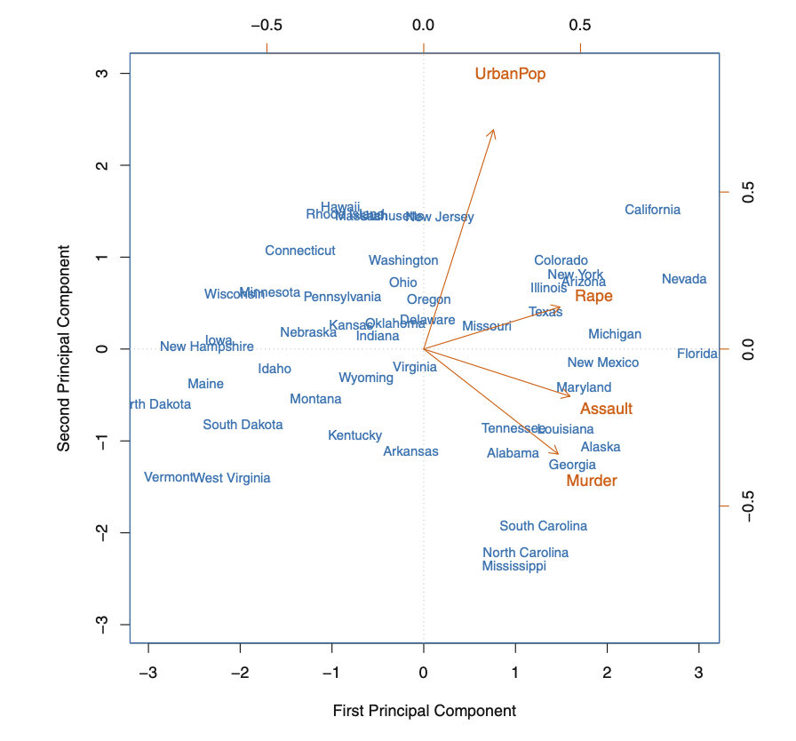]

---

Here is an example PCA using US Arrests data (with variables standardized to have mean 0 and standard deviation 1).

This type of image is sometimes called a **biplot**. The axes are the first two principal components. 

Credit for this image, along with much of the helpful interpretations in this section: An Introduction to Statistical Learning by Gareth James, Daniela Witten, Trevor Hastie, Robert Tibshirani.


---

Biplots show two pieces of important information:

* **scores:** the positions of observations in principal components space, "observation-to-concept"
  * This is just the columns of $\mathbf{U}$ from SVD! (up to scaling)
* **loadings:** how much each variable contributes to the principal components, "variable-to-concept"
  * This is just the columns of $\mathbf{V}$ from SVD!
  
---

Let's focus on the loadings first. Some observations:

* First principal component is highly correlated with all three serious crimes, very little with urban population
* Second principal component is highly correlated with urban population, very little with all three serious crimes
* All three crimes are correlated with each other, and have very low correlation with urban population

---

What does this mean for the scores?

* States with high values of violent crime will tend to be towards the right
* States with higher urban population will tend to be towards the top

---

Interpreting the scores:

* CA, NV, FL: high crime rates
* ND, VT: Low crime rate
* CA, HI: high urbanization
* MS, NC, SC: low urbanization
* IN, VA, DE: average levels of urbanization and crime rates (remember centering!)

---
layout: false

# What does PCA give us?

.middler-nocent[
PCA provides us with principal components. These have two primary interpretations, both of which are useful.

* Directions in feature space along which the data vary the most
  * Think of as dimensions that preserve the most interesting information
  
+ Directions in the feature space along which the data are closest
  + Think of as dimensions that provide a good summary of the data
]
---
layout: true

# Scaling variables before PCA

.center[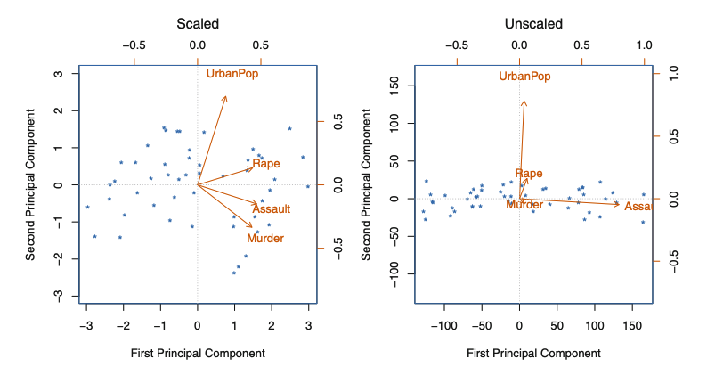]

---

We mentioned before that we centered and scaled the variables. Centering is mathematically necessary, but what happens if we don't scale? Let's return to our US arrests data biplot.

---

* Left: Same figure as before (variables are scaled to have standard deviation 1)
* Right: biplot using unscaled data


--


+ Left: All variables have similar loading magnitudes
+ Right: Assault and UrbanPop have by far the largest loadings. Why?

---

The three violent crimes are reported at number of occurrences per 100,000 people. 
Criminal assault has a much higher rate of reporting than rape and murder.
Urban Population is measured as the percentage of the population that lives in an urban area.

Assault and UrbanPop tend to have much larger magnitudes than Rape and Murder.
Thus, they will dominate measures of variance, like principal components.

---

If we simply changed the unit that we measured Assault in (what if it was number of occurrences per 100 people?), this plot would change dramatically. 
Do we really want a biplot that just represents the scale of a variables?

Typically, no. This is why we usually scale our variables when performing PCA.

---

One important disclaimer: this is not always the case! If our variables are measured in the same units, we may not wish to scale the variables because we can also lose information. For example, gene expression data we would not want to standardize because we want to compare all genes on the same scale of measurement.

---
layout: false

# Uniqueness of Principal Components

One nice property of principal components is that the loadings are unique, up to a sign flip.
In other words, there is no randomness (besides signs) in the process of generating principal components.

---
layout: true

# Proportion of Variance Explained (PVE)

---

For SVD we talked about using the **energy**. 
The analog for PCA is the **proportion of variance explained (PVE)**.

We can define the **total variance** of a data set as:

\\[
\begin{equation}
\sum_{j=1}^p\text{Var}(X_j) = \sum_{j=1}^p\frac{1}{n}\sum_{i=1}^n x_{ij}^2.
\end{equation}
\\]

---

Note that when we actually write out an equation for a principal component $Z_m$ in terms of our variables $\mathbf{X}$, we can express it:

\\[
\begin{equation}
Z_m = \phi_{1m}X_1 + \phi_{2m}X_2 + \cdots + \phi_{pm}X_p,
\end{equation}
\\]

where $\phi_{km}$ is the loading of the $k$th variable for the $m$th principal component.

To get the variance explained by the $m$th principal component, we simply multiply:

\\[
\begin{equation}
\frac{1}{n}\sum_{i=1}^n\left(\sum_{j=1}^p \phi_{jm}x_{ij}\right)^2.
\end{equation}
\\]

---
layout: false
layout: true

# Deciding how many components to use

.center[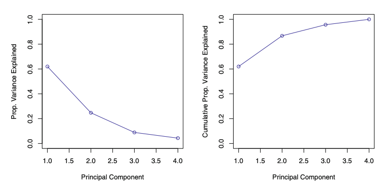]

---

When using PCA, we often use a **scree plot** to decide how many components to use.
Above is a scree plot for the US arrests data.

---

In general, an $n\times p$ data matrix $\mathbf{X}$ with $n$ observations and $p$ variables has min( $n-1,\ p$ ) distinct principal components.
Typically we don't want all of them, we only want enough to get a good understanding of the data!

--

Like many things in statistics, there is unfortunately not a magic rule I can tell you, like to always use 5 principal components, or only use 10% of the total principal components.
In reality, the process is a bit more *ad hoc*, and as much of an art as a science.

---

So what can you do? My recommendation is to make a scree plot, like the one above. Most standard PCA software will have implementations of scree plots for you, so you don't need to make one yourself.

--

In general, you have to eyeball the scree plot and look for the point where there is an elbow in the scree plot and the next principal component does not explain enough variance to warrant inclusion.
Alternatively, decide what proportion of total variance you want to explain, and choose the minimum number of components necessary to explain that proportion.

---
layout: false

# Summary

.middler-nocent[
* SVD and PCA are both powerful tools for many applications
* Visualizing your data
* Data compression
* Extracting new features from your data
* Dimension reduction for easier and more effective analysis and computation
]


