```{r setup, include=FALSE, purl=FALSE}
options(htmltools.dir.version = FALSE)
knitr::opts_chunk$set(comment = "##")
knitr::opts_chunk$set(cache = TRUE)
knitr::opts_chunk$set(error = TRUE)
library(kableExtra)
library(tidyverse)
```


# Outline

1. Setting up a package
2. Documenting a package
3. Github and R packages
4. Automated package testing
5. Package vignettes

.middler[**Goal:** Develop our own R packages (Project 2!)]


---
class: inverse 

.sectionhead[Please follow along with any slides marked with (*).]

---
class: inverse

.sectionhead[Part 1. Setting up a package]

---
layout: true
# Why?
---

.middler[.big[
repeating a task : writing a function ::
writing a function : writing a package
]]

---

* repeating a task : writing a function ::
writing a function : writing a package
* If you find yourself copying R code from one script file to another, it's probably worth it to write a package!
* Copying and pasting code as part of your workflow is **bad** practice!

---

.middler[.huge[
[How easy is it?](https://www.youtube.com/watch?v=0jgXYKtQtfA&feature=youtu.be&t=60)
]]


---
layout: false
# Getting Started (*)

First, we need to make sure you have the proper packages installed.
Remember, do this step only once!

```{r, eval = FALSE}
install.packages(c("devtools", "roxygen2", "testthat", "knitr", "covr"))
```

---

# Step 1: Create the directory (*)

1. Within your `STAT302` directory, go to your folder for projects
2. Create a new subdirectory, `Project2` (or similar)
3. **Change your working directory within R to your `Project2` subfolder!**
4. Type in your R console (changing the package name)
  ```{r, eval = FALSE}
  devtools::create("YOURPACKAGENAME")
  ```
  I don't care what you name your package. Unless you feel particularly inspired, feel free to go for `myfirstpackage`, `STAT302package`, or similar. Please don't go with `YOURPACKAGENAME`.

Congratulations, you have developed an R package! Let's go through what we just created.

---
# Package file content

.middler[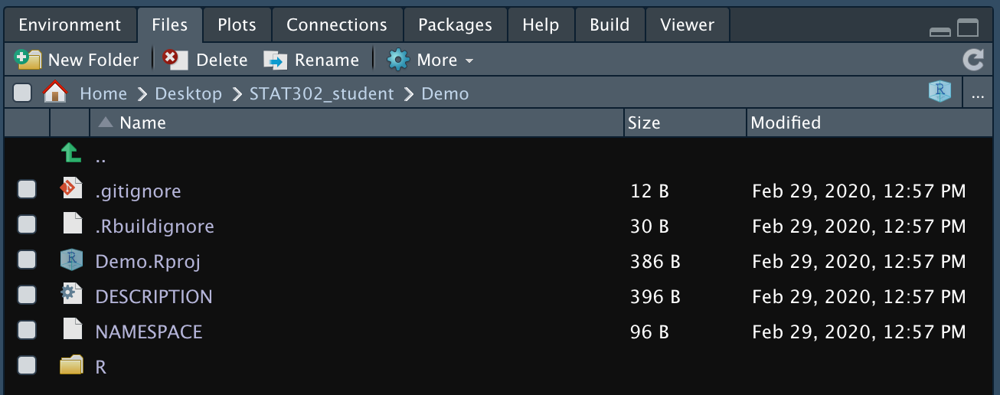]

---

# .gitignore: Files git ignores (*)

The `.gitignore` file specifies which files git will ignore and not track. devtools puts `.Rproj.user` there by default, a helper file associated with your project file. Typically, you don't want to do version control on things like your history, so I usually add `.Rhistory`.
This is unnecessary, but recommended.

When you add files here (which you don't need to do often, if at all), add them on new lines!

.center[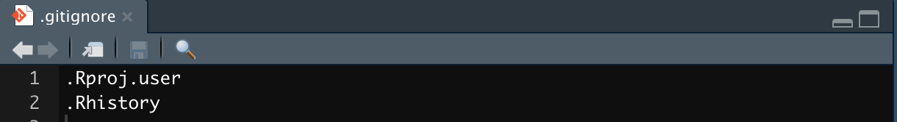]

---

# .Rbuildignore: Files R build ignores

The `.Rbuildignore` file specifies which files will be ignored when you build your package. 
devtools puts R project files there by default, because the project files are for you, the developer, not a user of your package!

Typically, you won't need to edit this by hand.

---

# Step 2: DESCRIPTION metadata (*)

The `DESCRIPTION` file is a space for package metadata.
Go ahead and fill in the relevant information now.
We will come back to this file shortly.

For `License`, I recommend either `GPL-3` or `MIT`. Do not use Creative Commons (`CC`) for software.
I like Karl Broman's overview of licenses [here](https://kbroman.org/pkg_primer/pages/licenses.html).
If you use `MIT`, make sure you include a `LICENSE` file with the year and copywrite holder as well!
See the link for an example.


.center[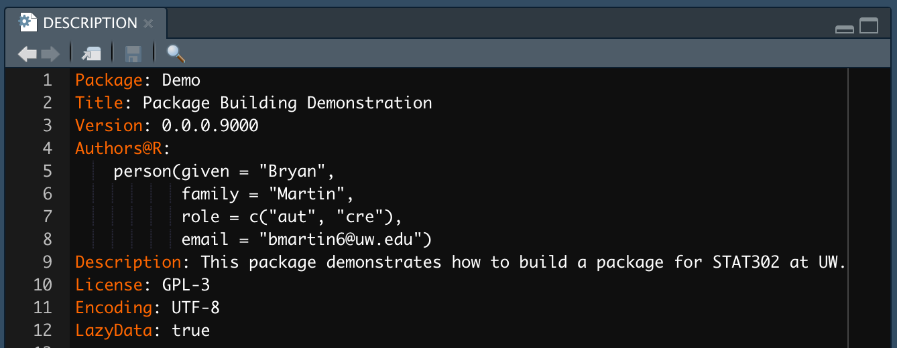]

---

# NAMESPACE: Package namespace

The `NAMESPACE` file is a space for the package namespace.
For the most part, this  tells R what functions your package exports.
It is also used to list function imports as well as some other more advanced topics we won't get into in this class, such as S3 methods.

Fortunately, with devtools you don't have to (and shouldn't!) ever edit this file by hand!

---
layout: true

# Step 3: The R Folder (*)

---

Now that we've been introduced to every file that was created by `devtools::create()`, we are ready to give our package some functions!

Open a new R script and write the following simple function.

```{r}
my_pow <- function(x, power = 2) {
  return(x^power)
}
```


Save this R script within the R folder as `my_pow.R`.


---

Now open **another** new R script and write the following simple function.

```{r}
f_to_c <- function(temp_F) {
  temp_C <- (temp_F - 32) * 5 / 9
  return(temp_C)
}
```

Save this R script within the R folder as `f_to_c.R`.

**Best practice:** Each R script should include a single R function, and the name of the `.R` file should match the name of the function!
Get in the habit of doing this now and you will thank yourself later.
It will make version control with R packages much cleaner and easier.

---
layout: false
class: inverse

.sectionhead[Part 2. Documenting a package]

---
layout: true

# Step 4: Add documentation (*)
---

We now have functions within our package, but they are incomplete because they lack **documentation**. 
Documentation is what you see when you type something like `?lm`.

Of course, style matters a lot when it comes to documentation!
This is the user-facing part of your code, so following proper style guidelines is crucial (and graded)! 
As usual, we will follow the [tidyverse style guide](https://style.tidyverse.org/documentation.html).

---

## Title and description

For package documentation using the `roxygen2` package (built in to `devtools` workflow), we write comments a special way.
When documenting functions, we use `#'` rather than just `#` for the comments. 
Always indent one space after `#'` to begin documentation.

The first documentation line should be the title of the function. This should not end with a full stop `.`. 
Then you should skip a line, and then write the function description.
This is often similar to the title, but with more details.
It should end with a full stop.

.center[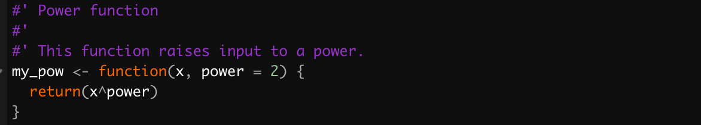]

---

## Title and description

For package documentation using the `roxygen2` package (built in to `devtools` workflow), we write comments a special way.
When documenting functions, we use `#'` rather than just `#` for the comments.
Always indent one space after `#'` to begin documentation.

The first documentation line should be the title of the function. This should not end with a full stop `.`. 
Then you should skip a line, and then write the function description.
This is often similar to the title, but with more details.
It should end with a full stop.

.center[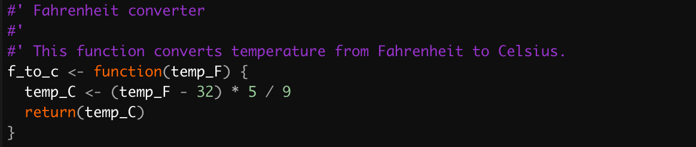]

---

## Parameters

Next, we document **all** parameters of a function.
We proceed the documentation with `@param`, then a space, then the parameter name, then another space, then the description.

In general, write the documentation as a sentence. Starting with a capital letter and ending with a full stop `.`. 
Include the type of data input expected as well as the default value, if applicable.

To refer to other parameters or value of code, wrap the text in `\code{TEXT}`.
For long lines of documentation, begin a new line and indent an extra 2 spaces.

.center[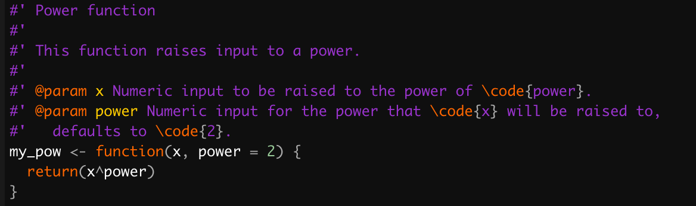]

---

## Parameters

Next, we document **all** parameters of a function.
We proceed the documentation with `@param`, then a space, then the parameter name, then another space, then the description.

In general, write the documentation as a sentence. Starting with a capital letter and ending with a full stop `.`. 
Include the type of data input expected as well as the default value, if applicable.

To refer to other parameters or value of code, wrap the text in `\code{TEXT}`.
For long lines of documentation, begin a new line and indent an extra 2 spaces.

.center[]

---

## Keywords

If relevant, add keywords to your functions using `@keywords`
These are useful if you have several functions that have a similar topic. 
For example, maybe we have several temperature related functions:

.center[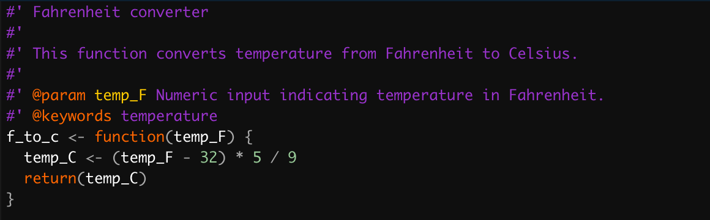]

---

## Return

Document what your function returns using `@return`. 
Documentation style for `@return` follows `@param` (sentence with full stop).
Always describe the full structure of your output ("A list with elements \code{...}...", "a vector of...", etc.).

.center[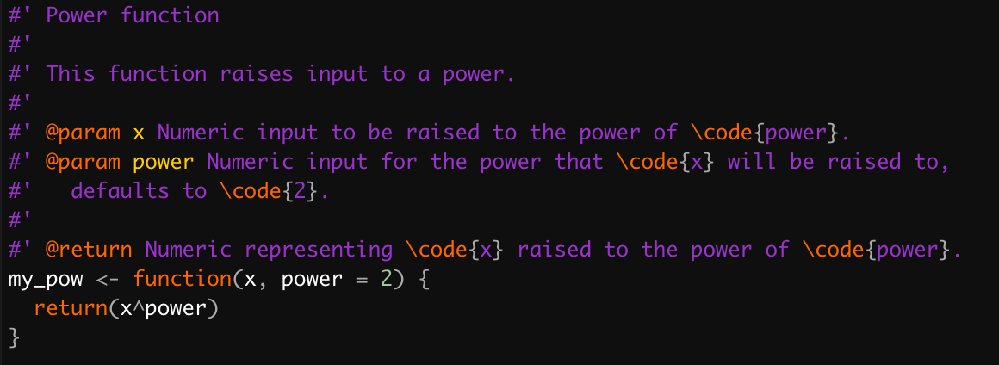]

---

## Return

Document what your function returns using `@return`. 
Documentation style for `@return` follows `@param` (sentence with full stop).
Always describe the full structure of your output ("A list with elements \code{...}...", "a vector of...", etc.).

.center[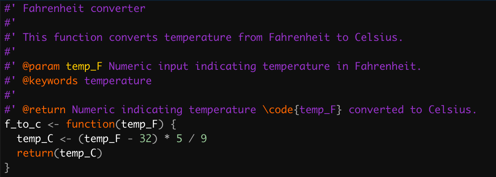]

---

## Examples

All functions should include at least one example demonstrating how to use the function.
Proceed the example by `@examples`, then on new documentation lines indented with 
a single space, write R code exactly as you would in the console demonstrating the function.

.center[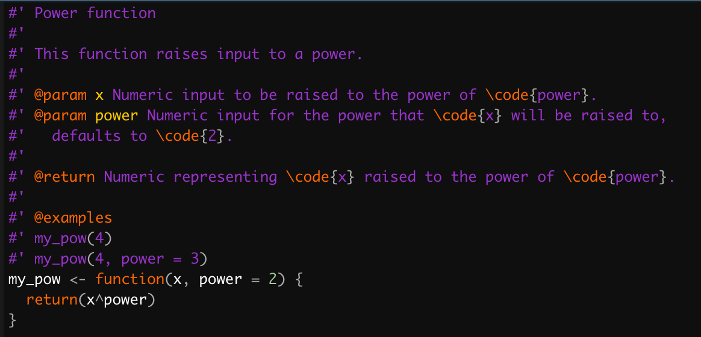]

---

## Examples

All functions should include at least one example demonstrating how to use the function.
Proceed the example by `@examples`, then on new documentation lines indented with 
a single space, write R code exactly as you would in the console demonstrating the function.

.center[]

---

## Export

Lastly, if you want your function to visible to the user, add an `@export` tag just before the first line of your function. 
In general, most functions you write should have this tag, unless you want the function to be used internally only.

.center[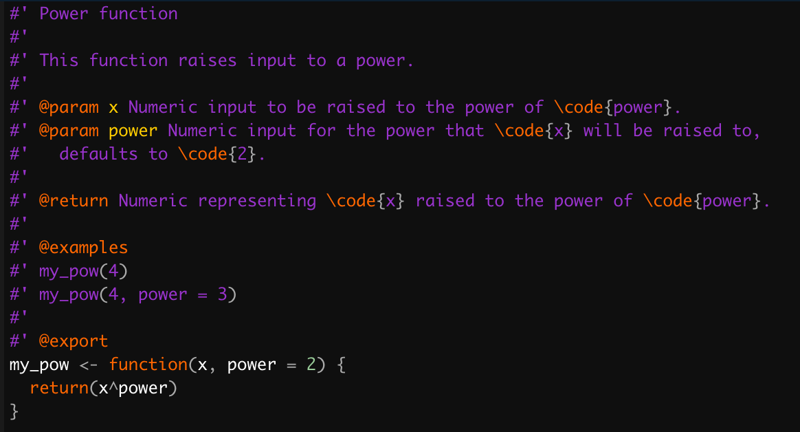]

---

## Export

Lastly, if you want your function to visible to the user, add an `@export` tag just before the first line of your function. 
In general, most functions you write should have this tag, unless you want the function to be used internally only.

.center[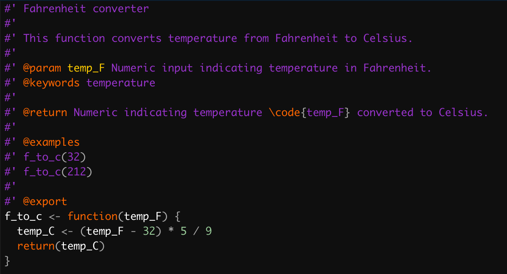]

---
layout: false

# Step 5: Build documentation (*)

If you've been following the instructions so far, devtools makes this step almost trivial.
In your console, run the command

```{r, eval = FALSE}
devtools::document()
```

Let's look at what changed.

---

# The man folder: manual files

The poorly-named `man` folder should now exist in your package directory.
Look inside, and you should see a `.Rd` file for every function you've documented.
These files are written in a markdown language, and never need to be (or should be!) edited by hand!

Make sure that any time you change even a single character in your documentation, 
you update the documentation with `devtools::document()`.
R will get confused if the documentation within the `.R` files doesn't **exactly** match the documentation that appears within the `.Rd` files.

---

# NAMESPACE: namespace

Look at the `NAMESPACE` again, and you will see an exported line for every function with an `@export` tag.
Like the `man` folder, this files never need to be edited by hand!

---
layout: true
# Install! (*)
---

Next, move into the parent directory that contains your package (should be one directory up), and install using `devtools::install()`.
Then load your package, like any other, using `library()`. 
Then check out the documentation of your functions using `?`.

```{r, eval = FALSE}
setwd("..")
devtools::install("YOUR_PACKAGE_NAME")
library(YOUR_PACKAGE_NAME)
?my_pow
```

.center[Congratulations, you have just built and installed your own R package from scratch!]

---

.center[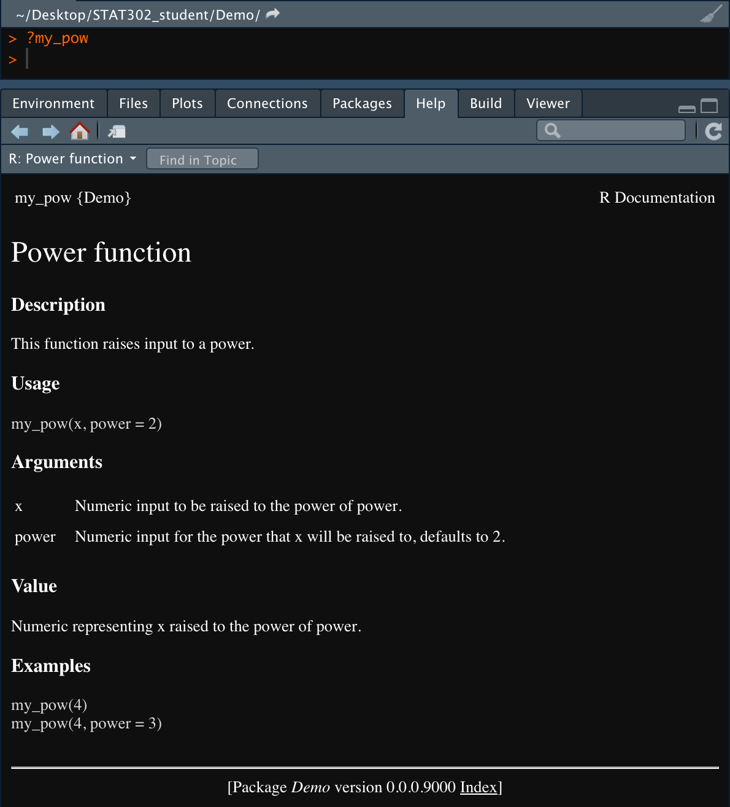]

---

.center[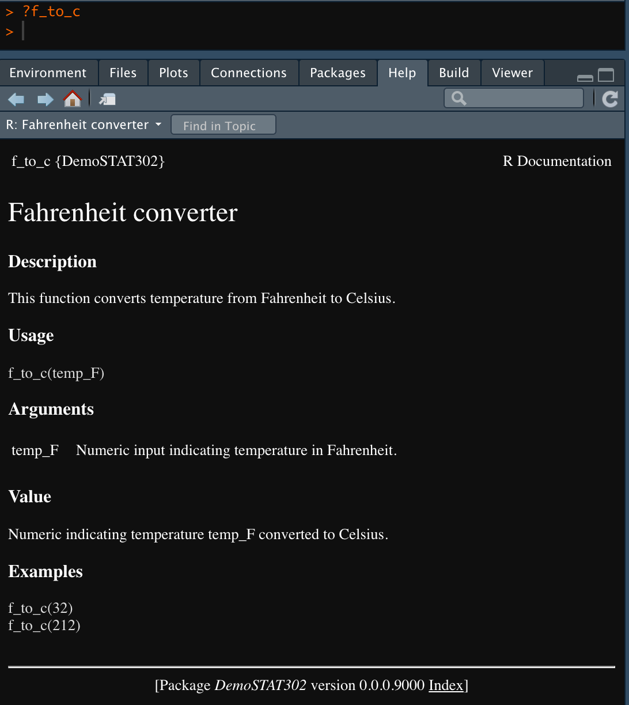]

---
layout: false

# Step 5.5: Check your package (*)

Anytime you update a package, it's a good idea to check it.
This can be done in two ways.

1. In the console, type `devtools::check()`
  * If you get an error that says `Error: Could not find package root.`, then you need to navigate to the package working directory (not the directory that *contains* your package, for example)
2. Open the `Build` pane, then click `Check`

If you have no errors, warnings, or notes, then your package passed standard checks!

.center[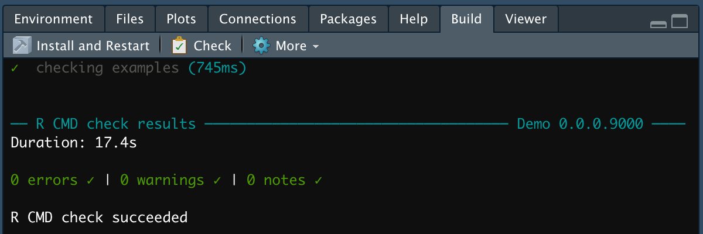]

---
class: inverse

.sectionhead[Part 3: Github and R packages]
---

# Step 6: Create a Github repo (*)

Using steps from week 7 lecture slides, set up a repository on Github. 
Make sure **not** to select *Initialize this repository with a README*.
The repo name **must** match the name of the package!

---

# Step 7: Connect git with R (*)

1. Open your console
2. **Navigate your working directory to your package folder** 
  * Confirm this using `pwd` and `ls`, it should be the folder that includes the .Rproj file
3. `git init`: set up git
4. `git status`: confirm the files look like you expect
5. `git add .`: adds git tracking for all files not in `.gitignore`
6. `git status`: confirm, as always
7. `git commit -m "Set up package"`: (or similar message) to commit your changes
8. `git remote add origin https://github.com/YOUR_GITHUB/YOUR_PACKAGE_NAME.git`: connect your Github repo to your local git with nickname origin
9. `git push -u origin master`: push your local changes to origin

Now navigate online to your Github repo link. 
You should see your package hosted!

---

# Install from Github! (*)

Installing from Github is simple! Just use `devtools::install_github()`!
Try installing your own package.
If that works, try installing your neighbor's package!

Fill in the username and link with your own information:
```{r, eval = FALSE}
devtools::install_github("bryandmartin/Demo")
library(Demo)
?my_pow
```

---
layout: false
class: inverse

.sectionhead[Part 4. Automated package testing]
---

# Step 8: Set up a travis CI account (*)

Instructions from the official [travis CI tutorial](https://docs.travis-ci.com/user/tutorial/).

1. Go to [travis-ci.com](travis-ci.com) and click `Sign up with Github`
2. Accept the Authorization of Travis CI. You'll be redirected to GitHub.
3. Click on your profile picture in the top right of your Travis Dashboard, click the green *Activate* button, and select the repositories you want to use with Travis CI.
  * In this case, select your package for Project 2.
  
---

# Step 9: Set up travis in your package (*)

1. Within your console, enter `usethis::use_testthat()`. This will:
  * Create a `tests/testthat` directory for storing your tests
  * Adds `testthat` to the `Suggests` field in `DESCRIPTION`
  * Creates `tests/testthat.R` which runs your tests automatically whenever you check your package.
2. Within your console, enter `usethis::use_travis()`. This will:
  * Create a `.travis.yml` file and add it to your `.Rbuildignore`
  * Push you to the travis website.
  * Provide the markdown to insert a badge into `README`.
3. Activate travis for your repo at the travis website.
4. *File -> New File -> Text File*
  * Take the markdown text from `use_travis()` output and save as `README.md`. You **must** change the file extension!
5. Push your local changes to Github using instructions from Lecture Slide 7.
  * Recall: Easy way - through RStudio! 
  * Note that you may need to open and close RStudio. You probably opened this R session before you set up with git. The git panel will not show up if this is the case. If you restart RStudio, it will appear.

---
layout: true
# Step 10: Add automated tests (*)
---

The organization of tests should match the organization of R files.
Thus, for every `.R` file within our R folder, we should have a corresponding file within `tests/testthat`.

1. Run `usethis::use_test("my_pow")`. This will automatically create and open `tests/testthat/test-my_pow.R`.
2. Edit the test file. Let's test whether both inputs are numeric, and add a second test that it works mathematically on some example input.
  ```{r, eval = FALSE}
  # within test-my_pow.R
  test_that("my_pow works mathmatically", {
      expect_equal(my_pow(2), 4)
      expect_equal(my_pow(2, power = 3), 8)
  })
  
  test_that("non-numeric input throws error", {
      expect_error(my_pow("a string"))
      expect_error(my_pow(2, power = "a string"))
  })
  ```
3. Run `devtools::check()`. Does your code pass the checks?

---

Let's repeat the process with `f_to_c`.

1. Run `usethis::use_test("f_to_c")`
2. Edit the test file. Let's again test a few input values and that non-numeric input breaks.
  ```{r, eval = FALSE}
  # within test-f_to_c.R
  test_that("f_to_c works mathmatically", {
      expect_equal(f_to_c(32), 0)
      expect_equal(f_to_c(212), 100)
  })
  
  test_that("non-numeric input throws error", {
      expect_error(f_to_c("a string"))
  })
  ```
3. Run `devtools::check()`. Does your code pass the checks?
4. Push your changes to your remote repository on Github.

Now go to the [travis-ci.com](travis-ci.com) and click on your repository. What is happening?

---
layout: false

# Structure of a test

Like R scripts, I recommend you have one test file per function. You should certainly have one per file in the R folder.
Ideally, you have only one function per R folder file, but if you have multiple functions in an R folder file, there should also be only one test file for that file.

The function to create a test is `test_that`. The first argument is a human-readable string designed for *you* to be able to determine what that test is doing. If a test fails, it will tell you the string associated with the test that failed.
The second argument is contained in curly brackets `{...}`. It uses `testthat` helper functions.

```{r, eval = FALSE}
# within test-f_to_c.R
test_that("f_to_c works mathmatically", {
  expect_equal(f_to_c(32), 0)
  expect_equal(f_to_c(212), 100)
})

test_that("non-numeric input throws error", {
  expect_error(f_to_c("a string"))
})
```


---

# Testthat Expectations

An **expectation** is the unit of testing within `test_that`.
They tell your test what to expect, and all associated functions begin with `expect_`.

* `expect_equal()`: is equal within small numerical tolerance?
* `expect_identical()`: is exactly equal?
* `expect_match()`: matches specified string or regular expression?
* `expect_output()` prints specified output?
* `expect_message()`: displays specified message?
* `expect_warning()`: displays specified warning?
* `expect_error()`: throws specified error?
* `expect_is()`: output inherits from certain class?
* `expect_false()`: returns `FALSE`?
* `expect_true()`: returns `TRUE`?

---

# Testthat workflow

Your workflow should be:

1. Modify your code or files
2. Test your package using `Check` or `devtools::test()`
3. Repeat until you pass all your tests

Further, anytime you find and fix a bug, you should add a test for it! 
This will make your code more robust in future iterations.
Remember, if it can break again, it likely will!
Add an automated test so you don't have to debug the same things over and over!

---
layout: true 
# Step 11: Add code coverage (*)
---

## What is code coverage?

**Code coverage** measures the proportion of your code that is tested via automated testing.
We will use software from `codecov.io`.
This software will take all your automated tests and detect which lines of code are utilized during any given test.
It will report, for each line of code, organized graphically by file, how many times that line was utilized during a test.
Ultimately, we will be looking at the coverage, the over proportion of lines that were tested at least once.

Our goal is high coverage.
If a line isn't being tested with a unit test, you aren't doing any automated check to ensure that it is working as intended!
If you have a line that is uncovered, it's a good idea to try and write a test that utilizes that line of code.


---

Thanks to the tidyverse authors, adding code coverage is easy! (Are you sensing a theme yet?)

1. Navigate online to `codecov.io` and create an account. Link this account with your Github account.
2. Run `usethis::use_coverage()`. This will:
  * Add `covr` to the `Suggests` field in `DESCRIPTION`
  * Create `codecov.yml` and add it to `.Rbuildignore`
  * Add a Codecov test coverage badge to `README.md`
  * Provide text to add to `.travis.yml`
3. Take the text it generated and add it on a new line to your `.travis.yml`. (It should be automatically copied to your clipboard.)
  
.center[]

---
layout: true
# Step 12: Add data (*)
---

It is often useful to add data to our packages.
To practice this, we are going to add the `penguins` data to our own packages as `my_penguins` (with proper credit, of course!).

After creating `my_penguins`, run `usethis::use_data(my_penguins)` in your console. This will create a `data/my_penguins.rda`, which contains the object `my_penguins`.
Package data is always stored in `data` subfolder.

```{r, eval = FALSE}
library(palmerpenguins)
data(penguins)
my_penguins <- penguins
usethis::use_data(my_penguins)
```

---

## Documenting Data

Data is exported to the user, and so it must also be documented! The process is as follows, where you replace `my_penguins` with the name of the data you are documenting:

1. Create `my_penguins.R` within the `R` subdirectory.
2. Add title and description, as usual.
  * Note my use of `\code{}` and `link{}`. Pay attention to what that does to the documentation on the next slides.
3. Add `@format` describing the exact format of your data set
  * Include class, number of observations, and number of variables
  * Use `\describe{}` and `item{}` to describe every variable in the data, with units
4. Add `@source` to give a reference for or `\url{}` source of your data.
5. End the documentation with the name of your data in quotes.
  * Never `@export` data!
  
---

(Don't worry, this time you can copy and paste the documentation.)

---

```{r, eval = FALSE}
#' Size measurements for adult foraging penguins near Palmer Station, Antarctica
#'
#' Includes measurements for penguin species, island in Palmer Archipelago,
#' size (flipper length, body mass, bill dimensions), and sex.
#' This data and documentation come from the \code{palmerpenguins} package, 
#' available as \code{\link[palmerpenguins]{penguins}}.
#'
#' @format A tibble with 344 rows and 8 variables:
#' \describe{
#'   \item{species}{a factor denoting penguin species (Adélie, Chinstrap and Gentoo)}
#'   \item{island}{a factor denoting island in Palmer Archipelago, Antarctica (Biscoe, Dream or Torgersen)}
#'   \item{bill_length_mm}{a number denoting bill length (millimeters)}
#'   \item{bill_depth_mm}{a number denoting bill depth (millimeters)}
#'   \item{flipper_length_mm}{an integer denoting flipper length (millimeters)}
#'   \item{body_mass_g}{an integer denoting body mass (grams)}
#'   \item{sex}{a factor denoting penguin sex (female, male)}
#'   \item{year}{an integer denoting the study year (2007, 2008, or 2009)}
#' }
#' @source {Adélie penguins: Palmer Station Antarctica LTER and K. Gorman. 2020. Structural size measurements and isotopic signatures of foraging among adult male and female Adélie penguins (Pygoscelis adeliae) nesting along the Palmer Archipelago near Palmer Station, 2007-2009 ver 5. Environmental Data Initiative} \url{https://doi.org/10.6073/pasta/98b16d7d563f265cb52372c8ca99e60f}
#' @source {Gentoo penguins: Palmer Station Antarctica LTER and K. Gorman. 2020. Structural size measurements and isotopic signatures of foraging among adult male and female Gentoo penguin (Pygoscelis papua) nesting along the Palmer Archipelago near Palmer Station, 2007-2009 ver 5. Environmental Data Initiative} \url{https://doi.org/10.6073/pasta/7fca67fb28d56ee2ffa3d9370ebda689}
#' @source {Chinstrap penguins: Palmer Station Antarctica LTER and K. Gorman. 2020. Structural size measurements and isotopic signatures of foraging among adult male and female Chinstrap penguin (Pygoscelis antarcticus) nesting along the Palmer Archipelago near Palmer Station, 2007-2009 ver 6. Environmental Data Initiative} \url{https://doi.org/10.6073/pasta/c14dfcfada8ea13a17536e73eb6fbe9e}
#' @source {Originally published in: Gorman KB, Williams TD, Fraser WR (2014) Ecological Sexual Dimorphism and Environmental Variability within a Community of Antarctic Penguins (Genus Pygoscelis). PLoS ONE 9(3): e90081. doi:10.1371/journal.pone.0090081}
"penguins"
```


---
layout: false
class: inverse

.sectionhead[Part 5. Package vignettes]

---

# What is a vignette?

A **vignette** is a long-form guide to your package.
Think of it like an article or instructive tutorial that explains and demonstrates how to use your package.
A vignette should describe the problems your package is built for, and the demonstrate using your package to solve those problems. 

Vignettes are (usually) written in R Markdown, so they are automatically generated (and updated!) every time you re-build your package.

---
layout: true

# Part 13: Adding a vignette (*)
---

Run `usethis::use_vignette("tutorial", title = "Project 2: PACKAGE_NAME Tutorial")` in your console, changing the package name to match. This will:
  * Add `knitr` and `rmarkdown` to the `Suggests` field in `DESCRIPTION`
  * Sets `VignetteBuilder` field in `DESCRIPTION` to `knitr`
  * Add `inst/doc` to `.gitignore`
  * Add `vignettes/tutorial.Rmd`
  * Add `*.html` and `*.Rmd` to `vignettes/.gitignore`

---


.center[]

Remove `Project 2: ` from the `%\VignetteIndexEntry`. We want that text in the title of the vignette `.html`, not within the vignette index.
Also add your own name to the YAML header using the `author:` field.

---
layout: false

# Viewing vignettes

In order to install the vignettes with the package from Github, 
use the optional parameters `build_vignette = TRUE` and `build_opts = c()`.

```{r, eval = FALSE}
devtools::install_github("bryandmartin/Demo", build_vignette = TRUE, build_opts = c())
library(Demo)
# Use this to view the vignette in the Demo HTML help
help(package = "Demo", help_type = "html")
# Use this to view the vignette as an isolated HTML file
utils::browseVignettes(package = "Demo")
```

I recommend including instructions like these in any package `README.md` file to tell users how to view your vignette. 
You can see one of [my packages](https://github.com/bryandmartin/corncob) for an example.

---
class: inverse

.sectionhead[Project 2!]


